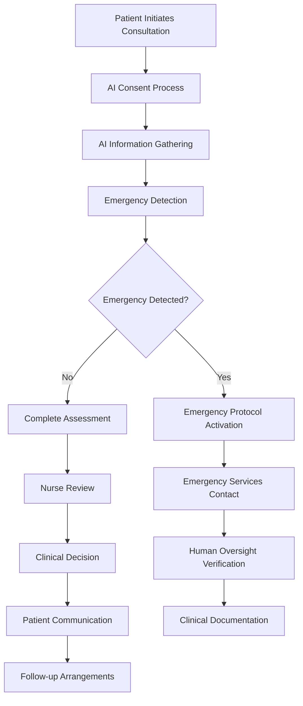
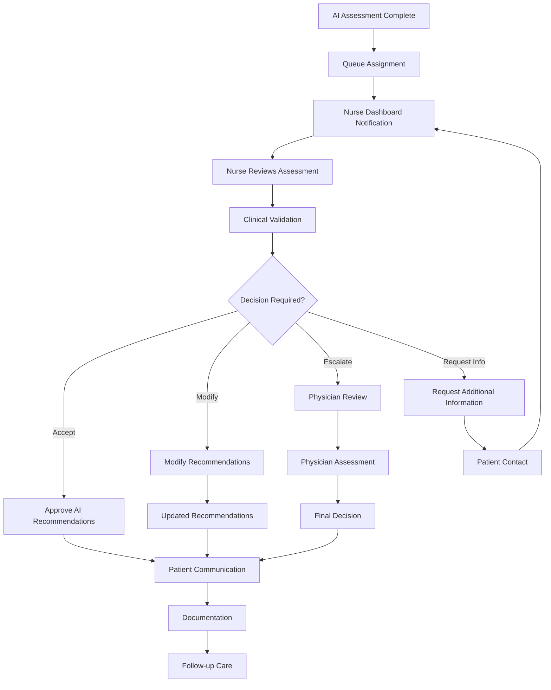

# Clinical Workflow Documentation and Best Practices

## Overview

This document provides comprehensive clinical workflow documentation and best practices for the Medical AI Assistant system, ensuring safe, effective, and compliant implementation across healthcare settings.

## 🏥 Clinical Workflow Architecture

### Primary Clinical Workflows

#### 1. Standard Patient Triage Workflow



#### 2. Healthcare Professional Review Workflow



## 📋 Workflow Implementation Guidelines

### Pre-Implementation Phase

#### Site Assessment
- **Clinical Environment**: Assess physical and technical infrastructure
- **Staff Readiness**: Evaluate staff training needs and capabilities
- **Workflow Integration**: Map current workflows to AI-enhanced workflows
- **Compliance Review**: Ensure HIPAA and local regulatory compliance
- **Risk Assessment**: Identify and mitigate potential risks

#### Staff Training Requirements
- **All Staff**: Basic AI system understanding and safety protocols
- **Nurses**: Dashboard operation and clinical integration training
- **Physicians**: Review processes and clinical decision-making protocols
- **IT Staff**: Technical support and system maintenance training
- **Administrators**: Oversight and governance responsibilities

#### Workflow Customization
- **Clinical Protocols**: Adapt AI integration to existing clinical protocols
- **Escalation Procedures**: Establish clear escalation pathways
- **Documentation Standards**: Define documentation requirements
- **Communication Protocols**: Establish patient communication standards
- **Quality Metrics**: Define measurable quality indicators

### Implementation Phase

#### Pilot Program
- **Limited Scope**: Start with limited patient population
- **Close Monitoring**: Intensive monitoring during initial phase
- **Rapid Response**: Quick response to issues and concerns
- **Feedback Collection**: Systematic collection of user feedback
- **Iterative Improvement**: Continuous workflow refinement

#### Full Deployment
- **Gradual Rollout**: Phased deployment across clinical areas
- **Performance Monitoring**: Continuous performance monitoring
- **Ongoing Training**: Continuous education and skill development
- **Quality Assurance**: Regular quality assurance reviews
- **Regulatory Compliance**: Ongoing compliance monitoring

## 🎯 Best Practices by Clinical Setting

### Primary Care Clinics

#### Workflow Optimization
- **Pre-Visit Preparation**: Use AI for pre-visit information gathering
- **Appointment Triage**: Use AI assessments to prioritize appointments
- **Provider Efficiency**: Streamline information flow to providers
- **Follow-up Care**: Coordinate follow-up based on AI-generated insights

#### Quality Measures
- **Assessment Accuracy**: Monitor correlation between AI and clinical assessments
- **Patient Satisfaction**: Regular patient satisfaction measurement
- **Provider Adoption**: Monitor provider acceptance and usage
- **Clinical Outcomes**: Track clinical outcomes for AI-assisted cases

#### Implementation Tips
- **Start Simple**: Begin with routine cases before complex scenarios
- **Provider Buy-in**: Ensure providers understand benefits and limitations
- **Patient Education**: Educate patients about AI role in their care
- **Continuous Improvement**: Regular workflow review and optimization

### Emergency Departments

#### Emergency-Specific Protocols
- **Rapid Triage**: Use AI for initial rapid symptom assessment
- **Emergency Detection**: Implement robust emergency detection protocols
- **Priority Assignment**: Use AI to assist in priority level assignment
- **Resource Allocation**: Optimize resource allocation based on AI insights

#### Safety Protocols
- **Always Human Override**: Ensure healthcare professionals can override AI recommendations
- **Redundancy Systems**: Maintain traditional emergency detection alongside AI
- **Immediate Response**: Immediate response to AI-detected emergencies
- **Continuous Monitoring**: Continuous monitoring of AI system performance

#### Emergency Workflow Steps
1. **Immediate Assessment**: AI provides rapid initial assessment
2. **Emergency Flagging**: Automatic flagging of potential emergencies
3. **Human Verification**: Healthcare professional verification of AI findings
4. **Clinical Decision**: Healthcare professional makes final clinical decisions
5. **Documentation**: Comprehensive documentation of AI involvement

### Specialty Clinics

#### Cardiology
- **Cardiac Symptoms**: Focus on chest pain and cardiac risk factors
- **Risk Stratification**: Use AI for cardiac risk assessment
- **Medication Interactions**: Consider medication interactions and contraindications
- **Follow-up Protocols**: Establish cardiac-specific follow-up protocols

#### Respiratory
- **Breathing Problems**: Focus on respiratory symptoms and conditions
- **Oxygen Saturation**: Consider oxygen saturation levels
- **Asthma/COPD**: Specialty-specific assessment protocols
- **Pulmonary Function**: Integration with pulmonary function tests

#### Pediatrics
- **Age-Appropriate Communication**: Ensure age-appropriate AI communication
- **Growth and Development**: Consider growth and developmental stages
- **Vaccination Status**: Include vaccination status in assessments
- **Family History**: Emphasize family history in pediatric cases

#### Geriatrics
- **Polypharmacy**: Consider medication interactions and polypharmacy
- **Functional Assessment**: Include functional status assessment
- **Cognitive Status**: Consider cognitive function in older adults
- **Social Factors**: Include social and support system factors

## 🚨 Emergency Management Protocols

### Emergency Detection Standards

#### Red Flag Symptoms
The AI system is programmed to immediately flag these emergency symptoms:

**Cardiovascular Emergencies**
- Chest pain or pressure
- Severe shortness of breath
- Palpitations with dizziness
- Syncope or near-syncope

**Neurological Emergencies**
- Stroke symptoms (facial drooping, arm weakness, speech difficulty)
- Severe headache with neurological symptoms
- Altered mental status
- Seizure activity

**Respiratory Emergencies**
- Severe breathing difficulty
- Stridor or respiratory distress
- Cyanosis or oxygen saturation <90%
- Pneumothorax symptoms

**Other Emergencies**
- Severe allergic reactions
- Uncontrolled bleeding
- Signs of shock
- Severe abdominal pain with instability

#### Emergency Response Protocol
```python
def emergency_response_protocol(session_id: str, emergency_type: str):
    """
    Emergency response protocol for AI-detected emergencies
    """
    
    # 1. Immediate AI response
    ai_response = {
        "message": f"EMERGENCY SYMPTOMS DETECTED: {emergency_type}",
        "urgency": "IMMEDIATE",
        "action_required": "Contact emergency services immediately",
        "safety_instructions": get_emergency_instructions(emergency_type)
    }
    
    # 2. Human notification
    notify_healthcare_professionals(
        session_id=session_id,
        emergency_type=emergency_type,
        priority="CRITICAL"
    )
    
    # 3. Emergency services contact (if configured)
    if settings.auto_contact_emergency_services:
        contact_emergency_services(
            location=get_patient_location(session_id),
            emergency_type=emergency_type
        )
    
    # 4. Documentation
    log_emergency_event(
        session_id=session_id,
        emergency_type=emergency_type,
        response_time=datetime.utcnow()
    )
    
    return ai_response
```

### Human Oversight Requirements

#### Healthcare Professional Response
- **Immediate Verification**: Healthcare professional must immediately verify emergency
- **Direct Patient Contact**: Attempt direct patient contact when possible
- **Clinical Decision Making**: Make independent clinical decisions
- **Emergency Services**: Contact emergency services as clinically indicated
- **Documentation**: Document clinical decision-making process

#### Override Capabilities
- **Clinical Judgment**: Healthcare professionals can override any AI recommendation
- **Risk Assessment**: Independent risk assessment by qualified professionals
- **Treatment Decisions**: All treatment decisions remain with healthcare professionals
- **Escalation Decisions**: Escalation decisions made by healthcare professionals

## 📊 Quality Assurance and Monitoring

### Quality Metrics

#### Clinical Quality Metrics
- **Assessment Accuracy**: Correlation between AI and human assessments
- **Emergency Detection Rate**: Rate of appropriate emergency detection
- **False Positive Rate**: Rate of inappropriate emergency flagging
- **Patient Satisfaction**: Patient satisfaction with AI-assisted care

#### Operational Metrics
- **Response Time**: Time from AI completion to human review
- **Workflow Efficiency**: Impact on overall clinical workflow efficiency
- **Provider Adoption**: Rate of provider adoption and usage
- **Documentation Quality**: Quality and completeness of documentation

#### Safety Metrics
- **Near Miss Events**: Events where safety issues were caught
- **Safety Protocol Adherence**: Adherence to safety protocols
- **Incident Reporting**: Number and type of safety incidents
- **Corrective Actions**: Effectiveness of corrective actions

### Continuous Monitoring

#### Real-time Monitoring
- **System Performance**: Continuous monitoring of system performance
- **User Behavior**: Monitoring user interactions and behaviors
- **Clinical Outcomes**: Monitoring clinical outcomes for AI-assisted cases
- **Safety Events**: Real-time monitoring of safety events

#### Periodic Reviews
- **Weekly Reviews**: Weekly review of performance metrics
- **Monthly Analysis**: Monthly comprehensive analysis
- **Quarterly Assessments**: Quarterly quality assessments
- **Annual Evaluations**: Annual comprehensive program evaluation

### Feedback Mechanisms

#### Patient Feedback
- **Satisfaction Surveys**: Regular patient satisfaction surveys
- **Feedback Forms**: Easy-to-use feedback forms
- **Focus Groups**: Periodic patient focus groups
- **Complaint Resolution**: Systematic complaint resolution process

#### Provider Feedback
- **Regular Surveys**: Regular provider satisfaction surveys
- **Focus Groups**: Provider focus groups for feedback
- **Incident Reporting**: Easy incident reporting mechanisms
- **Improvement Suggestions**: Systematic collection of improvement suggestions

## 🔒 Compliance and Governance

### Regulatory Compliance

#### HIPAA Compliance
- **Privacy Protection**: Robust privacy protection measures
- **Access Controls**: Strict access controls and monitoring
- **Audit Trails**: Comprehensive audit trails
- **Breach Response**: Procedures for breach response

#### FDA Regulations
- **Clinical Decision Support**: Appropriate classification under FDA guidelines
- **Documentation**: Comprehensive documentation of AI system use
- **Validation**: Ongoing validation of AI system performance
- **Adverse Event Reporting**: Procedures for adverse event reporting

#### State Regulations
- **Licensing Requirements**: Compliance with state licensing requirements
- **Telemedicine Regulations**: Compliance with telemedicine regulations
- **Scope of Practice**: Adherence to scope of practice requirements
- **Quality Standards**: Compliance with quality standards

### Clinical Governance

#### Governance Structure
- **Medical Director**: Overall clinical oversight responsibility
- **Clinical Committee**: Multidisciplinary clinical committee
- **Quality Committee**: Quality assurance and improvement committee
- **Ethics Committee**: Ethical oversight and guidance

#### Governance Activities
- **Policy Development**: Development and maintenance of policies
- **Training Oversight**: Oversight of training programs
- **Quality Monitoring**: Continuous quality monitoring
- **Risk Management**: Ongoing risk assessment and management

#### Documentation Requirements
- **Clinical Policies**: Comprehensive clinical policies
- **Training Records**: Complete training records for all staff
- **Quality Reports**: Regular quality reports and assessments
- **Incident Reports**: Detailed incident reports and analysis

## 📚 Training and Education

### Initial Training Program

#### Core Training Modules
1. **AI System Overview**: Understanding AI capabilities and limitations
2. **Safety Protocols**: Comprehensive safety training
3. **Privacy and Security**: Privacy and security training
4. **Clinical Integration**: Training on clinical workflow integration
5. **Documentation Standards**: Documentation requirements and standards

#### Role-Specific Training
- **Patient-Facing Staff**: Training on patient communication about AI
- **Nurses**: Detailed training on dashboard operation and review processes
- **Physicians**: Training on review and validation of AI outputs
- **IT Staff**: Technical training on system operation and maintenance

### Ongoing Education

#### Regular Training Updates
- **Annual Refresher**: Annual refresher training for all staff
- **System Updates**: Training on system updates and changes
- **Case Studies**: Regular case study discussions
- **Best Practices**: Sharing of best practices and lessons learned

#### Competency Assessment
- **Knowledge Testing**: Regular knowledge assessments
- **Skills Evaluation**: Regular skills evaluations
- **Performance Monitoring**: Ongoing performance monitoring
- **Remedial Training**: Remedial training when needed

## 🔄 Continuous Improvement

### Improvement Process

#### Data Collection
- **Performance Metrics**: Collection of performance metrics
- **User Feedback**: Collection of user feedback
- **Patient Outcomes**: Monitoring of patient outcomes
- **System Analytics**: Analysis of system usage patterns

#### Analysis and Planning
- **Trend Analysis**: Analysis of trends in performance and outcomes
- **Gap Identification**: Identification of gaps and improvement opportunities
- **Solution Development**: Development of improvement solutions
- **Implementation Planning**: Planning for implementation of improvements

#### Implementation and Monitoring
- **Pilot Testing**: Pilot testing of improvements
- **Gradual Rollout**: Gradual rollout of improvements
- **Effectiveness Monitoring**: Monitoring of improvement effectiveness
- **Adjustment**: Adjustment of improvements based on results

### Innovation and Research

#### Research Opportunities
- **Clinical Research**: Opportunities for clinical research
- **Technology Research**: Opportunities for technology improvement
- **Process Research**: Opportunities for process improvement
- **Education Research**: Opportunities for education research

#### Collaboration
- **Academic Partnerships**: Partnerships with academic institutions
- **Industry Collaboration**: Collaboration with technology industry
- **Clinical Networks**: Participation in clinical networks
- **Professional Organizations**: Participation in professional organizations

---

**Remember: Clinical workflow documentation should be living documents that evolve with experience, technology, and clinical best practices. Regular review and updates are essential for maintaining effectiveness and safety.**

*For questions about clinical workflow implementation or best practices, contact your organization's clinical leadership or the Medical AI Assistant implementation team.*

**Version**: 1.0 | **Last Updated**: November 2025 | **Next Review**: February 2026
