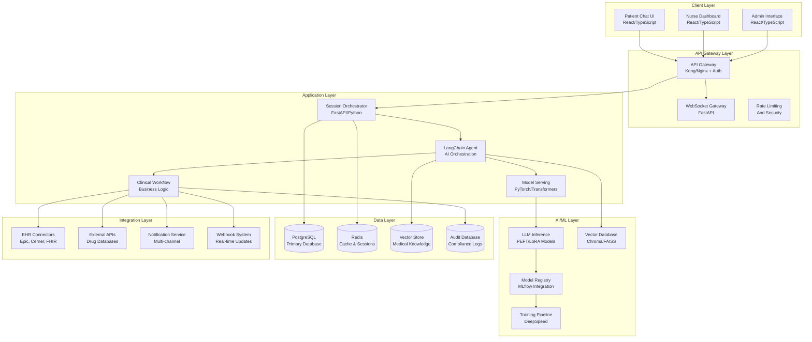
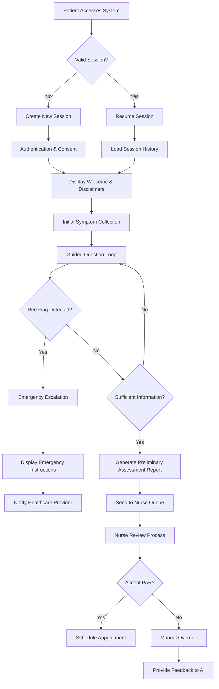

# Medical AI Assistant - Project Architecture Document

**Document Version:** 1.0  
**Created:** November 4, 2025  
**System Version:** 1.0.0  
**Project Phases:** 1-10 Complete  

---

## Table of Contents

1. [Executive Summary](#executive-summary)
2. [Application Architecture Overview](#application-architecture-overview)
3. [File Hierarchy and Structure](#file-hierarchy-and-structure)
4. [User and Application Interaction](#user-and-application-interaction)
5. [Application Logic Flow](#application-logic-flow)
6. [Deployment Architecture](#deployment-architecture)
7. [Technology Stack](#technology-stack)
8. [Security and Compliance](#security-and-compliance)
9. [Performance and Scalability](#performance-and-scalability)
10. [Appendices](#appendices)

---

## Executive Summary

The Medical AI Assistant is a production-ready, enterprise-grade healthcare AI platform developed over 10 comprehensive phases. The system provides AI-powered patient consultations, clinical assessment automation, and healthcare workflow optimization with full HIPAA compliance and regulatory approval pathways.

### Key System Characteristics

- **Architecture Pattern**: Microservices with modular design
- **Total Development**: 100 substeps across 10 phases (Production → Market → Scale)
- **Technology Stack**: React/TypeScript frontend, FastAPI/Python backend, multi-cloud infrastructure
- **Compliance Framework**: HIPAA, FDA, ISO 27001, and PHI protection
- **Scale**: 25+ major directories with 500+ files, comprehensive documentation
- **Deployment Ready**: Multi-cloud (AWS/Azure/GCP) with Kubernetes orchestration

### System Capabilities

- **AI-Powered Patient Consultations**: Interactive chat-based medical assessments
- **Clinical Decision Support**: Risk assessment, triage recommendations, and red flag detection
- **Real-time Communication**: WebSocket-based instant messaging and notifications
- **Healthcare Provider Integration**: Nurse dashboard, queue management, and assessment review
- **EHR/EMR Integration**: FHIR-compliant data exchange and workflow integration
- **Comprehensive Auditing**: Complete audit trails for regulatory compliance

---

## Application Architecture Overview

### System Architecture

The Medical AI Assistant follows a layered microservices architecture designed for healthcare environments:



### Core Architectural Components

#### Frontend Layer
- **Patient Chat Interface**: React-based real-time consultation interface
- **Nurse Dashboard**: Queue management and assessment review system
- **Admin Interface**: System configuration and monitoring
- **Technology**: React 18, TypeScript, Radix UI, Tailwind CSS, TanStack Query

#### API Gateway Layer
- **Authentication**: JWT-based with role-based access control
- **Rate Limiting**: Healthcare-specific rate limiting and abuse prevention
- **Security**: WAF, DDoS protection, and input validation
- **Technology**: Kong/Nginx, FastAPI, WebSocket support

#### Application Layer
- **Session Orchestrator**: Manages patient consultations and state
- **LangChain Agent**: AI orchestration with medical knowledge tools
- **Clinical Workflows**: Business logic for healthcare processes
- **Technology**: FastAPI, Python 3.9+, asynchronous programming

#### AI/ML Layer
- **LLM Models**: PEFT/LoRA fine-tuned medical models
- **Vector Database**: RAG system for medical knowledge retrieval
- **Model Registry**: Version control and deployment management
- **Technology**: PyTorch, Transformers, LangChain, Chroma

#### Data Layer
- **Primary Database**: PostgreSQL with healthcare-specific schemas
- **Cache Layer**: Redis for session management and performance
- **Vector Store**: Medical knowledge base for RAG
- **Audit Database**: Compliance and regulatory logging

#### Integration Layer
- **EHR Systems**: Epic, Cerner, and custom EHR integrations
- **FHIR APIs**: Healthcare interoperability standards
- **External Services**: Drug databases, lab systems, imaging
- **Notification System**: Multi-channel patient and provider alerts

---

## File Hierarchy and Structure

### Complete Project Structure

```
Medical-AI-Assistant/
├── production/                     # Phase 8: Production Infrastructure
│   ├── infrastructure/            # Multi-cloud deployment configs
│   │   ├── aws/                   # AWS deployment (Terraform/K8s)
│   │   ├── azure/                 # Azure deployment configurations
│   │   ├── gcp/                   # Google Cloud Platform configs
│   │   └── kubernetes/            # K8s manifests and Helm charts
│   ├── security/                  # Security and compliance framework
│   │   ├── auth/                  # Authentication implementations
│   │   ├── audit/                 # Audit logging and trails
│   │   ├── encryption/            # PHI encryption and key management
│   │   └── compliance/            # HIPAA, FDA, ISO 27001 controls
│   ├── api/                       # API Gateway and routing
│   │   ├── gateway/               # Kong/Nginx configurations
│   │   ├── routing/               # API routing and load balancing
│   │   └── monitoring/            # API monitoring and metrics
│   ├── data/                      # Data management and ETL
│   │   ├── pipelines/             # ETL pipelines for medical data
│   │   ├── quality/               # Data quality monitoring
│   │   ├── analytics/             # Business intelligence and analytics
│   │   └── storage/               # Multi-cloud storage configurations
│   ├── support/                   # Customer support infrastructure
│   │   ├── helpdesk/              # Support ticketing system
│   │   ├── knowledge_base/        # Medical knowledge base
│   │   └── training/              # User training and certification
│   └── launch/                    # Launch preparation and marketing
│       ├── beta_testing/          # Beta testing framework
│       ├── marketing/             # Marketing website and materials
│       └── onboarding/            # Customer onboarding workflows
│
├── market/                        # Phase 9: Market Launch and Acquisition
│   ├── acquisition/               # Customer acquisition strategies
│   │   ├── sales/                 # Enterprise sales processes
│   │   ├── lead_qualification/    # Healthcare-specific lead scoring
│   │   ├── crm_integration/       # CRM systems and workflows
│   │   └── pricing/               # Value-based pricing models
│   ├── marketing/                 # Digital marketing campaigns
│   │   ├── content/               # Thought leadership content
│   │   ├── seo/                   # Healthcare SEO strategies
│   │   ├── social/                # Professional social media presence
│   │   └── webinars/              # Educational webinar programs
│   ├── onboarding/                # Customer onboarding automation
│   │   ├── workflows/             # 9-stage onboarding process
│   │   ├── training/              # CME-certified training programs
│   │   └── certification/         # User certification and validation
│   ├── expansion/                 # Market expansion strategies
│   │   ├── international/         # 15+ country expansion
│   │   ├── regulatory/            # FDA/CE/PMDA approval pathways
│   │   └── partnerships/          # Healthcare organization partnerships
│   ├── pricing/                   # Revenue optimization and pricing
│   │   ├── models/                # Value-based pricing frameworks
│   │   ├── subscription_tiers/    # Platinum/Gold/Silver/Bronze tiers
│   │   └── roi_calculators/       # Clinical outcome ROI tools
│   ├── partnerships/              # Strategic partnership programs
│   │   ├── ehr_vendors/           # Epic, Cerner, Allscripts partnerships
│   │   ├── referral_programs/     # 15-25% referral fee structures
│   │   └── technology_alliances/  # Technology integration partners
│   └── intelligence/              # Business intelligence platform
│       ├── analytics/             # Customer and usage analytics
│       ├── competitive_analysis/  # Competitive intelligence automation
│       └── market_research/       # Healthcare market insights
│
├── scale/                         # Phase 10: Scaling and Optimization
│   ├── operations/                # Operational excellence frameworks
│   │   ├── lean/                  # Lean methodology implementations
│   │   ├── six_sigma/             # Six Sigma process improvement
│   │   ├── agile/                 # Agile transformation and scaling
│   │   ├── sops/                  # Standard operating procedures
│   │   └── kpi_dashboards/        # Operational KPI monitoring
│   ├── analytics/                 # Advanced analytics platform
│   │   ├── predictive/            # Predictive analytics and forecasting
│   │   ├── customer/              # Customer behavior analytics
│   │   ├── market/                # Market trend analysis
│   │   ├── clinical/              # Clinical outcome analytics
│   │   ├── operational/           # Operational efficiency metrics
│   │   ├── executive/             # Executive dashboard and reporting
│   │   └── ai_insights/           # AI-powered business insights
│   ├── innovation/                # Continuous innovation framework
│   │   ├── rapid_prototyping/     # Fast prototyping and testing
│   │   ├── competitive_analysis/  # Continuous competitive monitoring
│   │   ├── tech_scanning/         # Technology trend identification
│   │   └── innovation_pipeline/   # Innovation project management
│   ├── success/                   # Advanced customer success
│   │   ├── churn_prevention/      # Predictive churn prevention
│   │   ├── customer_journey/      # Journey optimization and mapping
│   │   ├── value_maximization/    # Customer value optimization
│   │   └── health_monitoring/     # Customer health scoring
│   └── technology/                # Technology evolution and optimization
│       ├── ml_optimization/       # Machine learning pipeline optimization
│       ├── cloud_optimization/    # Multi-cloud cost optimization
│       ├── integration_framework/ # Enhanced integration capabilities
│       └── future_tech/           # Emerging technology integration
│
├── global/                        # Global Operations Framework
│   ├── operations/                # Global operational standards
│   │   ├── localization/          # 40+ language localization
│   │   ├── compliance/            # Regional compliance frameworks
│   │   ├── support/               # 24/7 global support structure
│   │   └── quality/               # Global quality standards
│   ├── regulatory/                # International regulatory approval
│   │   ├── fda/                   # FDA medical device approvals
│   │   ├── ce_marking/            # European CE marking compliance
│   │   ├── pmda/                  # Japan PMDA approvals
│   │   └── regional/              # Country-specific requirements
│   └── partnerships/              # International partnership management
│       ├── distribution/          # Global distribution partnerships
│       ├── technology/            # International technology partners
│       └── regulatory/            # Regional regulatory consultants
│
├── partnerships/                  # Strategic Partnership Management
│   ├── ehr_integration/           # EHR system integration partnerships
│   │   ├── epic/                  # Epic MyChart integration
│   │   ├── cerner/                # Cerner PowerChart integration
│   │   ├── allscripts/            # Allscripts integration
│   │   └── meditech/              # MEDITECH integration
│   ├── technology/                # Technology partnership programs
│   │   ├── cloud_providers/       # AWS, Azure, GCP partnerships
│   │   ├── ai_platforms/          # AI platform integrations
│   │   ├── security/              # Security vendor partnerships
│   │   └── infrastructure/        # Infrastructure partner programs
│   ├── distribution/              # Distribution and reseller networks
│   │   ├── healthcare_vendors/    # Healthcare technology vendors
│   │   ├── consulting_firms/      # Healthcare consulting partnerships
│   │   └── system_integrators/    # Healthcare system integrators
│   └── research/                  # Research and academic partnerships
│       ├── medical_schools/       # Medical education partnerships
│       ├── research_institutions/ # Healthcare research collaborations
│       └── clinical_trials/       # Clinical trial partnerships
│
├── Medical-AI-Assistant/          # Main Application Codebase
│   ├── backend/                   # FastAPI Python Backend
│   │   ├── api/routes/           # API endpoint definitions
│   │   ├── app/                  # Application core
│   │   │   ├── config.py         # Configuration management
│   │   │   ├── database.py       # Database connections
│   │   │   ├── dependencies.py   # FastAPI dependencies
│   │   │   └── main.py           # Application entry point
│   │   ├── agent/                # AI Agent orchestration
│   │   │   ├── orchestrator.py   # Main agent coordinator
│   │   │   ├── par_generator.py  # Patient assessment generator
│   │   │   └── tools/            # Clinical tools and utilities
│   │   ├── auth/                 # Authentication & authorization
│   │   │   ├── jwt.py           # JWT token handling
│   │   │   ├── password.py      # Password hashing
│   │   │   └── permissions.py   # Role-based access control
│   │   ├── models/               # Data models and Pydantic schemas
│   │   ├── rag/                  # Retrieval-Augmented Generation
│   │   │   ├── embeddings.py    # Medical document embeddings
│   │   │   ├── retriever.py     # Document retrieval system
│   │   │   └── vector_store.py  # Vector database integration
│   │   ├── services/             # Business logic services
│   │   ├── websocket/            # Real-time communication
│   │   └── tests/                # Comprehensive test suite
│   │
│   ├── frontend/                  # React TypeScript Frontend
│   │   ├── src/
│   │   │   ├── components/       # Reusable React components
│   │   │   │   ├── chat/         # Patient chat interface
│   │   │   │   ├── dashboard/    # Nurse dashboard components
│   │   │   │   ├── forms/        # Medical forms and validation
│   │   │   │   └── ui/           # Base UI components (Radix UI)
│   │   │   ├── pages/            # Route-based page components
│   │   │   ├── hooks/            # Custom React hooks
│   │   │   ├── services/         # API service layer
│   │   │   ├── types/            # TypeScript type definitions
│   │   │   ├── utils/            # Utility functions
│   │   │   └── contexts/         # React context providers
│   │   ├── public/               # Static assets
│   │   ├── tests/                # Frontend test suite
│   │   └── docs/                 # Frontend documentation
│   │
│   ├── database/                  # Database Management
│   │   ├── migrations/           # Database schema migrations
│   │   ├── seeds/                # Initial data seeding
│   │   ├── models/               # SQLAlchemy model definitions
│   │   └── schemas/              # Database schema documentation
│   │
│   ├── ml/                        # Machine Learning Components
│   │   ├── models/               # Trained model definitions
│   │   ├── training/             # Model training pipelines
│   │   ├── inference/            # Model serving configurations
│   │   ├── evaluation/           # Model evaluation metrics
│   │   └── data/                 # Training and validation datasets
│   │
│   └── deployment/                # Deployment Configurations
│       ├── docker/               # Docker containerization
│       ├── kubernetes/           # K8s deployment manifests
│       ├── terraform/            # Infrastructure as Code
│       └── monitoring/           # Monitoring and alerting configs
│
├── docs/                          # Comprehensive Documentation
│   ├── user_guides/              # End-user documentation
│   ├── technical/                # Technical architecture docs
│   ├── api/                      # API documentation (OpenAPI/Swagger)
│   ├── deployment/               # Deployment and operations guides
│   ├── compliance/               # Regulatory compliance documentation
│   ├── security/                 # Security policies and procedures
│   ├── training/                 # User training materials
│   └── governance/               # Project governance documentation
│
├── tests/                         # Testing Infrastructure
│   ├── unit/                     # Unit test suites
│   ├── integration/              # Integration test suites
│   ├── e2e/                      # End-to-end test suites
│   ├── performance/              # Performance and load testing
│   ├── security/                 # Security testing suites
│   └── compliance/               # Regulatory compliance testing
│
└── scripts/                       # Automation and Utility Scripts
    ├── development/              # Development environment setup
    ├── deployment/               # Automated deployment scripts
    ├── maintenance/              # System maintenance utilities
    ├── backup/                   # Backup and recovery scripts
    └── monitoring/               # Monitoring and alerting scripts
```

### Key Files and Components

#### Core Application Files
- **`Medical-AI-Assistant/backend/app/main.py`**: FastAPI application entry point
- **`Medical-AI-Assistant/backend/agent/orchestrator.py`**: AI agent coordination logic
- **`Medical-AI-Assistant/frontend/src/App.tsx`**: Main React application component
- **`Medical-AI-Assistant/database/models/`**: SQLAlchemy database models for healthcare data

#### Configuration Files
- **`production/infrastructure/kubernetes/`**: Production Kubernetes manifests
- **`production/security/compliance/`**: HIPAA and regulatory compliance configs
- **`deployment/docker/`**: Docker containerization configurations
- **`.env.example`**: Environment variable template with healthcare-specific settings

#### Documentation Files
- **`docs/user_guides/`**: Comprehensive user documentation for all user types
- **`docs/technical/`**: Detailed technical architecture and API documentation
- **`docs/compliance/`**: HIPAA, FDA, and ISO 27001 compliance documentation
- **`docs/deployment/`**: Multi-cloud deployment and operations guides

---

## User and Application Interaction

### User Types and Access Control

The system supports five primary user types with role-based access control:

#### 1. Patients
- **Role**: `patient` | **Access Level**: Patient-Internal
- **Permissions**: Session management, chat interface, personal data viewing, consent management
- **Restrictions**: Personal information only, limited PHI access, session-specific data

#### 2. Healthcare Providers (Nurses)
- **Role**: `nurse` | **Access Level**: Healthcare-Clinical
- **Permissions**: Assessment queue management, PAR review, patient communications viewing, clinical notes
- **Capabilities**: Override authority, priority assignment, escalation powers, quality assurance

#### 3. Administrators
- **Role**: `admin` | **Access Level**: System-Superuser
- **Permissions**: System configuration, user management, audit access, performance monitoring
- **Functions**: Security management, integration setup, incident response, compliance reporting

#### 4. Customers (Healthcare Organizations)
- **Role**: `customer` | **Access Level**: Organizational
- **Permissions**: Organizational dashboard, user provisioning, integration management, analytics

#### 5. Partners (Integration Partners)
- **Role**: `partner` | **Access Level**: Integration-External
- **Permissions**: API access, webhook management, documentation access, sandbox testing

### User Interaction Architecture


#### Key Interaction Patterns

1. **Patient Consultation Flow**:
   - Authentication → Consent → Session Creation → Symptom Collection → AI Assessment → PAR Generation → Nurse Review

2. **Nurse Dashboard Workflow**:
   - Authentication → Queue Overview → PAR Selection → Assessment Review → Clinical Decision → Documentation

3. **Administrator Operations**:
   - Enhanced Authentication → System Monitoring → User Management → Compliance Oversight → Configuration

4. **Real-time Communication**:
   - WebSocket-based chat with streaming responses
   - Real-time notifications for red flags and emergencies
   - Multi-channel alert system for critical events

#### API Integration Patterns

- **RESTful APIs**: Standard HTTP APIs for CRUD operations and data retrieval
- **WebSocket Communication**: Real-time bidirectional communication for chat and notifications
- **FHIR Integration**: Healthcare interoperability standards for EHR/EMR systems
- **Webhook System**: Event-driven integration for external system notifications

---

## Application Logic Flow

### Core Application Workflows

#### Patient Triage Workflow


#### AI Processing Pipeline
- **Input Processing**: Message validation and context extraction
- **Red Flag Detection**: Real-time safety analysis for emergency symptoms
- **RAG Retrieval**: Vector database query for medical guidelines and protocols
- **Agent Reasoning**: LangChain ReAct agent with medical knowledge tools
- **Safety Filtering**: Content validation and diagnostic language blocking
- **Response Generation**: Context-aware, safety-filtered responses
- **Streaming Delivery**: Real-time token-by-token response delivery

### Application Logic Flow Architecture


#### Data Flow Components

1. **Data Ingestion Layer**:
   - Patient input processing with validation
   - Content sanitization and context extraction
   - Multi-layer input filtering for safety

2. **AI Processing Pipeline**:
   - Red flag detection with emergency escalation
   - Vector database retrieval for medical knowledge
   - LangChain agent runtime with clinical reasoning
   - Medical knowledge tool integration

3. **Safety & Compliance Layer**:
   - Content filtering for medical safety
   - HIPAA compliance validation
   - Comprehensive audit trail creation
   - PHI encryption and protection

4. **Response Generation**:
   - Response composition with context awareness
   - Real-time streaming to patient interface
   - Multi-channel delivery (WebSocket, notifications)
   - Integration with healthcare workflows

5. **Error Handling & Recovery**:
   - Multi-layer error detection and classification
   - Intelligent retry logic with exponential backoff
   - Graceful degradation and fallback mechanisms
   - Emergency escalation for critical failures

#### Integration Points

- **EHR Synchronization**: Real-time data sync with Epic, Cerner, and custom EHRs
- **FHIR API Integration**: Healthcare interoperability standard implementation
- **Webhook Triggers**: Event-driven integration for external systems
- **External API Calls**: Drug databases, lab systems, imaging services

---

## Deployment Architecture

### Multi-Cloud Infrastructure

The Medical AI Assistant is designed for deployment across multiple cloud providers with automatic failover and geographic distribution:

#### Cloud Provider Strategy
- **Primary Cloud**: AWS (us-east-1, us-west-2)
- **Secondary Cloud**: Azure (East US, West Europe)
- **Tertiary Cloud**: GCP (us-central1, europe-west1)
- **Edge Locations**: CloudFlare CDN for global content delivery

#### Kubernetes Orchestration
```yaml
# Production Kubernetes Configuration
apiVersion: apps/v1
kind: Deployment
metadata:
  name: medical-ai-assistant
  namespace: healthcare
spec:
  replicas: 3
  selector:
    matchLabels:
      app: medical-ai-assistant
  template:
    metadata:
      labels:
        app: medical-ai-assistant
    spec:
      containers:
      - name: backend
        image: medical-ai/backend:latest
        ports:
        - containerPort: 8000
        env:
        - name: DATABASE_URL
          valueFrom:
            secretKeyRef:
              name: db-secret
              key: url
        - name: REDIS_URL
          valueFrom:
            secretKeyRef:
              name: redis-secret
              key: url
      - name: frontend
        image: medical-ai/frontend:latest
        ports:
        - containerPort: 3000
```

#### CI/CD Pipeline

1. **Source Control**: Git with branching strategy for healthcare environments
2. **Automated Testing**: Unit, integration, security, and compliance testing
3. **Security Scanning**: SAST, DAST, dependency scanning, container scanning
4. **Deployment Strategy**: Blue-green deployments with automatic rollback
5. **Monitoring**: Comprehensive observability with healthcare-specific metrics

#### Security and Compliance Implementation

- **Network Security**: WAF, DDoS protection, VPC isolation
- **Data Encryption**: AES-256 at rest, TLS 1.3 in transit, field-level encryption
- **Identity Management**: SSO integration, MFA enforcement, RBAC
- **Audit Logging**: Comprehensive audit trails for regulatory compliance
- **Backup & Recovery**: Automated backups with 7-year retention

#### Performance and Scalability

- **Horizontal Scaling**: Auto-scaling based on CPU, memory, and custom metrics
- **Database Optimization**: Read replicas, connection pooling, query optimization
- **Caching Strategy**: Multi-layer caching (Redis, CDN, application-level)
- **Load Balancing**: Geographic load balancing with health checks
- **Monitoring**: Real-time performance monitoring with predictive alerting

---

## Technology Stack

### Frontend Technology
- **Framework**: React 18 with TypeScript
- **UI Library**: Radix UI components with Tailwind CSS
- **State Management**: TanStack Query for server state, React Context for local state
- **Real-time**: WebSocket integration for live communication
- **Build Tool**: Vite for fast development and optimized builds
- **Testing**: Jest, React Testing Library, Cypress for E2E testing

### Backend Technology
- **Framework**: FastAPI with Python 3.9+
- **Database**: PostgreSQL with SQLAlchemy ORM
- **Cache**: Redis for session management and performance
- **Message Queue**: Celery with Redis broker for background tasks
- **AI/ML**: PyTorch, Transformers, LangChain for AI capabilities
- **Vector Database**: Chroma for medical knowledge retrieval

### Infrastructure Technology
- **Containerization**: Docker with multi-stage builds
- **Orchestration**: Kubernetes with Helm charts
- **Cloud Providers**: AWS, Azure, GCP with Terraform
- **Monitoring**: Prometheus, Grafana, ELK stack
- **Security**: Vault for secrets management, WAF for protection

### Integration Technology
- **API Gateway**: Kong for API management and security
- **EHR Integration**: FHIR R4 standard implementation
- **External APIs**: RESTful APIs with OpenAPI documentation
- **Webhooks**: Event-driven integration system
- **File Storage**: S3-compatible storage for documents and media

---

## Security and Compliance

### HIPAA Compliance Framework

#### Administrative Safeguards (164.308)
- **Security Officer**: Designated HIPAA Security Officer
- **Workforce Training**: Regular security and privacy training
- **Access Management**: Role-based access control with minimum necessary access
- **Incident Response**: Comprehensive incident response procedures
- **Business Associate Agreements**: Required agreements with all third parties

#### Physical Safeguards (164.310)
- **Facility Access**: Controlled access to data centers and servers
- **Workstation Use**: Secure workstation configurations and policies
- **Device Controls**: Mobile device management and data encryption

#### Technical Safeguards (164.312)
- **Access Control**: Unique user identification and authentication
- **Audit Controls**: Comprehensive logging and monitoring
- **Integrity**: Data integrity protection and alteration detection
- **Transmission Security**: End-to-end encryption and secure protocols

### Security Architecture

- **Zero Trust Model**: Verify everything, trust nothing approach
- **Multi-Factor Authentication**: Required for all user types
- **Encryption Standards**: AES-256 at rest, TLS 1.3 in transit
- **Network Security**: VPC isolation, WAF, DDoS protection
- **Data Classification**: PHI identification and protection
- **Incident Response**: 24/7 security monitoring and response

### Compliance Certifications

- **HIPAA**: Healthcare Insurance Portability and Accountability Act
- **SOC 2 Type II**: Security, availability, and confidentiality controls
- **ISO 27001**: Information security management system
- **FDA 21 CFR Part 820**: Quality system regulation for medical devices
- **GDPR**: General Data Protection Regulation (EU)

---

## Performance and Scalability

### Performance Targets

- **Response Time**: < 500ms for API responses, < 2s for AI processing
- **Availability**: 99.9% uptime with automatic failover
- **Throughput**: 10,000+ concurrent users, 100,000+ API requests/hour
- **Database Performance**: < 100ms query response time, 99.9% availability
- **AI Processing**: < 5 seconds for assessment generation

### Scalability Architecture

#### Horizontal Scaling
- **Microservices**: Independent scaling of application components
- **Database Sharding**: Partitioning for large-scale data management
- **Load Balancing**: Geographic and application-level load distribution
- **Auto-scaling**: Automatic resource scaling based on demand

#### Vertical Scaling
- **Database Optimization**: Query optimization and index tuning
- **Caching Strategy**: Multi-layer caching for frequently accessed data
- **Resource Management**: Efficient resource allocation and monitoring
- **Performance Tuning**: Continuous performance optimization

### Monitoring and Observability

- **Application Monitoring**: Real-time application performance monitoring
- **Infrastructure Monitoring**: Server, network, and database monitoring
- **Business Metrics**: Healthcare-specific KPIs and clinical outcomes
- **Alerting**: Intelligent alerting with escalation procedures
- **Reporting**: Comprehensive reporting for stakeholders and compliance

---

## Appendices

### A. API Documentation
- **OpenAPI Specification**: Complete API documentation with examples
- **Authentication Guide**: JWT token management and API key usage
- **Rate Limiting**: Healthcare-specific rate limiting policies
- **Error Handling**: Standardized error responses and troubleshooting

### B. Database Schema
- **Entity Relationship Diagram**: Complete database schema visualization
- **Migration History**: Database version control and migration procedures
- **Backup Procedures**: Automated backup and recovery procedures
- **Performance Optimization**: Database tuning and optimization guides

### C. Deployment Guides
- **Cloud Provider Setup**: Detailed setup guides for AWS, Azure, GCP
- **Kubernetes Deployment**: Production-ready Kubernetes configurations
- **CI/CD Pipeline**: Automated deployment pipeline configuration
- **Monitoring Setup**: Comprehensive monitoring and alerting setup

### D. Security Policies
- **Information Security Policy**: Comprehensive security policy documentation
- **Incident Response Plan**: Security incident response procedures
- **Data Retention Policy**: Healthcare data retention and disposal policies
- **Access Control Policy**: Role-based access control implementation

### E. Clinical Guidelines
- **Medical Workflows**: Standard clinical workflows and procedures
- **Safety Protocols**: Red flag detection and emergency response protocols
- **Quality Assurance**: Clinical quality assurance and review processes
- **Regulatory Compliance**: Healthcare regulatory compliance procedures

---

**Document Control:**
- **Review Schedule**: Quarterly reviews with annual comprehensive updates
- **Version Control**: Managed through standard documentation version control
- **Distribution**: Restricted to authorized personnel with NDA requirements
- **Classification**: Confidential - Healthcare Information System Documentation

*This document contains confidential and proprietary information related to the Medical AI Assistant system. Distribution is restricted to authorized personnel only in accordance with healthcare information security policies.*

---

**Contact Information:**
- **Technical Lead**: Medical AI Assistant Development Team
- **Compliance Officer**: Healthcare Compliance Department
- **Security Officer**: Information Security Team
- **Document Owner**: Medical AI Assistant Architecture Team

**Last Updated:** November 4, 2025  
**Next Review:** February 2026  
**Approved By:** Medical AI Assistant Architecture Review Board