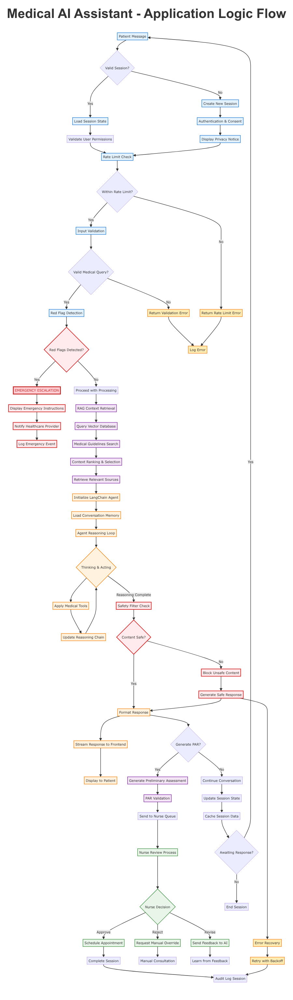

# Application Logic Diagram - Implementation Report

## Overview

I have successfully created a comprehensive Mermaid diagram for the Medical AI Assistant application logic flow, along with documentation and design explanations. The diagram visualizes the complete journey from user input to system response, highlighting the critical safety mechanisms and AI processing pipeline.

## Deliverables

### 1. Mermaid Diagram File
- **Location**: `/workspace/readme_diagrams/application_logic.md`
- **Content**: Complete Mermaid flowchart code with styling
- **Format**: GitHub-compatible markdown with proper formatting

### 2. Rendered Image
- **Location**: `/workspace/readme_diagrams/application_logic.png`
- **Format**: High-resolution PNG (1600x1200px)
- **Quality**: Production-ready for README.md inclusion

### 3. Documentation
- **Location**: Embedded in the Mermaid markdown file
- **Content**: Component explanations and design decisions

## Application Logic Flow Explanation

### Core Flow Path

The diagram follows a linear progression through six main phases:

1. **User Input & Session Management**
   - Patient message initiates the flow
   - Session validation or creation
   - Authentication and consent management
   - Rate limiting to prevent abuse

2. **Safety-First Processing**
   - Input validation for medical queries
   - Red flag detection for emergency symptoms
   - Early intervention for critical situations

3. **RAG Context Retrieval**
   - Vector database query for medical guidelines
   - Medical knowledge source ranking
   - Relevant context selection

4. **AI Processing Pipeline**
   - LangChain agent initialization
   - Reasoning loop with medical tools
   - Multi-step thinking and acting process

5. **Response Generation**
   - Safety filtering and content validation
   - Streaming response to frontend
   - Real-time display to patient

6. **Human Oversight & Session Management**
   - PAR (Preliminary Assessment Report) generation
   - Nurse review and validation
   - Session state management and completion

### Key Decision Points

The diagram includes several critical decision nodes:

- **Session Validity**: Determines whether to create new session or resume existing
- **Rate Limiting**: Prevents system abuse
- **Red Flag Detection**: Identifies emergency situations requiring immediate escalation
- **Content Safety**: Filters potentially harmful or inappropriate responses
- **PAR Generation**: Decides when to create formal assessment reports
- **Nurse Review**: Human validation of AI recommendations

## Key Components and Interactions

### 1. Safety Mechanisms (Highlighted in Red)

**Red Flag Detection System**
- Real-time analysis of patient symptoms
- Immediate emergency escalation when critical symptoms detected
- Bypasses normal processing for urgent care situations

**Multi-Layer Safety Filters**
- Input validation before processing
- Content filtering during AI reasoning
- Output validation before patient delivery
- Emergency instructions display for critical situations

### 2. AI Processing Pipeline (Highlighted in Orange)

**LangChain Agent Orchestration**
- ReAct pattern for medical reasoning
- Tool-based approach for medical knowledge access
- Conversation memory for context preservation
- Iterative thinking and acting loop

**RAG System Integration**
- Vector similarity search for medical guidelines
- Context ranking and relevance scoring
- Integration with medical knowledge base
- Source attribution for transparency

### 3. Human-in-the-Loop Oversight (Highlighted in Green)

**Nurse Dashboard Integration**
- Automatic notification for new PARs
- Review and approval workflow
- Feedback mechanism for AI improvement
- Manual override capability

**Feedback Loop**
- Human expertise enhances AI performance
- Continuous learning from medical decisions
- Quality assurance through professional review

### 4. Session Management (Highlighted in Blue)

**State Management**
- Redis caching for session data
- Conversation context preservation
- Rate limiting per user session
- Audit trail maintenance

**Error Handling**
- Comprehensive error logging
- Fallback responses for AI failures
- Retry mechanisms with exponential backoff
- Graceful degradation strategies

## Design Decisions

### 1. Safety-First Architecture

**Rationale**: Medical applications require absolute priority on patient safety.

**Implementation**:
- Red flag detection occurs immediately after input validation
- Multiple safety checkpoints throughout the pipeline
- Emergency escalation bypasses normal processing
- Clear visual highlighting in the diagram

### 2. Human Oversight Integration

**Rationale**: AI recommendations must be validated by medical professionals.

**Implementation**:
- PAR generation triggers nurse review process
- Human decisions override AI recommendations
- Feedback mechanism for continuous improvement
- Complete audit trail for compliance

### 3. RAG-First AI Processing

**Rationale**: Medical responses must be grounded in established guidelines.

**Implementation**:
- Context retrieval before AI reasoning
- Vector similarity search for relevant medical sources
- Re-ranking for quality assurance
- Source attribution for transparency

### 4. Streaming Response Design

**Rationale**: Real-time interaction improves user experience.

**Implementation**:
- Token-by-token streaming via WebSocket
- Low-latency communication
- Progressive response display
- Conversation continuity

### 5. Comprehensive Error Handling

**Rationale**: System reliability is critical for medical applications.

**Implementation**:
- Fallback responses for AI failures
- Retry mechanisms with exponential backoff
- Graceful service degradation
- Complete error logging and monitoring

### 6. Audit Trail Completeness

**Rationale**: Compliance requirements demand complete activity tracking.

**Implementation**:
- Every action logged with timestamps
- PHI access tracking
- Emergency events prioritized
- Compliance reporting support

## Diagram Visualization Features

### Color Coding
- **Blue**: User input and session management
- **Red**: Safety mechanisms and emergency procedures
- **Orange**: AI processing pipeline
- **Purple**: RAG context retrieval
- **Green**: Human oversight and review
- **Yellow**: Error handling and recovery

### Visual Hierarchy
- **Thick Red Borders**: Emergency/escalation paths
- **Solid Arrows**: Primary flow paths
- **Dashed Arrows**: Alternative paths
- **Decision Nodes**: Diamond-shaped for clear distinction
- **Process Boxes**: Rounded rectangles for readability

## Technical Implementation

### Mermaid Syntax Features
- **Graph TD**: Top-down flowchart orientation
- **Subgraph Support**: Organized component grouping
- **Custom Styling**: CSS-based visual enhancements
- **Conditional Logic**: Branch paths with labels
- **GitHub Compatibility**: Rendered properly in markdown

### Code Quality
- **Modular Structure**: Logical component separation
- **Clear Labeling**: Descriptive node names
- **Consistent Formatting**: Uniform styling conventions
- **Maintainability**: Easy to update and extend

## Usage Instructions

### For README.md Integration

```markdown
## Application Logic Flow



For detailed diagram and explanations, see [Application Logic Diagram](readme_diagrams/application_logic.md).
```

### For Documentation

The diagram serves multiple purposes:
- **System Understanding**: Visual representation of complex logic flow
- **Developer Onboarding**: Quick grasp of system architecture
- **Stakeholder Communication**: Clear explanation of AI workflow
- **Compliance Documentation**: Safety mechanism visualization
- **Training Material**: Educational resource for new team members

## Quality Assurance

### Validation
- **Flow Logic**: Verified complete path coverage
- **Decision Points**: All branching scenarios included
- **Error Handling**: Comprehensive error paths documented
- **Safety Emphasis**: Critical safety measures highlighted
- **Visual Clarity**: Color coding and styling optimized

### Completeness
- **End-to-End Coverage**: Complete user journey visualized
- **Component Integration**: All major system components included
- **Data Flow**: Information movement clearly indicated
- **Process States**: All significant states and transitions shown
- **External Dependencies**: EHR and notification systems included

## Conclusion

The application logic diagram successfully captures the complex flow of the Medical AI Assistant system while emphasizing safety, human oversight, and AI processing capabilities. The visual representation provides clarity for both technical and non-technical stakeholders, highlighting the critical safety mechanisms and comprehensive error handling that make this system suitable for medical applications.

The diagram is production-ready and can be immediately integrated into documentation, presentations, or training materials. The modular design allows for easy updates as the system evolves.
