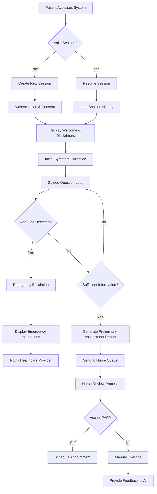
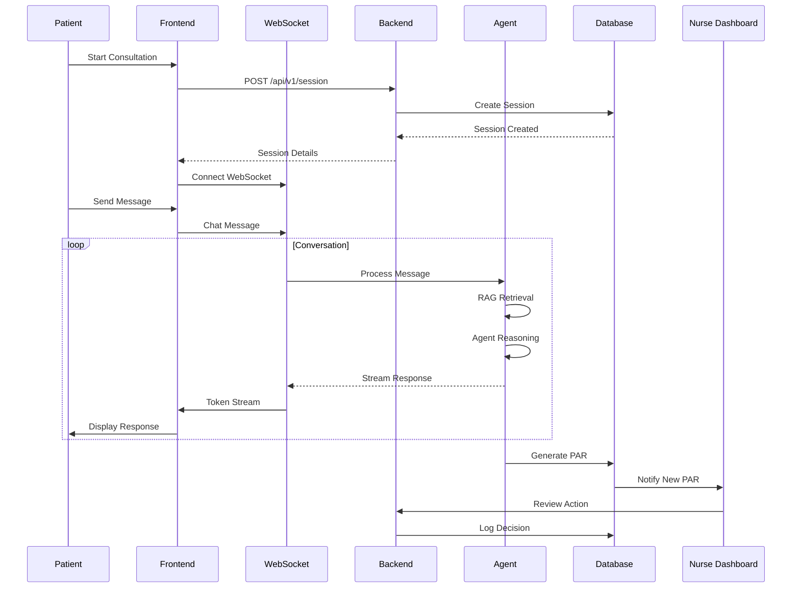
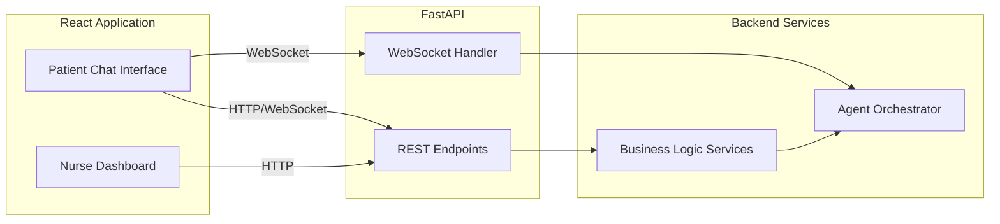
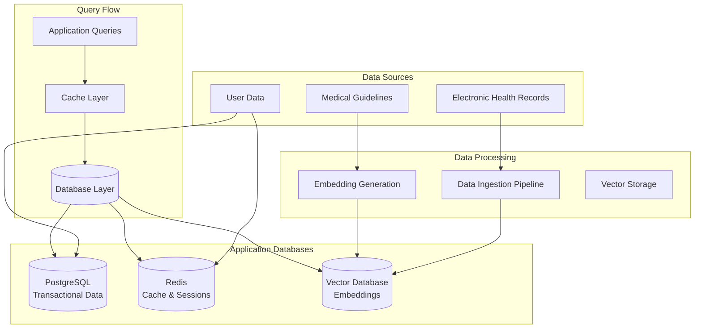
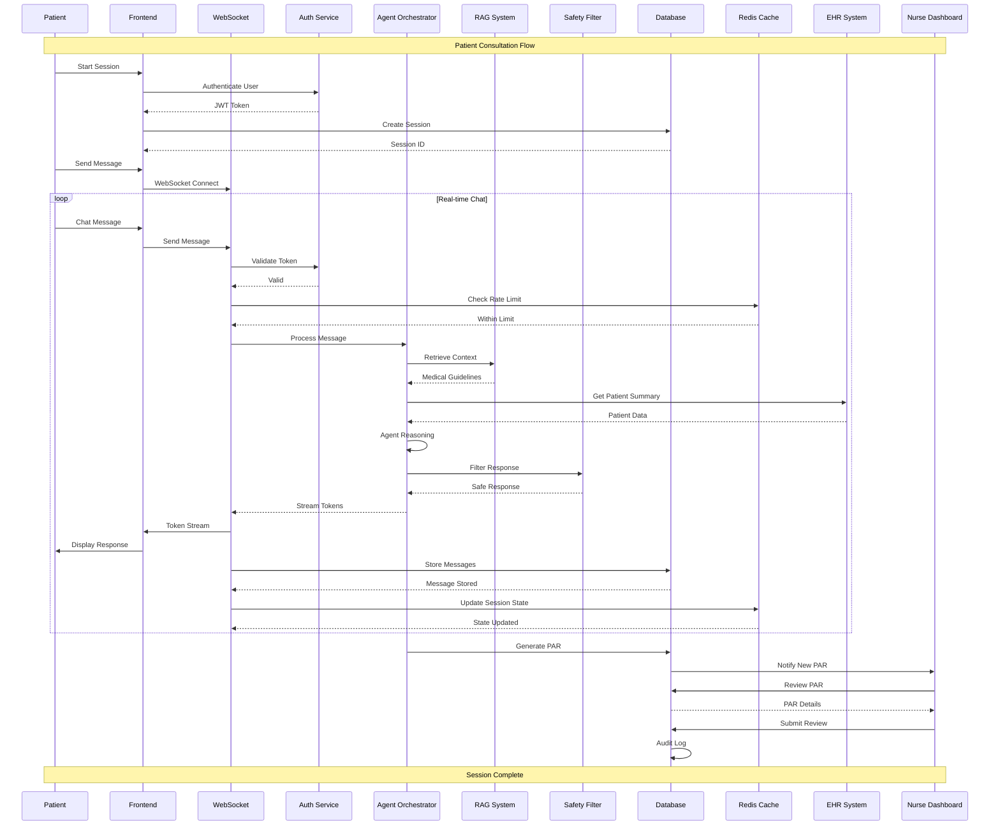
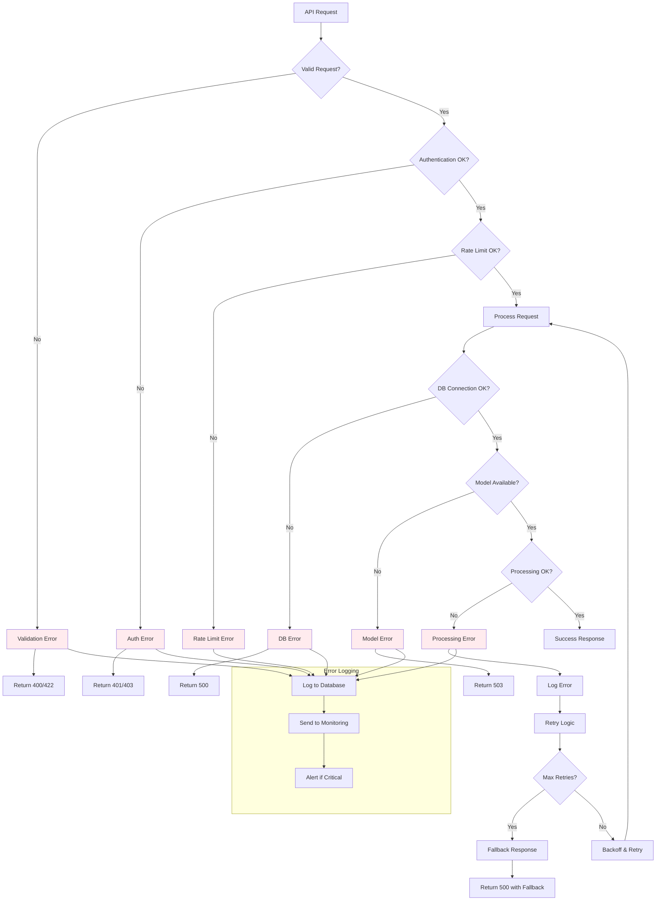
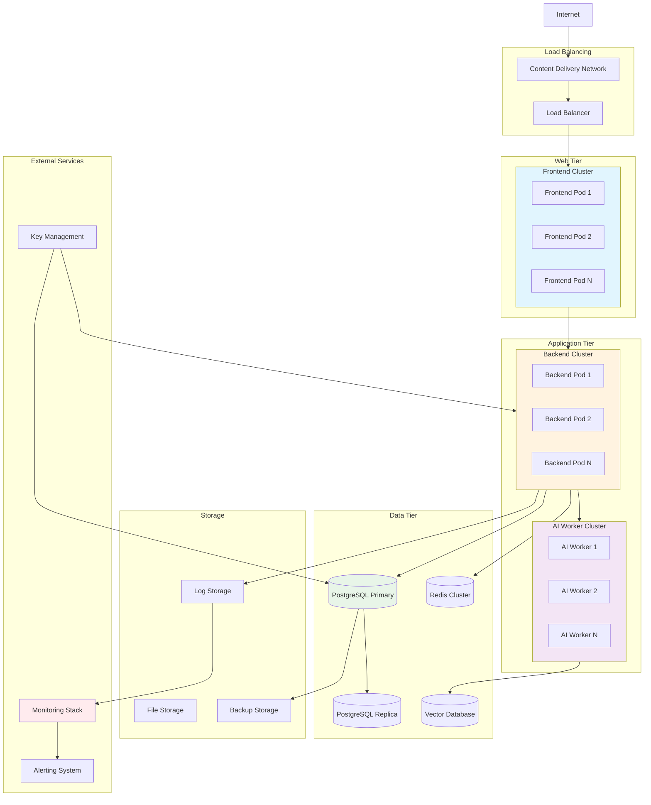

# Application Logic Flow Analysis
## Medical AI Assistant System

**Document Version:** 1.0  
**Last Updated:** 2025-11-04  
**System Version:** 1.0.0  

---

## Executive Summary

This document provides a comprehensive analysis of the Medical AI Assistant application logic flow, covering core workflows, system architecture, data processing pipelines, and integration patterns. The system implements a production-ready medical triage assistant with real-time patient interaction, AI-powered assessment generation, and nurse dashboard oversight.

### System Overview

The Medical AI Assistant is a distributed healthcare application featuring:
- **Frontend**: React-based patient chat interface and nurse dashboard
- **Backend**: FastAPI REST API with WebSocket real-time communication
- **AI Engine**: LangChain v1.0 agent runtime with RAG-grounded responses
- **Data Layer**: PostgreSQL, Redis, and vector database integration
- **Safety**: Multi-layered safety filters and audit logging

---

## 1. Core Application Workflows and Business Logic

### 1.1 Patient Triage Workflow

The patient triage workflow follows a structured multi-step process:



**Workflow States:**
- **Session Creation**: Initializes new patient session with UUID
- **Consent Management**: Handles privacy consent and disclaimers
- **Symptom Collection**: Progressive questioning with contextual flow
- **Red Flag Detection**: Real-time analysis for emergency symptoms
- **PAR Generation**: AI-driven preliminary assessment report
- **Nurse Escalation**: Human-in-the-loop review and approval

### 1.2 Diagnosis Assistance Logic

The diagnosis assistance mechanism operates through LangChain v1.0 agent orchestration:

```python
# Core diagnostic workflow in orchestrator.py
class MedicalAgentOrchestrator:
    async def process_message(
        self, session_id, message, conversation_history
    ) -> AsyncIterator[Dict[str, Any]]:
        # 1. Input validation and safety checks
        red_flags = self.check_red_flags(message)
        
        # 2. Context retrieval (RAG)
        contexts = await self.retrieve_medical_contexts(message)
        
        # 3. LangChain agent reasoning
        agent_response = await self.agent_arun(
            message, conversation_history, contexts
        )
        
        # 4. Safety filtering
        filtered_response = self.apply_safety_filters(agent_response)
        
        # 5. Streaming response to patient
        return self.stream_response(filtered_response)
```

**Diagnostic Flow Components:**
- **Input Processing**: Message validation and context extraction
- **RAG Retrieval**: Vector database query for medical guidelines
- **Agent Reasoning**: LangChain ReAct agent with medical tools
- **Safety Filtering**: Diagnostic language blocking and content validation
- **Response Streaming**: Real-time token-by-token delivery

### 1.3 Consultation Management

Consultation sessions follow a structured lifecycle:



---

## 2. AI Model Processing Pipeline

### 2.1 Medical AI Model Architecture

The system implements a sophisticated AI pipeline with multiple specialized components:

```python
# Model configuration in config.py
class Settings(BaseSettings):
    MODEL_PATH: str = Field(..., description="Path to LLM model")
    MODEL_DEVICE: str = "cuda"
    MODEL_MAX_LENGTH: int = 2048
    MODEL_TEMPERATURE: float = 0.7
    USE_8BIT: bool = True
    USE_FLASH_ATTENTION: bool = False
    
    # PEFT/LoRA Configuration
    PEFT_ADAPTER_PATH: Optional[str] = None
    USE_PEFT: bool = True
```

**Model Pipeline Components:**
- **Base Model**: HuggingFace transformer (Llama, Mistral, or Phi)
- **LoRA Adapters**: Efficient fine-tuning for medical domain
- **Quantization**: 8-bit/4-bit for resource optimization
- **Safety Guardrails**: Multi-layer content filtering

### 2.2 LangChain v1.0 Integration

The LangChain agent runtime provides the core reasoning capability:

```python
# Agent initialization pattern
def _initialize_agent(self):
    """Initialize LangChain v1.0 agent with medical tools"""
    from langchain.agents import create_react_agent
    from langchain.tools import Tool
    from langchain.memory import ConversationBufferMemory
    
    # Medical-specific tools
    tools = [
        Tool(
            name="medical_guidelines_search",
            func=self.rag_retriever.search,
            description="Search medical guidelines and protocols"
        ),
        Tool(
            name="red_flag_detector",
            func=self.safety_checker.detect_red_flags,
            description="Detect emergency symptoms and red flags"
        ),
        Tool(
            name="ehr_lookup",
            func=self.ehr_connector.get_patient_summary,
            description="Retrieve patient EHR summary (read-only)"
        )
    ]
    
    # Create ReAct agent
    self.agent = create_react_agent(
        llm=self.llm,
        tools=tools,
        prompt=self.system_prompt
    )
    
    return self.agent
```

**LangChain Integration Features:**
- **Tool System**: RAG retriever, red flag detector, EHR connector
- **Memory Management**: Conversation buffer for context
- **ReAct Pattern**: Reasoning and acting loop for medical queries
- **Prompt Engineering**: System prompts optimized for medical safety

### 2.3 RAG System Implementation

The Retrieval-Augmented Generation system provides medical context:

```python
# RAG configuration in rag/config.py
@dataclass
class RAGConfig:
    embedding_model: str = "sentence-transformers/all-MiniLM-L6-v2"
    vector_store_type: str = "chroma"
    collection_name: str = "medical_guidelines"
    top_k: int = 5
    similarity_threshold: float = 0.7
    use_reranker: bool = True
    
class MedicalRAGRetriever:
    async def search(self, query: str, session_id: UUID):
        """Search medical guidelines using vector similarity"""
        # 1. Embed query
        query_embedding = await self.embeddings.embed_query(query)
        
        # 2. Vector similarity search
        results = await self.vector_store.similarity_search(
            query_embedding,
            k=self.config.top_k,
            filter={"session_id": session_id}
        )
        
        # 3. Re-ranking (optional)
        if self.config.use_reranker:
            results = await self.reranker.rerank(query, results)
        
        # 4. Format for agent consumption
        return self.format_contexts(results)
```

**RAG System Features:**
- **Document Processing**: Medical guidelines, protocols, red flag lists
- **Embedding Pipeline**: Sentence transformers for medical text
- **Vector Storage**: Chroma/Qdrant/Milvus for similarity search
- **Re-ranking**: Cross-encoder for improved relevance

---

## 3. Data Flow Between System Components

### 3.1 Frontend-Backend Communication

The system uses a hybrid communication pattern:



**Communication Patterns:**
- **HTTP REST**: Session management, authentication, PAR retrieval
- **WebSocket**: Real-time chat streaming, token-by-token responses
- **GraphQL**: Complex queries for nurse dashboard (planned)
- **Server-Sent Events**: System status updates and notifications

### 3.2 Database Data Flow

Data flows through multiple database layers:



**Database Operations:**
- **PostgreSQL**: Sessions, messages, PARs, users, audit logs
- **Redis**: Session state, rate limiting, cache
- **Vector Database**: Medical guidelines, patient data embeddings

### 3.3 API Data Flow

Detailed API communication flow:

```python
# WebSocket message routing in handlers.py
async def route_websocket_message(
    connection_id: str, session_id: UUID, user_id: UUID, message: WebSocketMessage
):
    """Route messages based on type"""
    
    if message.type == MessageType.CHAT:
        # 1. Validate message
        validated_message = validate_chat_message(message)
        
        # 2. Check rate limits
        if not await rate_limiter.check_limit(user_id):
            raise RateLimitExceeded()
        
        # 3. Store in database
        db_message = await message_service.create(
            session_id, user_id, validated_message
        )
        
        # 4. Process with agent
        async for response_chunk in agent.process_message(
            session_id, message.content, conversation_history
        ):
            await ws_manager.send_to_connection(connection_id, response_chunk)
        
        # 5. Store agent response
        await message_service.create_agent_response(session_id, agent_response)
```

---

## 4. Error Handling and Logging Mechanisms

### 4.1 Exception Handling Hierarchy

The system implements comprehensive error handling:

```python
# Exception handling in main.py
@app.exception_handler(Exception)
async def general_exception_handler(request: Request, exc: Exception):
    """Handle unexpected exceptions"""
    logger.error(f"Unexpected error: {exc}", exc_info=True)
    
    # Audit log the error
    await audit_service.log_error(
        error_type="system_error",
        error_message=str(exc),
        request_path=request.url.path,
        user_id=get_current_user_id(request)
    )
    
    return JSONResponse(
        status_code=500,
        content={
            "error": "Internal server error",
            "message": "An unexpected error occurred",
            "request_id": request.state.request_id
        }
    )

# Service-level error handling
class MessageService:
    async def create_message(self, session_id, user_id, content):
        try:
            # Database operation
            message = await self.db.create_message(session_id, user_id, content)
            
            # Audit logging
            await audit_service.log_action(
                action="message_created",
                user_id=user_id,
                session_id=session_id,
                details={"message_id": message.id}
            )
            
            return message
            
        except ValidationError as e:
            logger.warning(f"Validation error: {e}")
            raise HTTPException(status_code=422, detail=str(e))
            
        except DatabaseError as e:
            logger.error(f"Database error: {e}")
            await audit_service.log_error(
                error_type="database_error",
                error_message=str(e),
                session_id=session_id
            )
            raise HTTPException(status_code=500, detail="Database error")
```

### 4.2 Audit Trail Implementation

Comprehensive audit logging for compliance:

```python
# Audit logging in models/audit_log.py
class AuditLog(Base):
    __tablename__ = "audit_logs"
    
    id = Column(UUID(as_uuid=True), primary_key=True)
    timestamp = Column(DateTime, default=datetime.utcnow)
    user_id = Column(UUID, nullable=False)
    session_id = Column(UUID, nullable=True)
    action = Column(String, nullable=False)  # message_created, par_generated, etc.
    resource_type = Column(String)  # session, message, par, user
    resource_id = Column(String)
    ip_address = Column(String)
    user_agent = Column(Text)
    details = Column(JSONB)  # Additional context data
    
    # Compliance fields
    phi_accessed = Column(Boolean, default=False)
    medical_data_accessed = Column(Boolean, default=False)

# Audit service implementation
class AuditService:
    async def log_action(
        self, action: str, user_id: UUID, session_id: Optional[UUID] = None,
        details: Optional[Dict] = None, ip_address: Optional[str] = None
    ):
        """Log user action with full context"""
        log_entry = AuditLog(
            action=action,
            user_id=user_id,
            session_id=session_id,
            details=details or {},
            ip_address=ip_address,
            timestamp=datetime.utcnow()
        )
        
        await self.db.add(log_entry)
        
        # Real-time alerting for critical actions
        if action in ["par_generated", "emergency_escalated"]:
            await self.send_alert(log_entry)
```

### 4.3 Error Recovery Mechanisms

```python
# Retry and circuit breaker patterns
class RobustAgentOrchestrator:
    async def process_message_with_retry(
        self, session_id, message, conversation_history
    ):
        """Process message with automatic retry and fallback"""
        
        max_retries = 3
        backoff_factor = 2
        
        for attempt in range(max_retries):
            try:
                # Attempt processing
                return await self.process_message(session_id, message, conversation_history)
                
            except ModelLoadError as e:
                if attempt == max_retries - 1:
                    # Final attempt failed - use fallback response
                    return self.get_fallback_response(message)
                
                # Wait before retry
                wait_time = backoff_factor ** attempt
                await asyncio.sleep(wait_time)
                
                # Try to reload model
                await self.reload_model()
                
            except Exception as e:
                logger.error(f"Processing failed on attempt {attempt + 1}: {e}")
                if attempt == max_retries - 1:
                    raise
                
                await asyncio.sleep(wait_time)
```

---

## 5. Integration Points and Dependencies

### 5.1 Electronic Health Record (EHR) Integration

EHR integration provides patient context:

```python
# EHR connector pattern
class EHRConnector:
    def __init__(self, connection_config):
        self.connection = self._establish_connection(connection_config)
    
    async def get_patient_summary(self, patient_id: UUID) -> Dict[str, Any]:
        """Retrieve read-only patient summary"""
        
        try:
            # Connect to EHR system (FHIR/HL7)
            patient_data = await self.connection.get_patient_data(
                patient_id,
                fields=[
                    "demographics", "medications", "allergies",
                    "recent_visits", "chronic_conditions"
                ]
            )
            
            # De-identify and format for AI consumption
            summary = self._format_for_ai(patient_data)
            
            # Log access for audit
            await audit_service.log_ehr_access(
                patient_id=patient_id,
                user_id=get_current_user(),
                access_type="read_summary"
            )
            
            return summary
            
        except EHRConnectionError as e:
            logger.warning(f"EHR connection failed: {e}")
            return {}  # Return empty dict to continue without EHR data
```

### 5.2 Cloud Services Integration

Multi-cloud deployment support:

```yaml
# Kubernetes deployment patterns
apiVersion: apps/v1
kind: Deployment
metadata:
  name: medical-ai-backend
spec:
  replicas: 3
  selector:
    matchLabels:
      app: medical-ai-backend
  template:
    metadata:
      labels:
        app: medical-ai-backend
    spec:
      containers:
      - name: backend
        image: medical-ai-backend:latest
        env:
        - name: DATABASE_URL
          valueFrom:
            secretKeyRef:
              name: db-secret
              key: url
        - name: REDIS_URL
          valueFrom:
            configMapKeyRef:
              name: redis-config
              key: url
        resources:
          requests:
            memory: "2Gi"
            cpu: "1000m"
          limits:
            memory: "4Gi"
            cpu: "2000m"
```

### 5.3 External API Dependencies

```python
# External service integration
class ExternalServiceIntegration:
    def __init__(self):
        self.appointment_api = AppointmentAPI()
        self.notification_service = NotificationService()
        self.monitoring_service = MonitoringService()
    
    async def schedule_appointment(self, par_data: Dict) -> str:
        """Schedule appointment based on PAR recommendations"""
        
        appointment_request = {
            "patient_id": par_data["patient_id"],
            "priority": par_data["urgency"],
            "department": par_data["recommended_department"],
            "notes": par_data["summary"]
        }
        
        appointment_id = await self.appointment_api.create_appointment(
            appointment_request
        )
        
        # Send notifications
        await self.notification_service.notify_patient(
            patient_id=par_data["patient_id"],
            message=f"Appointment scheduled for {appointment_id}"
        )
        
        await self.notification_service.notify_nurse(
            nurse_id=par_data["assigned_nurse"],
            message=f"New PAR requires attention: {appointment_id}"
        )
        
        return appointment_id
```

---

## 6. API Communication Patterns

### 6.1 REST API Endpoints

Comprehensive REST API for non-real-time operations:

```python
# API routes in app/api/
from fastapi import APIRouter, Depends, HTTPException
from sqlalchemy.orm import Session

router = APIRouter()

@router.post("/sessions", response_model=SessionResponse)
async def create_session(
    session_request: SessionCreate,
    db: Session = Depends(get_db),
    user: User = Depends(get_current_user)
):
    """Create new patient session"""
    
    # Validate user permissions
    if not user.can_create_sessions:
        raise HTTPException(status_code=403, detail="Insufficient permissions")
    
    # Create session with transaction
    async with db.begin():
        session = Session(
            patient_id=user.id,
            status=SessionStatus.ACTIVE,
            metadata=session_request.metadata
        )
        db.add(session)
        db.flush()  # Get ID without committing
        
        # Initialize session state in Redis
        await redis_client.setex(
            f"session:{session.id}",
            SESSION_TIMEOUT,
            json.dumps({"status": "active", "created_at": session.created_at})
        )
        
        # Audit log
        await audit_service.log_action(
            action="session_created",
            user_id=user.id,
            session_id=session.id
        )
    
    return SessionResponse.from_orm(session)

@router.get("/sessions/{session_id}/messages", response_model=List[MessageResponse])
async def get_session_messages(
    session_id: UUID,
    limit: int = 50,
    offset: int = 0,
    db: Session = Depends(get_db),
    user: User = Depends(get_current_user)
):
    """Get messages for a session"""
    
    # Verify session access
    session = await session_service.get_session(session_id)
    if not session or session.patient_id != user.id:
        raise HTTPException(status_code=404, detail="Session not found")
    
    # Get messages with pagination
    messages = await message_service.get_session_messages(
        session_id, limit=limit, offset=offset
    )
    
    return [MessageResponse.from_orm(msg) for msg in messages]
```

### 6.2 WebSocket Communication

Real-time communication for chat functionality:

```python
# WebSocket protocol in schemas/websocket.py
from enum import Enum
from pydantic import BaseModel

class MessageType(str, Enum):
    PING = "ping"
    PONG = "pong"
    CHAT = "chat"
    STATUS = "status"
    ERROR = "error"
    PAR_GENERATED = "par_generated"

class WebSocketMessage(BaseModel):
    type: MessageType
    payload: Dict[str, Any]
    timestamp: datetime = datetime.utcnow()
    message_id: Optional[str] = None

# WebSocket manager for connection handling
class WebSocketManager:
    def __init__(self):
        self.connections: Dict[str, WebSocket] = {}
        self.session_connections: Dict[UUID, Set[str]] = {}
    
    async def connect(
        self, websocket: WebSocket, connection_id: str, session_id: UUID
    ):
        """Accept and register WebSocket connection"""
        await websocket.accept()
        self.connections[connection_id] = websocket
        
        if session_id not in self.session_connections:
            self.session_connections[session_id] = set()
        self.session_connections[session_id].add(connection_id)
    
    async def send_to_connection(self, connection_id: str, message: Dict):
        """Send message to specific connection"""
        if connection_id in self.connections:
            websocket = self.connections[connection_id]
            await websocket.send_json(message)
    
    async def broadcast_to_session(self, session_id: UUID, message: Dict):
        """Broadcast message to all connections in session"""
        if session_id in self.session_connections:
            for connection_id in self.session_connections[session_id]:
                await self.send_to_connection(connection_id, message)
```

### 6.3 GraphQL Integration (Planned)

Planned GraphQL API for complex queries:

```python
# GraphQL schema (planned implementation)
from strawberry import Schema, ObjectType, Field, ID, String

class User(ObjectType):
    id: ID
    name: String
    sessions: List["Session"]

class Session(ObjectType):
    id: ID
    patient: User
    messages: List["Message"]
    par: "PAR"
    status: String

class Message(ObjectType):
    id: ID
    content: String
    sender: String
    timestamp: datetime

class PAR(ObjectType):
    id: ID
    chief_complaint: String
    assessment: String
    urgency: String

@strawberry.type
class Query:
    @strawberry.field
    async def user(self, id: ID) -> User:
        return await user_service.get_user(id)
    
    @strawberry.field
    async def session(self, id: ID) -> Session:
        return await session_service.get_session(id)
    
    @strawberry.field
    async def sessions_by_user(self, user_id: ID) -> List[Session]:
        return await session_service.get_user_sessions(user_id)

schema = Schema(query=Query)
```

---

## 7. Database Operations and Data Management

### 7.1 PostgreSQL Schema Design

Comprehensive relational data model:

```python
# Core models in app/models/
from sqlalchemy import Column, String, DateTime, Text, Boolean
from sqlalchemy.dialects.postgresql import UUID, JSONB
from sqlalchemy.orm import relationship

class User(Base):
    __tablename__ = "users"
    
    id = Column(UUID(as_uuid=True), primary_key=True)
    email = Column(String, unique=True, nullable=False)
    role = Column(String, nullable=False)  # patient, nurse, admin
    created_at = Column(DateTime, default=datetime.utcnow)
    
    # Relationships
    sessions = relationship("Session", back_populates="patient")

class Session(Base):
    __tablename__ = "sessions"
    
    id = Column(UUID(as_uuid=True), primary_key=True)
    patient_id = Column(UUID, ForeignKey("users.id"), nullable=False)
    status = Column(String, default="active")
    metadata = Column(JSONB, default=dict)
    created_at = Column(DateTime, default=datetime.utcnow)
    completed_at = Column(DateTime, nullable=True)
    
    # Relationships
    patient = relationship("User", back_populates="sessions")
    messages = relationship("Message", back_populates="session")

class Message(Base):
    __tablename__ = "messages"
    
    id = Column(UUID(as_uuid=True), primary_key=True)
    session_id = Column(UUID, ForeignKey("sessions.id"), nullable=False)
    sender = Column(String, nullable=False)  # patient, agent, nurse
    content = Column(Text, nullable=False)
    metadata = Column(JSONB, default=dict)
    created_at = Column(DateTime, default=datetime.utcnow)
    
    # Relationships
    session = relationship("Session", back_populates="messages")

class PAR(Base):
    __tablename__ = "pars"
    
    id = Column(UUID(as_uuid=True), primary_key=True)
    session_id = Column(UUID, ForeignKey("sessions.id"), nullable=False)
    chief_complaint = Column(Text)
    symptoms = Column(JSONB)  # List of symptoms
    assessment = Column(Text)
    urgency = Column(String)  # urgent, routine, emergency
    rag_sources = Column(JSONB)  # Retrieved documents
    red_flags = Column(JSONB)  # Detected red flags
    created_at = Column(DateTime, default=datetime.utcnow)
    reviewed_at = Column(DateTime, nullable=True)
    status = Column(String, default="pending")  # pending, approved, rejected
```

### 7.2 Redis Caching Strategy

Redis for performance optimization:

```python
# Redis operations in services/cache_service.py
import redis.asyncio as redis
from typing import Any, Optional

class CacheService:
    def __init__(self, redis_url: str):
        self.redis = redis.from_url(redis_url)
    
    async def cache_session_state(
        self, session_id: UUID, state: Dict[str, Any], ttl: int = 3600
    ):
        """Cache active session state"""
        key = f"session:{session_id}:state"
        await self.redis.setex(key, ttl, json.dumps(state))
    
    async def get_session_state(self, session_id: UUID) -> Optional[Dict[str, Any]]:
        """Get cached session state"""
        key = f"session:{session_id}:state"
        cached_state = await self.redis.get(key)
        return json.loads(cached_state) if cached_state else None
    
    async def increment_rate_limit(self, user_id: UUID, window: int = 60) -> int:
        """Increment rate limit counter"""
        key = f"rate_limit:{user_id}:{window}"
        pipe = self.redis.pipeline()
        pipe.incr(key)
        pipe.expire(key, window)
        results = await pipe.execute()
        return results[0]
    
    async def check_rate_limit(self, user_id: UUID, limit: int, window: int = 60) -> bool:
        """Check if user is within rate limits"""
        current_count = await self.increment_rate_limit(user_id, window)
        return current_count <= limit

# Rate limiting middleware
@app.middleware("http")
async def rate_limit_middleware(request: Request, call_next):
    user_id = get_user_id_from_token(request)
    
    if user_id:
        cache_service = CacheService(REDIS_URL)
        within_limit = await cache_service.check_rate_limit(
            user_id, settings.RATE_LIMIT_PER_MINUTE
        )
        
        if not within_limit:
            return JSONResponse(
                status_code=429,
                content={"error": "Rate limit exceeded"}
            )
    
    response = await call_next(request)
    return response
```

### 7.3 Vector Database Operations

Vector database for medical knowledge:

```python
# Vector store operations in rag/vector_store.py
from typing import List, Dict, Any

class MedicalVectorStore:
    def __init__(self, config: RAGConfig):
        self.config = config
        self.client = self._initialize_client()
    
    async def index_document(
        self, document_id: str, content: str, metadata: Dict[str, Any]
    ):
        """Index medical document for RAG"""
        
        # Split into chunks
        chunks = self._chunk_document(content)
        
        # Generate embeddings
        embeddings = await self.embeddings.embed_documents(chunks)
        
        # Store in vector database
        await self.client.add_texts(
            texts=chunks,
            embeddings=embeddings,
            metadatas=[metadata] * len(chunks),
            ids=[f"{document_id}:{i}" for i in range(len(chunks))]
        )
    
    async def similarity_search(
        self, query: str, session_id: UUID, top_k: int = 5
    ) -> List[Dict[str, Any]]:
        """Search for relevant medical context"""
        
        # Embed query
        query_embedding = await self.embeddings.embed_query(query)
        
        # Search with session filter
        results = await self.client.similarity_search_by_vector(
            embedding=query_embedding,
            k=top_k,
            filter={"session_id": session_id}
        )
        
        # Format results
        return [
            {
                "content": doc.page_content,
                "metadata": doc.metadata,
                "score": doc.score
            }
            for doc in results
        ]
    
    async def delete_session_documents(self, session_id: UUID):
        """Clean up session-specific documents"""
        await self.client.delete(
            filter={"session_id": session_id}
        )
```

---

## 8. Detailed Mermaid Diagrams

### 8.1 Complete System Architecture

```mermaid
graph TB
    subgraph "Client Layer"
        subgraph Patient[Patient Interface]
            ChatUI[React Chat UI]
            ConsentUI[Consent & Privacy]
        end
        
        subgraph Nurse[Nurse Dashboard]
            QueueUI[Triage Queue]
            ReviewUI[PAR Review]
            AdminUI[Admin Panel]
        end
    end
    
    subgraph "API Gateway"
        LoadBalancer[Load Balancer]
        APIGateway[API Gateway]
    end
    
    subgraph "Application Layer"
        subgraph Backend[FastAPI Backend]
            REST[REST API]
            WebSocket[WebSocket Handler]
            Auth[JWT Authentication]
            Middleware[Rate Limiting & Logging]
        end
        
        subgraph Services[Business Services]
            SessionService[Session Management]
            MessageService[Message Processing]
            PARService[PAR Generation]
            AuditService[Audit Logging]
        end
        
        subgraph Agent[AI Agent Runtime]
            Orchestrator[LangChain Orchestrator]
            Tools[Medical Tools]
            Safety[Safety Filters]
            Memory[Conversation Memory]
        end
    end
    
    subgraph "Data Layer"
        PostgreSQL[(PostgreSQL<br/>Transactional Data)]
        Redis[(Redis<br/>Cache & Sessions)]
        VectorDB[(Vector Database<br/>Medical Knowledge)]
    end
    
    subgraph "External Systems"
        EHR[Electronic Health Records]
        AppointmentAPI[Appointment System]
        Notification[Notification Service]
    end
    
    subgraph "Infrastructure"
        Monitoring[Monitoring & Observability]
        Logging[Centralized Logging]
        Security[Security & Compliance]
    end
    
    %% Connections
    ChatUI --> LoadBalancer
    QueueUI --> LoadBalancer
    
    LoadBalancer --> APIGateway
    APIGateway --> REST
    APIGateway --> WebSocket
    
    REST --> Auth
    WebSocket --> Auth
    
    REST --> SessionService
    REST --> MessageService
    REST --> PARService
    
    WebSocket --> Orchestrator
    
    Orchestrator --> Tools
    Orchestrator --> Safety
    Orchestrator --> Memory
    
    SessionService --> PostgreSQL
    MessageService --> PostgreSQL
    PARService --> PostgreSQL
    
    Orchestrator --> Redis
    Orchestrator --> VectorDB
    
    Tools --> EHR
    PARService --> AppointmentAPI
    Services --> Notification
    
    Agent --> Monitoring
    Backend --> Logging
    
    style ChatUI fill:#e1f5fe
    style Orchestrator fill:#fff3e0
    style VectorDB fill:#f3e5f5
    style PostgreSQL fill:#e8f5e8
```



### 8.2 Data Flow Diagram



### 8.3 Error Handling Flow



### 8.4 Security and Compliance Flow

```mermaid
flowchart LR
    subgraph "Security Layers"
        A[TLS/SSL Encryption]
        B[JWT Authentication]
        C[Role-Based Access Control]
        D[Input Validation]
        E[Output Sanitization]
    end
    
    subgraph "Data Protection"
        F[Data Encryption at Rest]
        G[PHI De-identification]
        H[Audit Logging]
        I[Data Retention Policies]
    end
    
    subgraph "Compliance"
        J[HIPAA Compliance]
        K[GDPR Compliance]
        L[SOC 2 Type II]
        M[FDA Regulations]
    end
    
    subgraph "Monitoring"
        N[Security Event Monitoring]
        O[Anomaly Detection]
        P[Compliance Reporting]
    end
    
    A --> B
    B --> C
    C --> D
    D --> E
    E --> F
    F --> G
    G --> H
    H --> I
    I --> J
    J --> K
    K --> L
    L --> M
    M --> N
    N --> O
    O --> P
    
    style A fill:#e3f2fd
    style H fill:#fff3e0
    style J fill:#e8f5e8
    style N fill:#fce4ec
```



### 8.5 Deployment Architecture



---

## Conclusion

The Medical AI Assistant implements a sophisticated, production-ready architecture designed for healthcare applications. Key architectural decisions include:

- **Real-time Communication**: WebSocket-based chat with streaming responses
- **AI-First Design**: LangChain v1.0 agent with medical-specific tools
- **Safety by Design**: Multi-layered safety filters and human oversight
- **Compliance Ready**: Comprehensive audit logging and data protection
- **Scalable Architecture**: Microservices design with horizontal scaling
- **Data Protection**: End-to-end encryption and PHI protection

The system's modular architecture enables:
- Easy integration with existing healthcare systems
- Flexible deployment options (on-premise, cloud, hybrid)
- Independent scaling of AI and web components
- Robust error handling and recovery mechanisms
- Comprehensive monitoring and observability

This architecture provides a solid foundation for medical AI applications while maintaining the highest standards of safety, security, and compliance required in healthcare environments.

---

## Document Information

**File:** `/workspace/docs/application_logic_analysis.md`  
**Created:** 2025-11-04  
**Author:** Medical AI Development Team  
**Review Status:** Draft  
**Next Review:** Upon major system updates  

**Related Documents:**
- System Architecture Overview
- Deployment Guide  
- API Documentation
- Security & Compliance Guide
- User Interaction Analysis