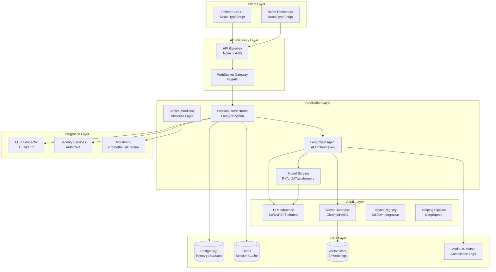
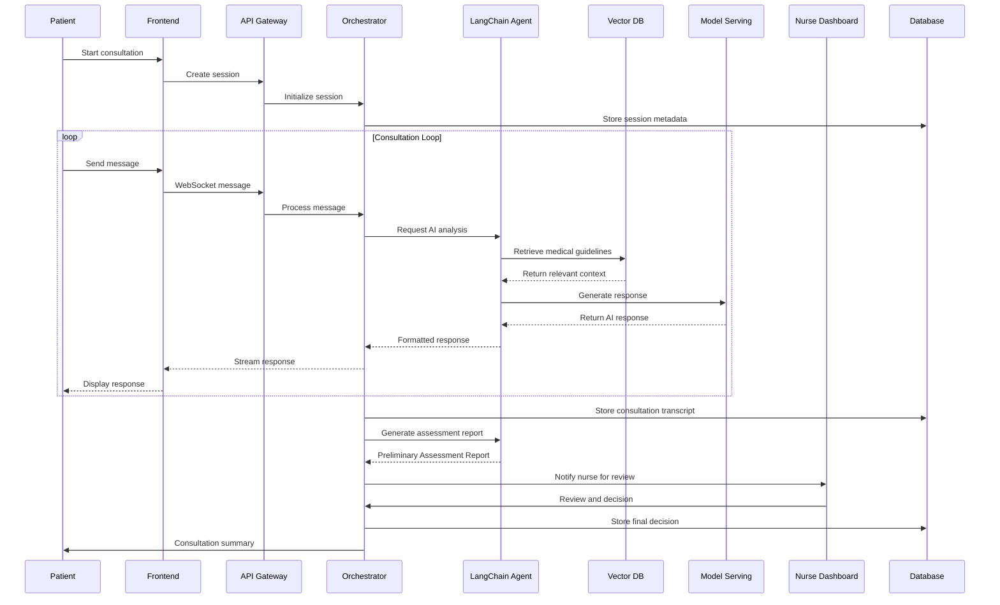
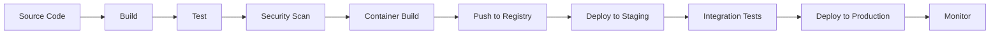

# Application Architecture Overview
**Medical AI Assistant System**

---

## 1. Executive Summary

The Medical AI Assistant is a production-ready, healthcare-grade AI system designed for clinic pre-screening and patient triage. Built with modern microservices architecture and healthcare compliance at its core, the system integrates large language models (LLMs), vector databases, and clinical workflows to provide safe, effective, and regulated AI-powered healthcare assistance.

### Key Architectural Principles
- **Patient Safety First**: Human-in-loop design with mandatory nurse review
- **Regulatory Compliance**: HIPAA, FDA, and ISO 27001 compliant architecture
- **Scalability**: Cloud-native design with Kubernetes orchestration
- **Security**: Zero-trust security model with comprehensive encryption
- **Auditability**: Complete audit trails for all clinical decisions
- **Modularity**: Microservices architecture enabling independent scaling

---

## 2. Overall System Architecture

### 2.1 High-Level Architecture



### 2.2 Design Patterns

#### Microservices Architecture
- **Service Independence**: Each service can be developed, deployed, and scaled independently
- **Clear Boundaries**: Defined interfaces between services using REST and WebSocket APIs
- **Database per Service**: Each service manages its own data store to ensure loose coupling

#### Event-Driven Architecture
- **Async Communication**: Services communicate asynchronously via Redis pub/sub
- **Event Sourcing**: All clinical decisions and state changes are recorded as events
- **CQRS Pattern**: Command Query Responsibility Segregation for optimal read/write operations

#### Circuit Breaker Pattern
- **Fault Isolation**: Prevents cascade failures across services
- **Fallback Mechanisms**: Provides graceful degradation when services are unavailable
- **Health Monitoring**: Continuous health checks with automatic recovery

#### Repository Pattern
- **Data Abstraction**: Provides a clean API for data access across all services
- **Testability**: Enables easy mocking and testing of data operations
- **Consistency**: Centralized data access logic ensures data consistency

---

## 3. Technology Stack

### 3.1 Backend Technologies

#### Core Framework
- **FastAPI** (0.109.0): Modern, high-performance Python web framework
  - Automatic API documentation with OpenAPI/Swagger
  - Async/await support for concurrent request handling
  - Built-in request validation and serialization
  
- **Pydantic** (2.5.3): Data validation and settings management
  - Runtime type checking and validation
  - Automatic data serialization/deserialization
  - Configuration management with environment variables

#### Database Technologies
- **PostgreSQL** (17+): Primary relational database
  - ACID compliance for data integrity
  - Advanced indexing for query optimization
  - Row-level security for multi-tenancy
  
- **Redis** (5.0+): Session store and caching layer
  - Sub-millisecond response times
  - Pub/sub for inter-service communication
  - Session state management
  
- **Chroma/FAISS**: Vector database for RAG (Retrieval-Augmented Generation)
  - Efficient similarity search
  - Real-time embedding updates
  - Scalable vector storage

#### AI/ML Framework
- **Transformers** (4.37.0): Hugging Face model library
  - Pre-trained language models
  - Tokenization and text processing
  - Model fine-tuning capabilities
  
- **LangChain** (1.0): AI orchestration framework
  - Chain-of-thought reasoning
  - Tool integration and function calling
  - Memory management for conversations
  
- **PyTorch** (2.1.2): Deep learning framework
  - GPU acceleration for model inference
  - Dynamic computation graphs
  - Production deployment optimization

#### Security & Authentication
- **JWT** (python-jose): Secure authentication tokens
- **bcrypt** (passlib): Password hashing and verification
- **Cryptography** (42.0.0): Encryption and security primitives

### 3.2 Frontend Technologies

#### Core Framework
- **React** (18+): Modern JavaScript library for user interfaces
  - Component-based architecture
  - Virtual DOM for performance
  - hooks for state management
  
- **TypeScript** (5.0+): Type-safe JavaScript development
  - Compile-time error checking
  - Enhanced IDE support
  - Better code maintainability
  
- **Vite** (4.0+): Next-generation frontend build tool
  - Hot module replacement
  - Fast development server
  - Optimized production builds

#### UI/UX Components
- **Tailwind CSS** (3.0+): Utility-first CSS framework
  - Responsive design system
  - Consistent styling tokens
  - Rapid UI development
  
- **Shadcn/ui**: High-quality React components
  - Accessible component library
  - Customizable design system
  - Medical-grade UI patterns

### 3.3 Infrastructure Technologies

#### Containerization
- **Docker** (20.0+): Application containerization
  - Multi-stage builds for optimization
  - Health check integration
  - Security scanning support
  
- **Docker Compose** (3.8): Local development orchestration
  - Service dependency management
  - Environment variable configuration
  - Development workflow automation

#### Orchestration
- **Kubernetes** (1.25+): Container orchestration platform
  - Auto-scaling and self-healing
  - Rolling deployments with zero downtime
  - Service mesh integration for observability
  
- **Helm** (3.10+): Kubernetes package management
  - Template-based configuration
  - Version control for deployments
  - Rollback and rollback capabilities

#### Cloud Infrastructure
- **Terraform** (1.0+): Infrastructure as Code
  - Multi-cloud deployment support (AWS, GCP, Azure)
  - State management and drift detection
  - Module-based infrastructure patterns

#### Monitoring & Observability
- **Prometheus** (2.40+): Metrics collection and alerting
  - Multi-dimensional data model
  - PromQL query language
  - Alertmanager for notification routing
  
- **Grafana** (9.0+): Visualization and dashboards
  - Real-time data visualization
  - Healthcare-specific dashboards
  - Custom alert configurations
  
- **Jaeger** (1.40+): Distributed tracing
  - End-to-end request tracing
  - Performance bottleneck identification
  - Clinical workflow monitoring

---

## 4. Key Architectural Components

### 4.1 Frontend Services

#### Patient Chat Interface
- **Purpose**: Guided patient symptom collection and interaction
- **Technology**: React, TypeScript, WebSocket client
- **Key Features**:
  - Real-time messaging with streaming responses
  - Progressive disclosure of medical questions
  - Accessibility compliance (WCAG 2.1 AA)
  - Multi-language support framework
  - Offline capability with data synchronization

#### Nurse Dashboard
- **Purpose**: Clinical review and triage management interface
- **Technology**: React, TypeScript, REST API client
- **Key Features**:
  - Queue management for triage reviews
  - Patient history and assessment review
  - Override capabilities with audit trails
  - Performance analytics and metrics
  - Role-based access control (RBAC)

### 4.2 Backend Services

#### API Gateway
- **Purpose**: Request routing, rate limiting, and security enforcement
- **Technology**: Nginx, Lua scripting, JWT validation
- **Key Responsibilities**:
  - Request authentication and authorization
  - Rate limiting and throttling
  - API versioning management
  - Request/response transformation
  - Security headers injection

#### Session Orchestrator
- **Purpose**: Manages patient consultation sessions and workflow coordination
- **Technology**: FastAPI, Python, async/await
- **Key Responsibilities**:
  - Session lifecycle management
  - Clinical workflow state tracking
  - Nurse notification and escalation
  - Audit trail generation
  - Error handling and recovery

#### LangChain Agent Runtime
- **Purpose**: AI-powered clinical reasoning and decision support
- **Technology**: LangChain, Python, custom tools
- **Key Responsibilities**:
  - Medical knowledge retrieval (RAG)
  - Symptom analysis and pattern recognition
  - Clinical decision support algorithms
  - Safety filter application
  - Response generation with citations

#### Model Serving Infrastructure
- **Purpose**: Production AI model inference and optimization
- **Technology**: PyTorch, FastAPI, CUDA optimization
- **Key Features**:
  - GPU-accelerated inference
  - Model versioning and rollback
  - A/B testing support
  - Performance monitoring
  - Dynamic scaling based on load

### 4.3 Data Layer Components

#### Primary Database (PostgreSQL)
- **Schema Design**: Normalized relational model for clinical data
- **Security**: Row-level security (RLS) for multi-tenancy
- **Performance**: Connection pooling, read replicas, query optimization
- **Compliance**: Encryption at rest, audit logging, backup automation

#### Cache Layer (Redis)
- **Session Management**: User session state and temporary data
- **Performance**: Query result caching, API response caching
- **Messaging**: Pub/sub for inter-service communication
- **Security**: Authenticated connections, network isolation

#### Vector Database (Chroma/FAISS)
- **Purpose**: Medical knowledge and guideline storage
- **Indexing**: HNSW (Hierarchical Navigable Small World) algorithm
- **Features**: Incremental updates, similarity search, metadata filtering
- **Security**: Encrypted storage, access controls, audit trails

#### Audit Database
- **Purpose**: Compliance logging and audit trail storage
- **Data**: All clinical decisions, user actions, system events
- **Retention**: 7-year retention policy (HIPAA requirement)
- **Access**: Restricted access with approval workflows

### 4.4 Integration Components

#### EHR Connector
- **Purpose**: Integration with existing Electronic Health Record systems
- **Standards**: HL7 FHIR R4, HL7 v2.x compatibility
- **Features**: Real-time data synchronization, bidirectional updates
- **Security**: OAuth 2.0, mutual TLS, data validation

#### Security Services
- **Authentication**: Multi-factor authentication (MFA) support
- **Authorization**: Role-based access control (RBAC) with fine-grained permissions
- **Encryption**: End-to-end encryption for all PHI data
- **Key Management**: Hardware security module (HSM) integration

---

## 5. System Boundaries and External Integrations

### 5.1 Internal System Boundaries

#### Trust Boundaries
```
┌─────────────────────────────────────────┐
│         HIGH TRUST ZONE                 │
│  ┌─────────────────────────────────┐   │
│  │     CLINICAL WORKFLOW           │   │
│  │  - Session Orchestrator         │   │
│  │  - LangChain Agent             │   │
│  │  - Model Serving               │   │
│  │  - Audit Database              │   │
│  └─────────────────────────────────┘   │
│                 │                       │
│                 │ (REST/WebSocket)      │
│                 ▼                       │
│  ┌─────────────────────────────────┐   │
│  │      MEDIUM TRUST ZONE          │   │
│  │  - API Gateway                  │   │
│  │  - Session Cache                │   │
│  │  - Primary Database             │   │
│  │  - Vector Database              │   │
│  └─────────────────────────────────┘   │
└─────────────────────────────────────────┘
                 │
                 │ (HTTPS/mTLS)
                 ▼
┌─────────────────────────────────────────┐
│          EXTERNAL ZONE                  │
│  - Client Applications                  │
│  - EHR Systems                          │
│  - Cloud Services                       │
│  - Monitoring Tools                     │
└─────────────────────────────────────────┘
```

#### Data Classification
- **Public**: System status, non-sensitive metrics
- **Internal**: Configuration, performance data
- **Confidential**: User preferences, non-PHI clinical data
- **Restricted**: Protected Health Information (PHI)

### 5.2 External Integrations

#### Electronic Health Record (EHR) Systems
- **Integration Type**: RESTful APIs with HL7 FHIR standards
- **Data Flow**: Read-only patient summary, write-back consultation notes
- **Authentication**: OAuth 2.0 with PKCE, mutual TLS
- **Compliance**: HIPAA Business Associate Agreements (BAA)
- **Supported Systems**: 
  - Epic MyChart
  - Cerner PowerChart
  - Allscripts
  - athenahealth
  - Custom FHIR servers

#### Cloud Infrastructure Providers

##### Amazon Web Services (AWS)
- **Primary Services**: EKS, RDS, ElastiCache, S3, CloudWatch
- **Compliance**: HIPAA eligible services, SOC 2, ISO 27001
- **Security**: VPC isolation, KMS encryption, WAF protection
- **Deployment**: Multi-AZ for high availability

##### Google Cloud Platform (GCP)
- **Primary Services**: GKE, Cloud SQL, Memorystore, Cloud Storage
- **Compliance**: HIPAA BAA, ISO 27001, SOC 2 Type II
- **Security**: VPC-SC, CMEK encryption, Identity-Aware Proxy
- **Deployment**: Multi-zonal clusters

##### Microsoft Azure
- **Primary Services**: AKS, Azure Database, Azure Cache, Blob Storage
- **Compliance**: HIPAA, HITRUST, ISO 27001, SOC 1/2
- **Security**: Private endpoints, Azure Key Vault, DDoS protection
- **Deployment**: Availability zones

#### Identity and Access Management
- **SAML 2.0**: Single Sign-On integration with healthcare organizations
- **OpenID Connect**: Modern authentication protocol
- **Active Directory**: Enterprise directory service integration
- **LDAP**: Legacy system integration support

#### Notification Services
- **Email**: HIPAA-compliant email with encryption
- **SMS**: Two-factor authentication and emergency notifications
- **Push Notifications**: Mobile app notifications
- **PagerDuty**: Critical alert escalation

#### Monitoring and Observability
- **DataDog**: Application performance monitoring
- **New Relic**: Full-stack observability
- **Splunk**: Security information and event management (SIEM)
- **PagerDuty**: Incident response and escalation

---

## 6. Data Flow Architecture

### 6.1 Patient Consultation Flow



### 6.2 Data Flow Architecture

#### Layer 1: Data Collection
```
Patient Input → Frontend Validation → API Gateway → Session Orchestrator
     ↓
Text Sanitization → PII Detection → Data Classification → Audit Logging
```

#### Layer 2: Data Processing
```
LangChain Agent → Vector Search → Model Inference → Clinical Rules Engine
     ↓
Safety Filters → Response Formatting → Confidence Scoring → Audit Trail
```

#### Layer 3: Data Storage
```
Primary Database → Audit Database → Vector Store → Cache Layer
     ↓
Encryption at Rest → Backup Automation → Retention Policies → Compliance Rules
```

#### Layer 4: Data Access
```
Query Request → Authentication → Authorization → Data Retrieval → Response
     ↓
Log Access → Audit Trail → Performance Monitoring → Security Alerts
```

### 6.3 Data Processing Pipeline

#### Real-time Data Flow
1. **Ingestion**: Patient messages received via WebSocket
2. **Validation**: Input sanitization and PII detection
3. **Processing**: AI analysis using LangChain and medical models
4. **Filtering**: Safety checks and clinical rule application
5. **Generation**: Response creation with citations and confidence scores
6. **Delivery**: Real-time response streaming to client
7. **Storage**: Audit logging and session persistence

#### Batch Data Flow
1. **Collection**: Daily clinical data aggregation
2. **Processing**: Model performance evaluation
3. **Analysis**: Quality metrics and compliance checks
4. **Storage**: Historical data for regulatory reporting
5. **Retention**: Automated data lifecycle management

---

## 7. Security and Compliance Frameworks

### 7.1 Security Architecture

#### Defense in Depth Strategy
```
┌─────────────────────────────────────────┐
│          EXTERNAL LAYERS               │
│  ┌─────────────────────────────────┐   │
│  │    Network Security             │   │
│  │  - WAF Protection               │   │
│  │  - DDoS Mitigation              │   │
│  │  - Intrusion Detection          │   │
│  └─────────────────────────────────┘   │
│  ┌─────────────────────────────────┐   │
│  │   Perimeter Security            │   │
│  │  - Firewall Rules               │   │
│  │  - Network Segmentation         │   │
│  │  - VPN Access Control           │   │
│  └─────────────────────────────────┘   │
└─────────────────────────────────────────┘
                 ↓
┌─────────────────────────────────────────┐
│         APPLICATION LAYERS              │
│  ┌─────────────────────────────────┐   │
│  │   Application Security          │   │
│  │  - Input Validation             │   │
│  │  - SQL Injection Prevention     │   │
│  │  - XSS Protection               │   │
│  └─────────────────────────────────┘   │
│  ┌─────────────────────────────────┐   │
│  │    Authentication & Auth        │   │
│  │  - Multi-Factor Auth            │   │
│  │  - Role-Based Access Control    │   │
│  │  - Session Management           │   │
│  └─────────────────────────────────┘   │
└─────────────────────────────────────────┘
                 ↓
┌─────────────────────────────────────────┐
│           DATA LAYERS                   │
│  ┌─────────────────────────────────┐   │
│  │   Data Protection               │   │
│  │  - Encryption at Rest           │   │
│  │  - Encryption in Transit        │   │
│  │  - Data Loss Prevention         │   │
│  └─────────────────────────────────┘   │
│  ┌─────────────────────────────────┐   │
│  │   Access Control                │   │
│  │  - Database Row-Level Security  │   │
│  │  - API Rate Limiting            │   │
│  │  - Audit Logging                │   │
│  └─────────────────────────────────┘   │
└─────────────────────────────────────────┘
```

#### Security Controls

##### Network Security
- **VPC Isolation**: Private subnets for all application components
- **Security Groups**: Least-privilege network access rules
- **Network Policies**: Kubernetes network segmentation
- **TLS Encryption**: End-to-end encryption for all communications
- **Certificate Management**: Automated certificate rotation

##### Application Security
- **Input Validation**: Comprehensive input sanitization and validation
- **Output Encoding**: XSS prevention through proper output encoding
- **CSRF Protection**: Cross-site request forgery prevention
- **Content Security Policy**: Browser-based security policy enforcement
- **Dependency Scanning**: Automated vulnerability scanning of dependencies

##### Identity and Access Management
- **Single Sign-On (SSO)**: SAML 2.0 and OpenID Connect support
- **Multi-Factor Authentication (MFA)**: Required for all clinical users
- **Role-Based Access Control (RBAC)**: Fine-grained permissions
- **Privileged Access Management (PAM)**: Admin access controls
- **Identity Governance**: Automated access review and certification

### 7.2 HIPAA Compliance Framework

#### Administrative Safeguards
- **Security Officer**: Designated HIPAA Security Officer
- **Workforce Training**: Regular security awareness training
- **Access Management**: Unique user identification and access controls
- **Incident Response**: Formal incident response procedures
- **Contingency Plan**: Data backup and disaster recovery procedures

#### Physical Safeguards
- **Facility Access Controls**: Physical access to servers and workstations
- **Workstation Controls**: Secure workstation configurations
- **Device and Media Controls**: Encryption and secure disposal procedures

#### Technical Safeguards
- **Access Control**: Unique user identification and emergency access procedures
- **Audit Controls**: Comprehensive logging of all system access
- **Integrity**: Data integrity controls and validation
- **Person or Entity Authentication**: Multi-factor authentication requirements
- **Transmission Security**: End-to-end encryption for all data transmission

#### HIPAA Implementation
```python
# Example: PHI Data Handling
class PHIDataHandler:
    def __init__(self):
        self.encryption_key = self._get_encryption_key()
        self.audit_logger = AuditLogger()
    
    def process_phi_data(self, data: Dict) -> Dict:
        # Audit log access
        self.audit_logger.log_access(
            user_id=current_user.id,
            resource_type="PHI_DATA",
            action="READ"
        )
        
        # Encrypt sensitive fields
        encrypted_data = self._encrypt_phi_fields(data)
        
        # Apply minimum necessary rule
        filtered_data = self._apply_minimum_necessary(data)
        
        return filtered_data
```

### 7.3 FDA Regulatory Compliance

#### Software as Medical Device (SaMD)
- **Clinical Decision Support**: FDA guidance for CDS software
- **Quality Management System**: ISO 13485 QMS implementation
- **Risk Management**: ISO 14971 risk management processes
- **Software Lifecycle**: IEC 62304 software lifecycle processes

#### FDA Submission Strategy
- **De Novo Classification**: For novel AI diagnostic systems
- **510(k) Clearance**: For predicate device comparisons
- **Real-World Evidence**: Post-market surveillance and reporting
- **Clinical Studies**: Prospective clinical validation studies

#### Clinical Decision Support Features
- **Transparency**: Clear explanation of AI recommendations
- **Validation**: Rigorous clinical testing and validation
- **Monitoring**: Continuous performance monitoring
- **Human Oversight**: Required human review of AI outputs

### 7.4 ISO 27001 Information Security Management

#### Information Security Policies
- **Security Policy Framework**: Comprehensive security policies
- **Risk Assessment**: Regular security risk assessments
- **Asset Management**: Information asset inventory and classification
- **Access Control Policy**: Formal access control procedures

#### Security Controls Implementation
- **A.5: Information Security Policies**: Policy management and compliance
- **A.6: Organization of Information Security**: Security governance structure
- **A.7: Human Resource Security**: Employee security procedures
- **A.8: Asset Management**: Information asset lifecycle management
- **A.9: Access Control**: Access control implementation
- **A.10: Cryptography**: Encryption and key management
- **A.11: Physical and Environmental Security**: Facility security
- **A.12: Operations Security**: Secure operations procedures
- **A.13: Communications Security**: Network security management
- **A.14: System Acquisition, Development, and Maintenance**: Secure development
- **A.15: Supplier Relationships**: Third-party security management
- **A.16: Information Security Incident Management**: Incident response
- **A.17: Information Security Aspects of Business Continuity**: BCP/DR
- **A.18: Compliance**: Legal and regulatory compliance

#### Continuous Improvement
- **Security Reviews**: Regular security assessments and audits
- **Penetration Testing**: Annual penetration testing exercises
- **Vulnerability Management**: Continuous vulnerability scanning and remediation
- **Security Metrics**: Key performance indicators for security effectiveness

---

## 8. Scalability and Performance

### 8.1 Horizontal Scaling Architecture

#### Auto-scaling Configuration
```yaml
apiVersion: autoscaling/v2
kind: HorizontalPodAutoscaler
metadata:
  name: medical-ai-backend-hpa
spec:
  scaleTargetRef:
    apiVersion: apps/v1
    kind: Deployment
    name: medical-ai-backend
  minReplicas: 3
  maxReplicas: 50
  metrics:
  - type: Resource
    resource:
      name: cpu
      target:
        type: Utilization
        averageUtilization: 70
  - type: Resource
    resource:
      name: memory
      target:
        type: Utilization
        averageUtilization: 80
  - type: Pods
    pods:
      metric:
        name: active_sessions
      target:
        type: AverageValue
        averageValue: "100"
```

#### Load Balancing Strategy
- **Application Load Balancer**: Layer 7 load balancing with content routing
- **Session Affinity**: Sticky sessions for WebSocket connections
- **Health Checks**: Automatic health check and failover
- **Geographic Distribution**: Multi-region deployment for global availability

### 8.2 Database Optimization

#### Read/Write Splitting
```
┌─────────────────────────────────────┐
│         Write Operations            │
│                                      │
│  Application → Primary Database     │
│     (Master/Slave Replication)      │
└─────────────────────────────────────┘
                 ↓
┌─────────────────────────────────────┐
│        Read Operations              │
│                                      │
│  Application → Read Replicas        │
│     (Connection Pooling)            │
└─────────────────────────────────────┘
```

#### Performance Optimization
- **Indexing Strategy**: Optimized indexes for clinical queries
- **Query Optimization**: Query plan analysis and optimization
- **Connection Pooling**: Efficient database connection management
- **Caching Strategy**: Multi-level caching (Redis, application, CDN)

### 8.3 AI Model Scaling

#### GPU Resource Management
- **Model Sharding**: Large models distributed across multiple GPUs
- **Dynamic Batching**: Efficient inference batching based on request volume
- **Model Quantization**: INT8 quantization for improved throughput
- **Load Balancing**: GPU-aware load balancing for inference services

#### Performance Metrics
- **Latency**: < 200ms for 95th percentile responses
- **Throughput**: 1000+ concurrent patient consultations
- **Availability**: 99.99% uptime SLA
- **Model Accuracy**: Continuous monitoring and drift detection

---

## 9. Deployment and DevOps

### 9.1 CI/CD Pipeline



#### CI/CD Stages
1. **Source Control**: Git with feature branch workflow
2. **Build**: Automated build with dependency resolution
3. **Testing**: Unit, integration, and end-to-end test suites
4. **Security Scanning**: Static code analysis and dependency scanning
5. **Container Building**: Multi-stage Docker builds
6. **Registry Deployment**: Secure container registry with image signing
7. **Staging Deployment**: Automated deployment to staging environment
8. **Validation**: Automated testing and manual approval gates
9. **Production Deployment**: Blue-green or canary deployment strategies
10. **Monitoring**: Real-time monitoring and alerting

### 9.2 Environment Strategy

#### Development Environment
- **Purpose**: Local development and feature development
- **Infrastructure**: Local Docker Compose setup
- **Data**: Synthetic data and de-identified test datasets
- **Access**: Developer laptops with VPN access

#### Staging Environment
- **Purpose**: Integration testing and pre-production validation
- **Infrastructure**: Cloud-based Kubernetes cluster
- **Data**: Synthetic data with realistic clinical scenarios
- **Access**: Automated CI/CD with manual approval gates

#### Production Environment
- **Purpose**: Live clinical operations
- **Infrastructure**: Multi-region Kubernetes clusters
- **Data**: Real PHI data with full encryption and protection
- **Access**: Restricted access with change management procedures

---

## 10. Monitoring and Observability

### 10.1 Observability Stack

#### Metrics Collection (Prometheus)
- **Application Metrics**: Request rates, latency, error rates
- **Business Metrics**: Consultation volumes, triage accuracy
- **Infrastructure Metrics**: CPU, memory, disk, network usage
- **Custom Metrics**: Clinical decision support metrics

#### Logging (Centralized)
- **Application Logs**: Structured JSON logs with correlation IDs
- **Access Logs**: HTTP request/response logging
- **Audit Logs**: All clinical and administrative actions
- **Security Logs**: Authentication, authorization, and security events

#### Tracing (Jaeger)
- **Request Tracing**: End-to-end request flow tracking
- **Performance Profiling**: Bottleneck identification
- **Clinical Workflow**: Patient journey and triage flow analysis

### 10.2 Healthcare-Specific Dashboards

#### Clinical Performance Dashboard
- **Triage Accuracy**: AI recommendation vs. nurse override rates
- **Patient Outcomes**: Clinical outcome tracking and analysis
- **Safety Metrics**: Red flag detection rates and emergency escalations
- **Quality Metrics**: Patient satisfaction and consultation effectiveness

#### System Health Dashboard
- **Service Availability**: Real-time service status and uptime
- **Performance Metrics**: Response times, throughput, and resource usage
- **Error Rates**: Application error tracking and analysis
- **Capacity Planning**: Resource utilization and scaling metrics

#### Compliance Dashboard
- **HIPAA Audit Status**: Compliance with HIPAA requirements
- **Security Incidents**: Security event tracking and response
- **Data Retention**: Compliance with data retention policies
- **Access Monitoring**: User access patterns and anomaly detection

---

## 11. Risk Management and Business Continuity

### 11.1 Risk Assessment

#### Technical Risks
- **Model Drift**: AI model performance degradation over time
- **Data Quality**: Poor quality input data affecting recommendations
- **System Availability**: Service outages affecting patient care
- **Security Breaches**: Unauthorized access to PHI data

#### Clinical Risks
- **Misdiagnosis**: AI providing incorrect medical recommendations
- **Alert Fatigue**: Too many false positive alerts
- **Human Error**: Nurse override errors or oversight
- **Workflow Disruption**: System changes affecting clinical workflows

#### Mitigation Strategies
- **Continuous Monitoring**: Real-time performance and quality monitoring
- **Human-in-the-Loop**: Mandatory human review for all AI recommendations
- **Redundancy**: Multiple levels of failover and backup systems
- **Training**: Comprehensive staff training on system usage and limitations

### 11.2 Business Continuity Planning

#### Disaster Recovery Strategy
- **Recovery Time Objective (RTO)**: 4 hours maximum downtime
- **Recovery Point Objective (RPO)**: 1 hour maximum data loss
- **Backup Frequency**: Continuous database replication + daily backups
- **Cross-Region Replication**: Automatic failover to secondary regions

#### Incident Response
- **Severity Levels**: Critical, High, Medium, Low incident classification
- **Response Teams**: 24/7 on-call rotations for different roles
- **Communication Plans**: Automated notifications and escalation procedures
- **Post-Incident Reviews**: Root cause analysis and improvement planning

---

## 12. Conclusion

The Medical AI Assistant architecture represents a comprehensive, production-ready solution for healthcare AI applications. Built with patient safety, regulatory compliance, and scalability at its core, the system provides a robust foundation for clinical decision support and patient triage.

### Key Architectural Strengths
- **Modular Design**: Microservices architecture enabling independent scaling and deployment
- **Security First**: Multi-layered security with comprehensive audit trails
- **Compliance Ready**: Built-in HIPAA, FDA, and ISO 27001 compliance features
- **Human-Centered**: Patient safety through human-in-loop workflows
- **Future-Proof**: Modern technology stack with continuous evolution capabilities

### Success Metrics
- **Clinical Safety**: Zero patient harm from AI recommendations
- **Regulatory Compliance**: 100% compliance with healthcare regulations
- **System Reliability**: 99.99% uptime with < 200ms response times
- **User Adoption**: High adoption rates among clinical staff
- **Patient Outcomes**: Measurable improvement in clinical outcomes

This architecture provides the foundation for safe, effective, and compliant AI-powered healthcare assistance, enabling healthcare organizations to leverage the benefits of AI while maintaining the highest standards of patient care and regulatory compliance.

---

**Document Information:**
- **Version**: 1.0
- **Created**: November 2025
- **Classification**: Internal Use
- **Review Cycle**: Quarterly
- **Owner**: Chief Technology Officer
- **Approver**: Chief Medical Officer

**Related Documents:**
- [Security Architecture](security-architecture.md)
- [Data Flow Diagrams](data-flow-diagrams.md)
- [Integration Patterns](integration-patterns.md)
- [Deployment Guide](../deployment/README.md)
- [Compliance Framework](../regulatory-submissions/README.md)