# User and Application Interaction Analysis
## Medical AI Assistant System

**Document Version:** 1.0  
**Created:** November 4, 2025  
**Last Updated:** November 4, 2025  
**Next Review:** February 2026  

---

## Table of Contents

1. [Executive Summary](#executive-summary)
2. [System Overview](#system-overview)
3. [User Types and Access Control](#user-types-and-access-control)
4. [User Interaction Flows](#user-interaction-flows)
5. [API Endpoints and Integrations](#api-endpoints-and-integrations)
6. [Authentication and Authorization](#authentication-and-authorization)
7. [Data Entry and Retrieval Processes](#data-entry-and-retrieval-processes)
8. [User Interface Components](#user-interface-components)
9. [WebSocket Communication](#websocket-communication)
10. [Clinical Workflow Integration](#clinical-workflow-integration)
11. [Security and Compliance](#security-and-compliance)
12. [Audit Trails and Monitoring](#audit-trails-and-monitoring)
13. [User Journey Flowcharts](#user-journey-flowcharts)
14. [Technical Architecture Diagrams](#technical-architecture-diagrams)

---

## Executive Summary

The Medical AI Assistant system is a comprehensive healthcare platform designed to facilitate AI-powered patient consultations, clinical assessments, and healthcare workflow optimization. This analysis documents all user interaction patterns, system integrations, and technical workflows to ensure optimal user experience, regulatory compliance, and clinical safety.

### Key System Capabilities
- **AI-Powered Patient Consultations**: Interactive chat-based medical assessments
- **Clinical Decision Support**: Risk assessment, triage recommendations, and red flag detection
- **Real-time Communication**: WebSocket-based instant messaging and notifications
- **Healthcare Provider Integration**: Nurse dashboard, queue management, and assessment review
- **Compliance Framework**: HIPAA-compliant data handling and audit trails
- **External System Integration**: EHR/EMR systems, FHIR APIs, and healthcare protocols

---

## System Overview

The Medical AI Assistant operates as a distributed healthcare platform with the following core components:

### Architecture Layers
1. **Frontend Layer**: React-based user interfaces for patients and healthcare providers
2. **API Gateway**: RESTful API with authentication and rate limiting
3. **WebSocket Service**: Real-time communication infrastructure
4. **AI Engine**: Medical consultation and assessment algorithms
5. **Data Layer**: Encrypted healthcare data storage with audit capabilities
6. **Integration Layer**: EHR/EMR connectors and external API interfaces

---

## User Types and Access Control

### 1. Patients
**Role Type**: `patient`  
**Access Level**: Patient-Internal

#### Permissions and Access Rights:
- **Session Management**: Create, view, and end their own consultation sessions
- **Chat Interface**: Send messages to AI assistant and view conversation history
- **Personal Data**: View and update their own basic information
- **Consent Management**: View, accept, and manage consent forms
- **Assessment Access**: View their own assessment reports and recommendations

#### Data Access Restrictions:
- **Personal Information Only**: Cannot access other patients' data
- **Limited PHI Access**: Can only view their own Protected Health Information
- **No Clinical Data**: Cannot access clinical records, medical history, or assessment details
- **Session-Specific**: Data access is limited to active and recently completed sessions

#### Security Constraints:
- **Device Fingerprinting**: Sessions tracked for security and compliance
- **IP Validation**: Access monitored for geographic and security compliance
- **Two-Factor Authentication**: Optional but recommended for sensitive interactions

### 2. Nurses/Healthcare Providers
**Role Type**: `nurse`  
**Access Level**: Healthcare-Clinical

#### Permissions and Access Rights:
- **Assessment Queue**: View and manage pending patient assessments
- **PAR Management**: Review, approve, override, and annotate Patient Assessment Reports
- **Patient Communications**: View patient chat sessions (for review purposes only)
- **Clinical Notes**: Add clinical context and recommendations
- **Queue Analytics**: Access performance metrics and queue statistics
- **Red Flag Management**: Review and respond to emergency alerts

#### Clinical Oversight Capabilities:
- **Override Authority**: Can modify AI recommendations with clinical justification
- **Priority Assignment**: Can reassign queue priority based on clinical judgment
- **Escalation Powers**: Can initiate emergency protocols and specialist referrals
- **Quality Assurance**: Can flag system issues and request model retraining

#### Data Access Restrictions:
- **Institutional Boundary**: Access limited to patients within their healthcare organization
- **Role-Based Filtering**: Can only access data relevant to their clinical responsibilities
- **Audit Trail**: All actions are logged and subject to clinical audit review

### 3. Administrators
**Role Type**: `admin`  
**Access Level**: System-Superuser

#### Permissions and Access Rights:
- **System Configuration**: Modify system settings and parameters
- **User Management**: Create, modify, and deactivate user accounts
- **Audit Access**: View comprehensive system logs and audit trails
- **Performance Monitoring**: Access system analytics and performance metrics
- **Compliance Reports**: Generate regulatory compliance reports
- **Model Management**: Monitor and manage AI model performance

#### Administrative Functions:
- **Security Management**: Configure authentication and authorization policies
- **Integration Setup**: Configure external system connections and API keys
- **Backup and Recovery**: Manage data backup and disaster recovery procedures
- **Incident Response**: Access security incidents and compliance violations

### 4. Customers (Healthcare Organizations)
**Role Type**: `customer`  
**Access Level**: Organizational

#### Permissions and Access Rights:
- **Organizational Dashboard**: View system usage and metrics for their organization
- **User Provisioning**: Manage their own healthcare provider accounts
- **Integration Management**: Configure EHR/EMR connections and data flows
- **Usage Analytics**: Access utilization reports and cost analysis
- **Compliance Documentation**: Download compliance reports and audit trails

### 5. Partners (Integration Partners)
**Role Type**: `partner`  
**Access Level**: Integration-External

#### Permissions and Access Rights:
- **API Access**: Limited API access for integration purposes
- **Webhook Management**: Configure and manage integration webhooks
- **Documentation Access**: Access to API documentation and integration guides
- **Sandbox Testing**: Access to development and testing environments

#### Integration Limitations:
- **Rate Limiting**: Strict API rate limits to prevent system overload
- **Data Isolation**: Access only to data explicitly shared via integration
- **Compliance Validation**: All integrations must meet healthcare compliance standards

---

## User Interaction Flows

### Patient Interaction Flow

#### 1. Initial Access and Onboarding
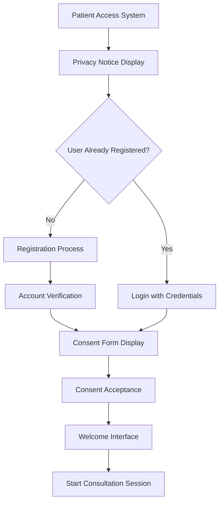

#### 2. Consultation Session Workflow
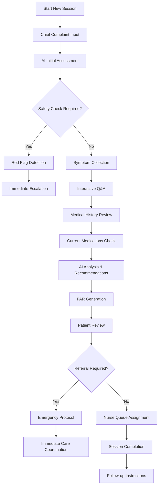

#### 3. Real-time Chat Interaction
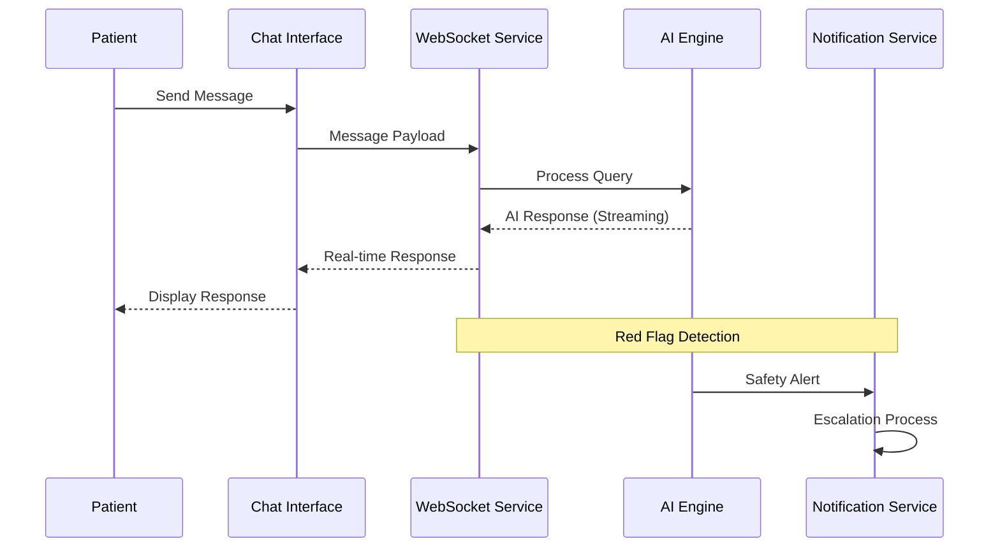

### Healthcare Provider (Nurse) Interaction Flow

#### 1. Authentication and Dashboard Access
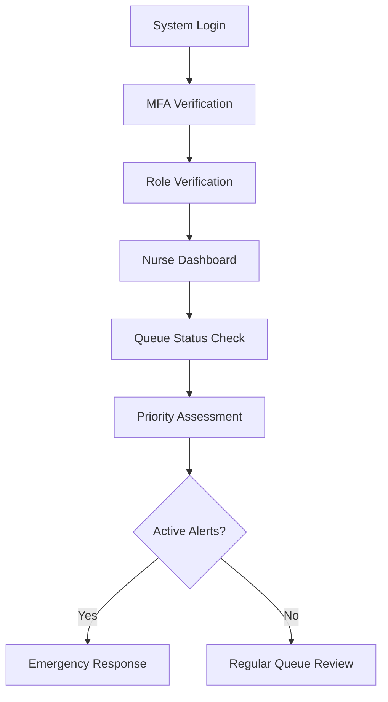

#### 2. Assessment Review Process
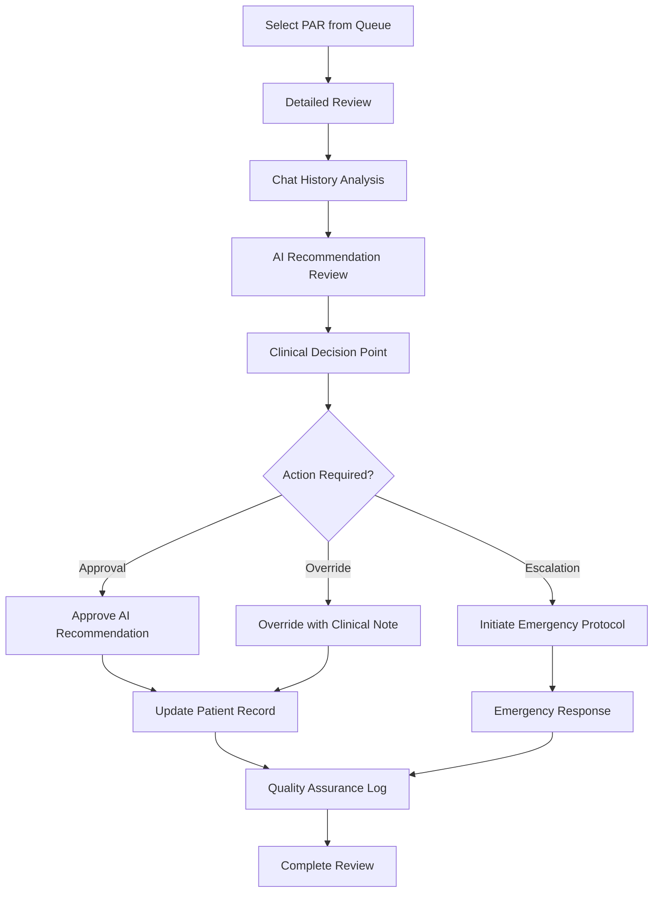

#### 3. Queue Management Workflow
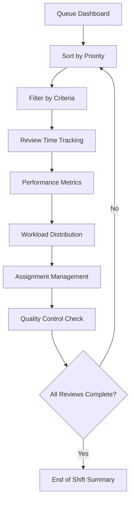

### Administrator Interaction Flow

#### 1. System Configuration
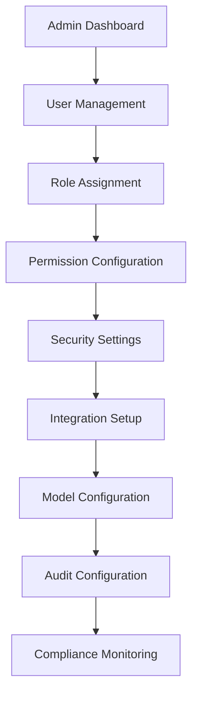

#### 2. Incident Response Workflow
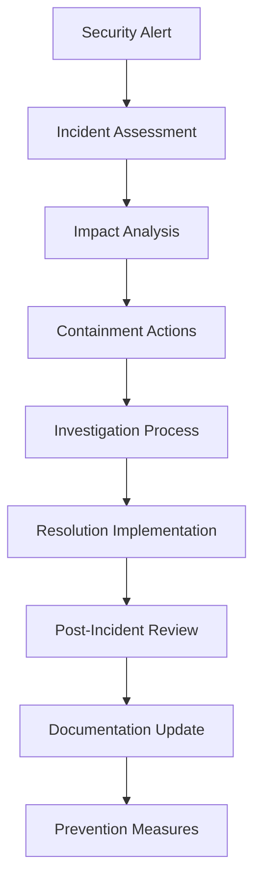

---

## API Endpoints and Integrations

### Core API Endpoints

#### Authentication Endpoints
```
POST /auth/login
- Description: User authentication
- Parameters: email, password
- Returns: JWT token, user profile
- Security: Rate limited, MFA support

POST /auth/register
- Description: New user registration
- Parameters: email, password, user details
- Returns: Account verification status

POST /auth/refresh
- Description: Token refresh
- Returns: New JWT token
- Security: Validates existing token

GET /auth/me
- Description: Current user profile
- Returns: User information, roles, permissions
```

#### Session Management Endpoints
```
POST /sessions
- Description: Create new consultation session
- Parameters: patient_id (optional), session metadata
- Returns: Session object with initial setup

GET /sessions/{session_id}
- Description: Retrieve session details
- Returns: Complete session information

PATCH /sessions/{session_id}/status
- Description: Update session status
- Parameters: status (active, completed, cancelled)

DELETE /sessions/{session_id}
- Description: End session and cleanup
- Returns: Session closure confirmation
```

#### Chat and Messaging Endpoints
```
POST /sessions/{session_id}/messages
- Description: Send message to AI assistant
- Parameters: content, message_type
- Returns: Message confirmation

GET /sessions/{session_id}/messages
- Description: Retrieve conversation history
- Parameters: pagination, filters
- Returns: Message list with metadata

WebSocket /ws/chat/{session_id}
- Description: Real-time chat interface
- Features: Streaming responses, typing indicators
```

#### Assessment and PAR Endpoints
```
GET /pars
- Description: List Patient Assessment Reports
- Parameters: filters, pagination, search
- Returns: PAR summary list

GET /pars/{par_id}
- Description: Retrieve specific PAR
- Returns: Complete assessment report

PATCH /pars/{par_id}/review
- Description: Update PAR with nurse review
- Parameters: status, notes, override_reason

GET /pars/queue
- Description: Get nurse queue
- Parameters: priority filters, status
- Returns: Prioritized assessment queue
```

#### Healthcare Provider Endpoints
```
GET /nurse/queue
- Description: Nurse assessment queue
- Parameters: filters, pagination
- Returns: Priority-sorted queue

POST /nurse/queue/{par_id}/review
- Description: Submit nurse review
- Parameters: action, notes, recommendations

GET /nurse/dashboard/stats
- Description: Dashboard statistics
- Returns: Performance metrics, analytics
```

#### Administrative Endpoints
```
GET /admin/system/health
- Description: System health status
- Returns: Service status, performance metrics

GET /admin/audit/logs
- Description: Retrieve audit trail
- Parameters: filters, pagination
- Returns: Comprehensive audit log

POST /admin/models/reload
- Description: Reload AI models
- Parameters: model_version, force_reload
```

### External System Integrations

#### EHR/EMR System Integration
```typescript
interface EHRSystemConfig {
  system_type: 'epic' | 'cerner' | 'allscripts' | 'custom';
  endpoint_url: string;
  authentication: {
    type: 'oauth2' | 'api_key' | 'saml';
    credentials: Record<string, string>;
  };
  data_mapping: {
    patient_id: string;
    encounter_data: string[];
    clinical_notes: string[];
  };
}

interface EHRDataSync {
  sync_frequency: 'real_time' | 'hourly' | 'daily';
  sync_scope: 'patient_data' | 'encounters' | 'clinical_notes';
  error_handling: 'retry' | 'queue' | 'skip';
}
```

#### FHIR Integration
```typescript
// FHIR R4 Integration for Healthcare Interoperability
interface FHIRConfiguration {
  server_url: string;
  client_id: string;
  scope: string;
  resources: {
    patient: boolean;
    encounter: boolean;
    observation: boolean;
    condition: boolean;
    diagnostic_report: boolean;
  };
}

// Example FHIR Patient Resource Mapping
interface FHIRPatientResource {
  resourceType: 'Patient';
  id: string;
  identifier: Array<{
    system: string;
    value: string;
  }>;
  name: Array<{
    family: string;
    given: string[];
  }>;
  gender: 'male' | 'female' | 'other' | 'unknown';
  birthDate: string;
}
```

#### Third-party Healthcare APIs
```typescript
interface HealthcareAPIIntegration {
  name: string;
  type: 'drug_database' | 'medical_codes' | 'lab_integration';
  endpoint: string;
  authentication: APIAuthConfig;
  data_format: 'json' | 'xml' | 'hl7';
  rate_limits: {
    requests_per_minute: number;
    burst_limit: number;
  };
}

// Drug Database Integration Example
interface DrugDatabaseAPI {
  search_drug: (query: string) => Promise<DrugInfo[]>;
  check_interactions: (medications: string[]) => Promise<InteractionWarning[]>;
  get_dosage_info: (drug_name: string, age: number) => Promise<DosageInfo>;
}
```

---

## Authentication and Authorization

### Authentication Framework

#### JWT Token Structure
```typescript
interface JWTPayload {
  sub: string;                    // User ID
  email: string;                  // User email
  role: UserRole;                 // Primary role
  permissions: Permission[];      // Detailed permissions
  organization_id?: string;       // Healthcare organization
  session_id?: string;            // Current session
  exp: number;                    // Expiration timestamp
  iat: number;                    // Issued at timestamp
  jti: string;                    // Token ID for revocation
}

type UserRole = 'patient' | 'nurse' | 'admin' | 'customer' | 'partner';
type Permission = 'read' | 'write' | 'delete' | 'admin' | 'override' | 'emergency';
```

#### Multi-Factor Authentication
```typescript
interface MFASetup {
  user_id: string;
  primary_method: 'totp' | 'sms' | 'email';
  backup_methods: MFAMethod[];
  is_required: boolean;
  last_verification?: string;
}

interface MFAMethod {
  type: 'totp' | 'sms' | 'email' | 'backup_code';
  identifier: string;             // Phone number, email, etc.
  is_verified: boolean;
  created_at: string;
}
```

#### Role-Based Access Control (RBAC)
```typescript
interface PermissionMatrix {
  [UserRole: string]: {
    [Resource: string]: {
      [Action: string]: boolean;
    };
  };
}

const ROLE_PERMISSIONS: PermissionMatrix = {
  patient: {
    sessions: { create: true, read: true, update: false, delete: false },
    messages: { create: true, read: true, update: false, delete: false },
    assessments: { read: true, create: false, update: false, delete: false },
    admin: { read: false, write: false, delete: false, admin: false }
  },
  nurse: {
    sessions: { create: true, read: true, update: true, delete: false },
    messages: { create: true, read: true, update: true, delete: false },
    assessments: { read: true, create: false, update: true, delete: false },
    pars: { read: true, create: false, update: true, delete: false },
    admin: { read: true, write: false, delete: false, admin: false }
  },
  admin: {
    '*': { read: true, write: true, update: true, delete: true, admin: true }
  }
};
```

### HIPAA Compliance Implementation

#### Access Control Requirements
```typescript
interface HIPAAAccessLog {
  user_id: string;
  patient_id: string;
  access_type: 'view' | 'modify' | 'export' | 'delete';
  justification: string;          // Clinical/business reason
  timestamp: string;
  session_id: string;
  ip_address: string;
  user_agent: string;
  data_elements: string[];        // Specific PHI accessed
}

// Required for HIPAA Section 164.312(a)(1)
class HIPAAController {
  validateAccess(userId: string, resource: string, action: string): boolean {
    // Implement minimum necessary access principle
    // Log all PHI access
    // Enforce role-based restrictions
  }
  
  auditAccess(accessLog: HIPAAAccessLog): void {
    // Store audit trail
    // Alert on suspicious access patterns
    // Generate compliance reports
  }
}
```

#### Data Encryption Standards
```typescript
// HIPAA Technical Safeguards Implementation
interface EncryptionConfig {
  data_at_rest: {
    algorithm: 'AES-256-GCM';
    key_management: 'aws_kms' | 'azure_key_vault' | 'hashicorp_vault';
    rotation_schedule: '90_days';
  };
  data_in_transit: {
    protocol: 'TLS_1.3';
    certificate_management: 'automatic';
    cipher_suites: string[];
  };
  application_layer: {
    field_level_encryption: string[];
    tokenization_format: 'vault' | 'format_preserving';
  };
}
```

#### Session Management for PHI
```typescript
interface PHISessionConfig {
  max_duration: number;           // Maximum session time (minutes)
  idle_timeout: number;           // Idle timeout (minutes)
  concurrent_sessions: number;    // Maximum concurrent sessions
  automatic_logout: boolean;      // Enable auto-logout on timeout
  security_flags: {
    secure_cookie: boolean;
    http_only: boolean;
    same_site: 'strict' | 'lax';
  };
}

class PHISessionManager {
  createSecureSession(userId: string, role: UserRole): PHISession {
    // Generate secure session token
    // Set appropriate security flags
    // Initialize audit logging
    // Configure automatic cleanup
  }
  
  validateSession(sessionId: string, requiredPermissions: Permission[]): boolean {
    // Check session validity
    // Verify permissions
    // Update audit trail
    // Extend session if active
  }
}
```

---

## Data Entry and Retrieval Processes

### Patient Data Flow

#### Data Collection Process
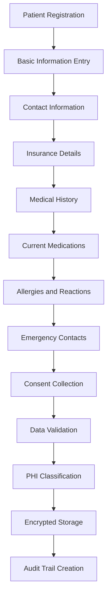

#### Consultation Data Collection
```typescript
interface ConsultationDataFlow {
  collection_points: {
    initial_intake: {
      chief_complaint: string;
      symptom_onset: string;
      severity_scale: number;
      associated_symptoms: string[];
    };
    detailed_history: {
      past_medical_history: MedicalHistory[];
      current_medications: Medication[];
      allergies: AllergyRecord[];
      family_history: FamilyHistoryItem[];
    };
    physical_assessment: {
      vital_signs: VitalSigns;
      physical_examination: ExaminationFindings;
      functional_assessment: FunctionalStatus;
    };
  };
  data_validation: {
    format_validation: boolean;
    range_validation: boolean;
    cross_field_validation: boolean;
    clinical_logic_validation: boolean;
  };
  quality_control: {
    duplicate_detection: boolean;
    completeness_check: boolean;
    consistency_verification: boolean;
    clinical_plausibility: boolean;
  };
}
```

### Healthcare Provider Data Entry

#### Clinical Assessment Process
```typescript
interface ClinicalDataEntry {
  assessment_types: {
    initial_assessment: {
      triage_level: 'low' | 'medium' | 'high' | 'critical';
      risk_factors: RiskFactor[];
      immediate_actions: string[];
      follow_up_required: boolean;
    };
    ongoing_assessment: {
      progress_notes: string;
      treatment_response: 'improved' | 'stable' | 'worsened';
      plan_modifications: string[];
      discharge_planning: boolean;
    };
    discharge_assessment: {
      outcome: 'resolved' | 'improved' | 'stable' | 'worsened' | 'transferred';
      disposition: string;
      patient_instructions: string[];
      follow_up_scheduled: boolean;
    };
  };
  documentation_requirements: {
    timestamp_requirement: boolean;        // All entries timestamped
    provider_identification: boolean;      // Provider clearly identified
    authentication_required: boolean;      // Digital signature required
    amendment_capability: boolean;         // Can amend previous entries
  };
}
```

### Data Retrieval and Display

#### PHI Access Patterns
```typescript
interface PHIRetrievalConfig {
  access_patterns: {
    patient_self_access: {
      allowed_fields: string[];
      restricted_fields: string[];
      time_limitations: number;           // How far back they can see
    };
    clinical_team_access: {
      role_based_access: RoleBasedFilter[];
      minimum_necessary: boolean;
      consent_override: boolean;
    };
    administrative_access: {
      audit_logging: boolean;
      justification_required: boolean;
      escalation_triggers: string[];
    };
  };
  display_settings: {
    field_visibility: {
      sensitive_fields: 'masked' | 'hidden' | 'protected';
      print_restrictions: boolean;
      export_limitations: boolean;
    };
    access_logging: {
      automatic_audit: boolean;
      user_notification: boolean;
      real_time_monitoring: boolean;
    };
  };
}
```

---

## User Interface Components

### React Component Architecture

#### Core Layout Components
```typescript
// Main Application Layout
interface AppLayoutProps {
  user: User;
  children: React.ReactNode;
  sidebar?: React.ComponentType<SidebarProps>;
  header?: React.ComponentType<HeaderProps>;
  notifications?: React.ComponentType<NotificationProps>;
}

interface LayoutComponents {
  ResponsiveSidebar: {
    user_role: UserRole;
    navigation_items: NavigationItem[];
    collapsed_state: boolean;
    mobile_optimized: boolean;
  };
  NotificationCenter: {
    real_time_alerts: boolean;
    priority_filtering: boolean;
    notification_history: boolean;
  };
  ConnectionStatus: {
    connection_state: 'connected' | 'disconnected' | 'reconnecting';
    latency_display: boolean;
    automatic_reconnect: boolean;
  };
}
```

#### Patient Chat Interface
```typescript
interface PatientChatComponents {
  ChatContainer: {
    session_management: {
      start_session: () => Promise<Session>;
      end_session: () => Promise<void>;
      session_status: ConnectionState;
    };
    message_handling: {
      send_message: (content: string) => Promise<Message>;
      message_streaming: boolean;
      typing_indicators: boolean;
    };
    safety_features: {
      red_flag_detection: boolean;
      crisis_intervention: boolean;
      emergency_protocols: boolean;
    };
  };
  
  ChatInput: {
    input_validation: {
      content_filtering: boolean;
      length_limits: number;
      medical_terminology_support: boolean;
    };
    accessibility_features: {
      voice_input: boolean;
      keyboard_navigation: boolean;
      screen_reader_support: boolean;
    };
    real_time_feedback: {
      character_count: boolean;
      medical_terminology_detection: boolean;
      urgency_indicators: boolean;
    };
  };
  
  MessageDisplay: {
    message_types: {
      patient_message: MessageBubble;
      ai_response: MessageBubble;
      system_notification: NotificationMessage;
      emergency_alert: AlertMessage;
    };
    formatting_support: {
      medical_formatting: boolean;
      code_snippets: boolean;
      rich_text_support: boolean;
    };
  };
}
```

#### Nurse Dashboard Components
```typescript
interface NurseDashboardComponents {
  QueueView: {
    queue_management: {
      priority_sorting: boolean;
      filter_capabilities: QueueFilters;
      real_time_updates: boolean;
      workload_balancing: boolean;
    };
    display_features: {
      patient_privacy_masking: boolean;
      urgency_indicators: boolean;
      wait_time_tracking: boolean;
      performance_metrics: boolean;
    };
  };
  
  PARDetailView: {
    assessment_details: {
      session_transcript: ChatMessage[];
      ai_recommendations: AIRecommendation[];
      risk_assessment: RiskAnalysis;
      clinical_notes: ClinicalNote[];
    };
    action_buttons: {
      approve_recommendation: () => Promise<void>;
      override_with_reason: (reason: string) => Promise<void>;
      escalate_emergency: () => Promise<void>;
      add_clinical_context: (note: string) => Promise<void>;
    };
  };
  
  AnalyticsDashboard: {
    metrics_display: {
      daily_statistics: DailyMetrics;
      performance_trends: TrendAnalysis;
      quality_indicators: QualityMetrics;
      workload_distribution: WorkloadAnalysis;
    };
    reporting_features: {
      export_capabilities: boolean;
      custom_date_ranges: boolean;
      comparative_analysis: boolean;
      predictive_insights: boolean;
    };
  };
}
```

### User Experience Optimization

#### Responsive Design Implementation
```typescript
interface ResponsiveConfig {
  breakpoints: {
    mobile: '320px';
    tablet: '768px';
    desktop: '1024px';
    large_desktop: '1440px';
  };
  component_adaptations: {
    chat_interface: {
      mobile_layout: 'stacked';
      tablet_layout: 'split_view';
      desktop_layout: 'multi_panel';
    };
    nurse_dashboard: {
      mobile_layout: 'card_based';
      tablet_layout: 'grid_layout';
      desktop_layout: 'full_dashboard';
    };
  };
  performance_optimizations: {
    lazy_loading: boolean;
    virtual_scrolling: boolean;
    code_splitting: boolean;
    bundle_optimization: boolean;
  };
}
```

#### Accessibility Features
```typescript
interface AccessibilityFeatures {
  screen_reader_support: {
    aria_labels: boolean;
    role_announcements: boolean;
    navigation_cues: boolean;
  };
  keyboard_navigation: {
    focus_management: boolean;
    shortcuts: KeyboardShortcut[];
    trap_focus: boolean;
  };
  visual_accessibility: {
    high_contrast_mode: boolean;
    font_size_adjustment: boolean;
    color_blind_support: boolean;
    reduced_motion: boolean;
  };
  cognitive_accessibility: {
    simple_language_mode: boolean;
    guided_interactions: boolean;
    confirmation_dialogs: boolean;
    help_tooltips: boolean;
  };
}
```

---

## WebSocket Communication

### Real-time Communication Architecture

#### WebSocket Connection Management
```typescript
interface WebSocketConfiguration {
  connection_management: {
    auto_reconnect: boolean;
    max_reconnect_attempts: number;
    reconnect_backoff: 'linear' | 'exponential';
    heartbeat_interval: number;
    connection_timeout: number;
  };
  security_features: {
    connection_authentication: boolean;
    message_encryption: boolean;
    rate_limiting: boolean;
    session_validation: boolean;
  };
  message_handling: {
    message_queueing: boolean;
    delivery_confirmation: boolean;
    ordering_guarantees: boolean;
    broadcast_capabilities: boolean;
  };
}
```

#### Message Types and Protocols
```typescript
interface WebSocketMessageTypes {
  // Core messaging
  chat_message: {
    type: 'message';
    payload: {
      session_id: string;
      message_id: string;
      content: string;
      sender_type: 'patient' | 'agent' | 'system';
      timestamp: string;
      metadata: MessageMetadata;
    };
    acknowledgments: boolean;
    encryption: boolean;
  };
  
  // Real-time updates
  session_update: {
    type: 'session_update';
    payload: {
      session_id: string;
      status: SessionStatus;
      participants: string[];
      metadata: SessionMetadata;
    };
    broadcast_scope: 'participants' | 'team' | 'all';
  };
  
  // Safety and emergency
  red_flag_alert: {
    type: 'red_flag_alert';
    payload: {
      session_id: string;
      alert_type: 'medical_emergency' | 'safety_concern' | 'system_issue';
      severity: 'low' | 'medium' | 'high' | 'critical';
      description: string;
      immediate_actions: string[];
      escalation_contacts: string[];
    };
    notification_priority: 'high' | 'critical';
    requires_acknowledgment: boolean;
  };
  
  // Queue management (for nurses)
  queue_update: {
    type: 'queue_update';
    payload: {
      queue_id: string;
      changes: QueueChange[];
      new_priorities: PriorityUpdate[];
      status_updates: StatusUpdate[];
    };
    subscription_scope: 'nurses' | 'admins';
  };
  
  // System notifications
  system_notification: {
    type: 'system_notification';
    payload: {
      notification_type: 'maintenance' | 'update' | 'incident' | 'policy_change';
      title: string;
      content: string;
      action_required: boolean;
      expiration_date?: string;
    };
    broadcast_scope: 'all' | 'role_based' | 'user_specific';
  };
}
```

#### Connection Security and Authentication
```typescript
interface WebSocketSecurity {
  authentication: {
    token_validation: boolean;
    session_verification: boolean;
    role_based_subscription: boolean;
  };
  encryption: {
    message_encryption: boolean;
    key_rotation: boolean;
    perfect_forward_secrecy: boolean;
  };
  monitoring: {
    connection_logging: boolean;
    message_auditing: boolean;
    threat_detection: boolean;
    rate_limit_enforcement: boolean;
  };
}

class SecureWebSocketManager {
  async establishSecureConnection(
    sessionId: string, 
    userRole: UserRole, 
    authToken: string
  ): Promise<WebSocketConnection> {
    // 1. Validate authentication token
    // 2. Verify session permissions
    // 3. Establish encrypted connection
    // 4. Set up role-based message filters
    // 5. Initialize monitoring and auditing
  }
  
  handleMessageSecurity(message: WebSocketMessage): SecurityValidationResult {
    // 1. Verify message authenticity
    // 2. Check authorization for message type
    // 3. Validate payload integrity
    // 4. Log for audit trail
    // 5. Apply rate limiting if needed
  }
}
```

### Real-time Features Implementation

#### Typing Indicators and Presence
```typescript
interface RealTimeFeatures {
  typing_indicators: {
    enabled: boolean;
    user_identification: boolean;
    timeout_duration: number;
    visual_feedback: 'dots' | 'animation' | 'text';
  };
  presence_system: {
    online_status: boolean;
    away_status: boolean;
    do_not_disturb: boolean;
    last_seen_timestamp: boolean;
  };
  collaborative_features: {
    concurrent_editing: boolean;
    cursor_tracking: boolean;
    shared_cursors: boolean;
  };
}
```

#### Streaming AI Responses
```typescript
interface StreamingConfiguration {
  response_streaming: {
    enabled: boolean;
    chunk_size: number;
    streaming_timeout: number;
    fallback_strategy: 'complete' | 'partial' | 'retry';
  };
  performance_optimization: {
    progressive_display: boolean;
    incremental_parsing: boolean;
    memory_management: boolean;
  };
  error_handling: {
    connection_interruption: 'pause' | 'retry' | 'abort';
    timeout_behavior: 'continue' | 'restart' | 'fallback';
    corruption_recovery: boolean;
  };
}
```

---

## Clinical Workflow Integration

### Triage and Assessment Workflow

#### AI-Driven Triage Process
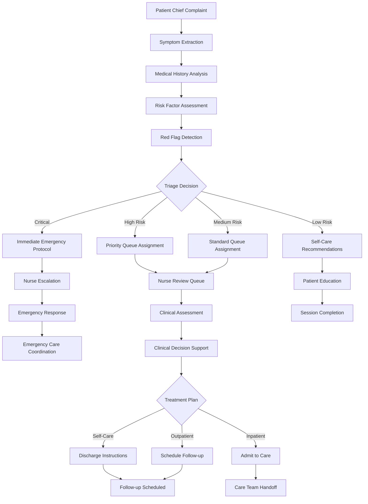

#### Clinical Decision Support Integration
```typescript
interface ClinicalDecisionSupport {
  assessment_framework: {
    primary_assessment: {
      chief_complaint_analysis: boolean;
      symptom_clustering: boolean;
      severity_scaling: boolean;
      urgency_determination: boolean;
    };
    secondary_assessment: {
      differential_diagnosis: boolean;
      risk_stratification: boolean;
      guideline_matching: boolean;
      evidence_review: boolean;
    };
  };
  recommendation_engine: {
    ai_suggestions: {
      confidence_threshold: number;
      evidence_level: 'A' | 'B' | 'C' | 'expert_opinion';
      guideline_compliance: boolean;
      safety_validation: boolean;
    };
    clinical_override: {
      nurse_modification: boolean;
      physician_escalation: boolean;
      protocol_deviation: boolean;
      safety_escalation: boolean;
    };
  };
  quality_assurance: {
    outcome_tracking: boolean;
    guideline_adherence: boolean;
    error_detection: boolean;
    performance_monitoring: boolean;
  };
}
```

### Emergency Response Protocols

#### Red Flag Detection System
```typescript
interface EmergencyResponseSystem {
  red_flag_categories: {
    life_threatening: {
      chest_pain: boolean;
      difficulty_breathing: boolean;
      severe_bleeding: boolean;
      loss_consciousness: boolean;
      severe_allergic_reaction: boolean;
    };
    mental_health_crisis: {
      suicidal_ideation: boolean;
      severe_anxiety: boolean;
      panic_attacks: boolean;
      disorientation: boolean;
    };
    system_safety: {
      inappropriate_content: boolean;
      system_abuse: boolean;
      privacy_breach: boolean;
      security_threat: boolean;
    };
  };
  response_protocols: {
    immediate_escalation: {
      notification_recipients: string[];
      response_time_target: number;  // seconds
      communication_channels: ('websocket' | 'sms' | 'email' | 'phone')[];
      escalation_tier: 'nurse' | 'physician' | 'emergency_services';
    };
    automated_responses: {
      safety_messages: boolean;
      resource_provision: boolean;
      follow_up_scheduling: boolean;
      documentation_requirements: boolean;
    };
  };
}
```

### Integration with Clinical Workflows

#### EHR Integration Workflow
```typescript
interface EHRIntegrationWorkflow {
  data_synchronization: {
    patient_registration: {
      demographics_sync: boolean;
      insurance_sync: boolean;
      contact_sync: boolean;
      emergency_contact_sync: boolean;
    };
    encounter_creation: {
      consultation_record: boolean;
      assessment_findings: boolean;
      treatment_recommendations: boolean;
      disposition_plan: boolean;
    };
    follow_up_management: {
      appointment_scheduling: boolean;
      care_plan_updates: boolean;
      communication_logging: boolean;
      outcome_tracking: boolean;
    };
  };
  clinical_documentation: {
    ai_transcript_integration: boolean;
    clinical_note_generation: boolean;
    coding_suggestion: boolean;
    quality_metrics: boolean;
  };
}
```

---

## Security and Compliance

### HIPAA Technical Safeguards Implementation

#### Access Control (164.312(a))
```typescript
interface HIPAASecurityControls {
  access_control: {
    unique_user_identification: boolean;
    emergency_access_procedure: boolean;
    automatic_logoff: boolean;
    encryption_and_decryption: boolean;
  };
  audit_controls: {
    hardware_software_mechanisms: boolean;
    audit_trail_monitoring: boolean;
    logging_frequency: 'real_time' | 'batch' | 'scheduled';
    retention_period: number;  // years
  };
  integrity_controls: {
    data_integrity_protection: boolean;
    alteration_detection: boolean;
    backup_procedures: boolean;
    disaster_recovery: boolean;
  };
  transmission_security: {
    end_to_end_encryption: boolean;
    secure_protocols: ('TLS_1.3' | 'WSS')[];
    certificate_management: boolean;
    key_rotation_policy: boolean;
  };
}
```

#### PHI Protection Measures
```typescript
interface PHIProtectionFramework {
  data_classification: {
    phi_identifiers: {
      direct_identifiers: string[];
      quasi_identifiers: string[];
      statistical_identifiers: string[];
    };
    sensitivity_levels: {
      highly_sensitive: 'diagnosis' | 'mental_health' | 'substance_abuse';
      moderately_sensitive: 'contact_info' | 'insurance' | 'employment';
      basic_sensitive: 'demographics' | 'visit_dates' | 'general_health';
    };
  };
  data_minimization: {
    collection_limitation: boolean;
    use_limitation: boolean;
    retention_limitation: boolean;
    disclosure_limitation: boolean;
  };
  de_identification: {
    safe_harbor_method: boolean;
    expert_determination: boolean;
    statistical_disclosure_control: boolean;
    re_identification_risk_assessment: boolean;
  };
}
```

### Security Incident Response

#### Incident Detection and Response
```typescript
interface SecurityIncidentResponse {
  detection_mechanisms: {
    automated_monitoring: {
      access_pattern_analysis: boolean;
      anomaly_detection: boolean;
      threat_intelligence: boolean;
      behavioral_analysis: boolean;
    };
    manual_reporting: {
      user_reporting: boolean;
      staff_reporting: boolean;
      external_reporting: boolean;
      third_party_notifications: boolean;
    };
  };
  response_protocols: {
    incident_classification: {
      severity_levels: ('low' | 'medium' | 'high' | 'critical')[];
      response_time_targets: Record<string, number>;  // minutes
      notification_requirements: string[];
      escalation_procedures: string[];
    };
    containment_measures: {
      immediate_actions: string[];
      system_isolation: boolean;
      access_suspension: boolean;
      forensic_preservation: boolean;
    };
    recovery_procedures: {
      service_restoration: boolean;
      data_integrity_verification: boolean;
      system_hardening: boolean;
      lessons_learned: boolean;
    };
  };
  reporting_requirements: {
    internal_reporting: {
      leadership_notification: boolean;
      it_security_team: boolean;
      compliance_officer: boolean;
      legal_counsel: boolean;
    };
    external_reporting: {
      hhs_ocr_notification: boolean;
      affected_individuals: boolean;
      media_notification: boolean;
      regulatory_bodies: boolean;
    };
  };
}
```

---

## Audit Trails and Monitoring

### Comprehensive Audit Logging

#### Audit Log Structure
```typescript
interface ComprehensiveAuditLog {
  entry_metadata: {
    log_id: string;
    timestamp: string;
    system_timestamp: string;
    source_system: string;
    environment: 'production' | 'staging' | 'development';
  };
  user_information: {
    user_id: string;
    session_id: string;
    user_role: UserRole;
    organization_id?: string;
    ip_address: string;
    user_agent: string;
    geographic_location?: string;
  };
  access_information: {
    resource_accessed: string;
    action_performed: string;
    resource_type: string;
    access_type: 'read' | 'write' | 'delete' | 'admin';
    success_status: boolean;
    error_details?: string;
  };
  phi_information: {
    patient_id?: string;
    phi_elements_accessed: string[];
    phi_classification: 'direct' | 'quasi' | 'statistical';
    minimum_necessary: boolean;
    clinical_justification?: string;
    consent_status?: 'granted' | 'denied' | 'not_required';
  };
  security_information: {
    authentication_method: string;
    authorization_level: Permission[];
    security_context: SecurityContext;
    risk_assessment: RiskLevel;
    compliance_flags: ComplianceFlag[];
  };
}
```

#### Real-time Monitoring and Alerting
```typescript
interface MonitoringAlertingSystem {
  real_time_monitoring: {
    access_patterns: {
      unusual_access_times: boolean;
      geographic_anomalies: boolean;
      frequency_anomalies: boolean;
      resource_anomalies: boolean;
    };
    security_events: {
      failed_authentication: boolean;
      privilege_escalation: boolean;
      data_export_attempts: boolean;
      system_modifications: boolean;
    };
    compliance_events: {
      phi_access_violations: boolean;
      policy_violations: boolean;
      retention_violations: boolean;
      disclosure_violations: boolean;
    };
  };
  alerting_mechanisms: {
    immediate_alerts: {
      critical_security_incidents: boolean;
      data_breach_attempts: boolean;
      system_compromise_indicators: boolean;
      regulatory_violations: boolean;
    };
    scheduled_alerts: {
      daily_summary_reports: boolean;
      weekly_compliance_reports: boolean;
      monthly_performance_reports: boolean;
      quarterly_audit_reports: boolean;
    };
    escalation_procedures: {
      level_1: 'automated_response';
      level_2: 'security_team_notification';
      level_3: 'management_escalation';
      level_4: 'external_notification';
    };
  };
}
```

---

## User Journey Flowcharts

### Patient Complete Journey
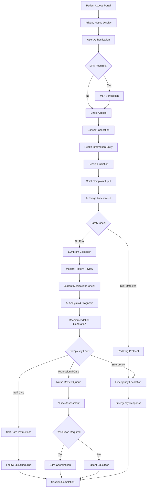

### Healthcare Provider (Nurse) Complete Journey
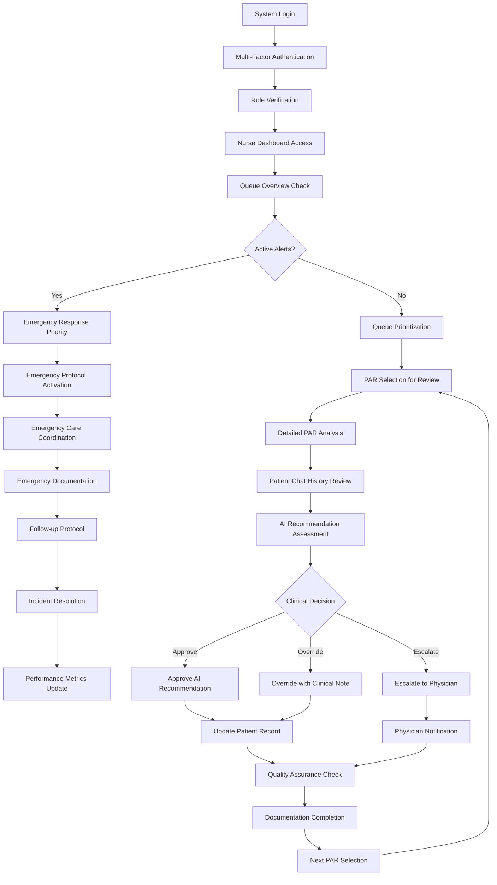

### Administrator Complete Journey
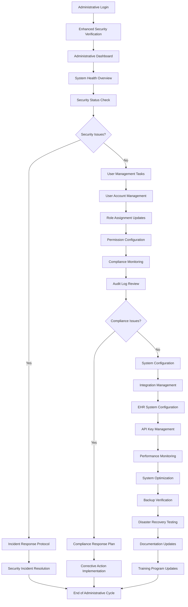

---

## Technical Architecture Diagrams

### System Architecture Overview
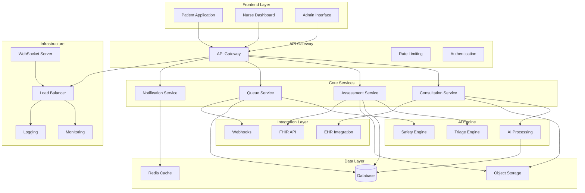

### Data Flow Architecture
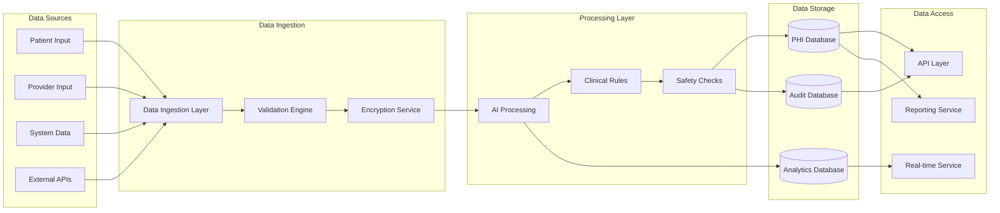

### Security Architecture
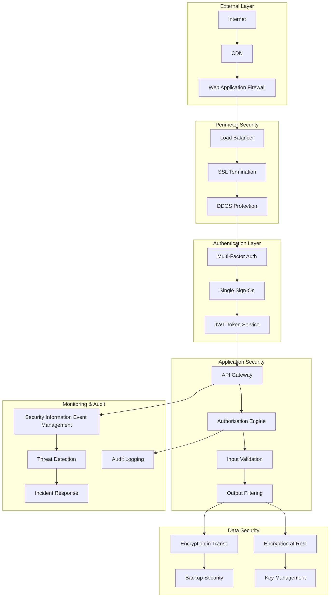

---

## Conclusion

This comprehensive User and Application Interaction Analysis provides a detailed framework for understanding, implementing, and maintaining the Medical AI Assistant system. The analysis covers all critical aspects of user interaction, system architecture, security, compliance, and clinical workflow integration.

### Key Implementation Priorities

1. **User Experience Optimization**: Focus on intuitive interfaces for all user types
2. **Security and Compliance**: Maintain HIPAA compliance throughout all interactions
3. **Real-time Communication**: Ensure reliable WebSocket connections for critical features
4. **Clinical Safety**: Implement robust red flag detection and emergency protocols
5. **Integration Readiness**: Prepare for seamless EHR/EMR integration
6. **Performance Monitoring**: Implement comprehensive audit trails and monitoring

### Success Metrics

- **User Adoption**: Track engagement across all user types
- **Clinical Outcomes**: Monitor AI recommendation accuracy and nurse override rates
- **System Performance**: Measure response times, uptime, and reliability
- **Compliance Achievement**: Ensure 100% HIPAA compliance
- **Security Incidents**: Maintain zero security breaches

### Continuous Improvement

This analysis serves as a living document that will be updated regularly as the system evolves and new requirements emerge. Regular reviews and updates ensure the system remains current with healthcare regulations, technology advancements, and user needs.

---

**Document Control:**
- **Review Schedule**: Quarterly
- **Update Triggers**: System changes, regulatory updates, user feedback
- **Distribution**: All stakeholders including development team, compliance officers, and clinical users
- **Version Control**: Managed through standard documentation version control processes

*This document contains confidential and proprietary information. Distribution is restricted to authorized personnel only.*