# Application Logic Flow Diagram

## Medical AI Assistant - Core Logic Flow

```mermaid
graph TD
    %% User Input & Authentication
    A[Patient Message] --> B{Valid Session?}
    B -->|No| C[Create New Session]
    B -->|Yes| D[Load Session State]
    C --> E[Authentication & Consent]
    D --> F[Validate User Permissions]
    E --> G[Display Privacy Notice]
    F --> H[Rate Limit Check]
    G --> H
    
    %% Input Processing & Safety
    H --> I{Within Rate Limit?}
    I -->|No| J[Return Rate Limit Error]
    I -->|Yes| K[Input Validation]
    K --> L{Valid Medical Query?}
    L -->|No| M[Return Validation Error]
    L -->|Yes| N[Red Flag Detection]
    
    %% Emergency Detection
    N --> O{Red Flags Detected?}
    O -->|Yes| P[EMERGENCY ESCALATION]
    O -->|No| Q[Proceed with Processing]
    P --> R[Display Emergency Instructions]
    R --> S[Notify Healthcare Provider]
    S --> T[Log Emergency Event]
    
    %% RAG Retrieval
    Q --> U[RAG Context Retrieval]
    U --> V[Query Vector Database]
    V --> W[Medical Guidelines Search]
    W --> X[Context Ranking & Selection]
    X --> Y[Retrieve Relevant Sources]
    
    %% AI Processing Pipeline
    Y --> Z[Initialize LangChain Agent]
    Z --> AA[Load Conversation Memory]
    AA --> BB[Agent Reasoning Loop]
    BB --> CC{Thinking & Acting}
    CC --> DD[Apply Medical Tools]
    DD --> EE[Update Reasoning Chain]
    EE --> CC
    
    %% Safety Filtering
    CC -->|Reasoning Complete| FF[Safety Filter Check]
    FF --> GG{Content Safe?}
    GG -->|No| HH[Block Unsafe Content]
    GG -->|Yes| II[Format Response]
    HH --> JJ[Generate Safe Response]
    JJ --> II
    
    %% Response Generation
    II --> KK[Stream Response to Frontend]
    KK --> LL[Display to Patient]
    
    %% PAR Generation
    II --> MM{Generate PAR?}
    MM -->|No| NN[Continue Conversation]
    MM -->|Yes| OO[Generate Preliminary Assessment]
    OO --> PP[PAR Validation]
    PP --> QQ[Send to Nurse Queue]
    QQ --> RR[Nurse Review Process]
    
    %% Human Oversight
    RR --> SS{Nurse Decision}
    SS -->|Approve| TT[Schedule Appointment]
    SS -->|Reject| UU[Request Manual Override]
    SS -->|Revise| VV[Send Feedback to AI]
    
    %% Session Management
    NN --> WW[Update Session State]
    TT --> XX[Complete Session]
    UU --> YY[Manual Consultation]
    VV --> ZZ[Learn from Feedback]
    WW --> AAA[Cache Session Data]
    XX --> BBB[Audit Log Session]
    AAA --> CCC{Awaiting Response?}
    CCC -->|Yes| A
    CCC -->|No| DDD[End Session]
    
    %% Error Handling
    M --> EEE[Log Error]
    J --> EEE
    JJ --> FFF[Error Recovery]
    FFF --> GGG[Retry with Backoff]
    GGG --> BBB
    
    %% Styling
    classDef userInput fill:#e3f2fd,stroke:#1976d2,stroke-width:2px
    classDef safety fill:#ffebee,stroke:#d32f2f,stroke-width:3px
    classDef aiProcess fill:#fff3e0,stroke:#f57c00,stroke-width:2px
    classDef ragProcess fill:#f3e5f5,stroke:#7b1fa2,stroke-width:2px
    classDef humanOversight fill:#e8f5e8,stroke:#388e3c,stroke-width:2px
    classDef emergency fill:#ffcdd2,stroke:#c62828,stroke-width:4px,color:#d32f2f
    classDef error fill:#ffecb3,stroke:#f57f17,stroke-width:2px
    
    class A,C,D,E,G,H,K,N userInput
    class O,P,R,S,T,FF,GG,HH,JJ safety
    class Z,AA,BB,CC,DD,EE,II,KK,LL aiProcess
    class U,V,W,X,Y,OO,PP ragProcess
    class RR,SS,TT,UU,VV humanOversight
    class P emergency
    class J,M,EEE,FFF,GGG error
```

## Key Components and Flow Explanation

### 1. **User Input & Session Management**
- **Entry Point**: Patient message initiates the flow
- **Session Validation**: Check for existing valid session or create new one
- **Authentication**: Verify user permissions and obtain consent
- **Rate Limiting**: Prevent abuse and ensure fair usage

### 2. **Safety-First Processing**
- **Input Validation**: Ensure medical queries are properly formatted
- **Red Flag Detection**: Real-time emergency symptom identification
- **Emergency Escalation**: Immediate response for critical situations

### 3. **AI Processing Pipeline**
- **RAG Retrieval**: Search medical guidelines and protocols
- **Context Ranking**: Select most relevant medical information
- **LangChain Agent**: Reasoning and acting with medical tools
- **Safety Filtering**: Multi-layer content validation

### 4. **Human-in-the-Loop Oversight**
- **PAR Generation**: AI creates preliminary assessment reports
- **Nurse Review**: Healthcare professionals validate AI recommendations
- **Feedback Loop**: Human expertise improves AI performance

### 5. **Response & Session Management**
- **Streaming Response**: Real-time token-by-token delivery
- **State Management**: Track conversation context and session data
- **Completion**: Finalize session with audit logging

## Design Decisions

### 1. **Safety-First Architecture**
- Red flag detection happens early in the pipeline
- Multiple safety checkpoints before AI processing
- Emergency escalation bypasses normal flow

### 2. **Human Oversight Integration**
- PAR generation requires nurse validation
- AI learns from human feedback
- Manual override always available

### 3. **RAG-First AI Processing**
- Medical context retrieved before reasoning
- Vector similarity search for relevant guidelines
- Re-ranking ensures quality sources

### 4. **Streaming Response Design**
- Real-time delivery improves user experience
- Token-by-token streaming for transparency
- WebSocket communication for low latency

### 5. **Comprehensive Error Handling**
- Fallback responses for AI failures
- Retry mechanisms with exponential backoff
- Graceful degradation of services

### 6. **Audit Trail Completeness**
- Every action logged for compliance
- PHI access tracking
- Emergency events prioritized in alerts
