# Medical AI Assistant - File Hierarchy Diagram

## Mermaid Diagram

```mermaid
graph TD
    %% Root Level
    ROOT[Medical AI Assistant Repository] --> MAIN[Medical-AI-Assistant/]
    ROOT --> DEPLOY[deployment/]
    ROOT --> DOCS[docs/]
    ROOT --> DIAGRAMS[diagrams/]
    
    %% Main Application Structure
    MAIN --> BACKEND[backend/]
    MAIN --> FRONTEND[frontend/]
    MAIN --> DOCKER[docker/]
    MAIN --> TRAINING[training/]
    MAIN --> DOCS_MAIN[docs/]
    MAIN --> DEMO[demo/]
    
    %% Backend Components
    BACKEND --> API[api/]
    BACKEND --> APP[app/]
    BACKEND --> CORE[core/]
    BACKEND --> DATA[models/]
    BACKEND --> SERVICES[services/]
    BACKEND --> UTILS[utils/]
    
    %% Frontend Structure
    FRONTEND --> PUBLIC[public/]
    FRONTEND --> SRC[src/]
    
    %% Training Components
    TRAINING --> MODELS_TRAIN[models/]
    TRAINING --> EVAL[evaluation/]
    TRAINING --> DATA_TRAIN[data/]
    TRAINING --> SCRIPTS_TRAIN[scripts/]
    TRAINING --> CONFIGS[configs/]
    
    %% Demo Components
    DEMO --> ANALYTICS[analytics/]
    DEMO --> API_DEMO[api/]
    DEMO --> AUTH[auth/]
    DEMO --> DATABASE[database/]
    
    %% Docker Structure
    DOCKER --> DOCKER_COMPOSE[docker-compose.yml]
    DOCKER --> DOCKERFILES[Dockerfile.*]
    
    %% Documentation Structure
    DOCS_MAIN --> USER_MAN[user-manuals/]
    DOCS_MAIN --> ADMIN_GUIDES[administrator-guides/]
    DOCS_MAIN --> API_DOCS[api/]
    DOCS_MAIN --> ARCH_DOCS[architecture/]
    DOCS_MAIN --> DEPLOY_GUIDES[deployment/]
    
    %% Deployment Structure
    DEPLOY --> CLOUD[cloud/]
    DEPLOY --> K8S[kubernetes/]
    DEPLOY --> DOCKER_PROD[docker/]
    DEPLOY --> MONITORING_DEPLOY[monitoring/]
    DEPLOY --> SECURITY_DEPLOY[security/]
    
    %% Additional Components
    MAIN --> SCRIPTS[scripts/]
    MAIN --> SERVING[serving/]
    MAIN --> VECTOR_STORES[vector_stores/]
    MAIN --> PROMPTS[prompts/]
    MAIN --> NOTEBOOKS[notebooks/]
    
    %% Styling
    classDef mainApp fill:#e1f5fe
    classDef backend fill:#f3e5f5
    classDef frontend fill:#e8f5e8
    classDef config fill:#fff3e0
    classDef docs fill:#fce4ec
    
    class MAIN,BACKEND,FRONTEND,TRAINING,DEMO mainApp
    class API,APP,CORE,SERVICES,UTILS backend
    class PUBLIC,SRC frontend
    class DOCKER,DOCKER_COMPOSE,DOCKERFILES,DOCS_MAIN config
    class DOCS,USER_MAN,ADMIN_GUIDES,API_DOCS docs
```

## Diagram Explanation

This file hierarchy diagram provides a comprehensive overview of the Medical AI Assistant repository structure, organized by logical components:

### **Main Application Components**
- **Medical-AI-Assistant/**: The core application directory containing all primary functionality
- **Backend/**: Python-based backend services with API endpoints, core logic, and model integrations
- **Frontend/**: React-based web application with TypeScript and modern UI components
- **Training/**: Machine learning model training infrastructure and evaluation systems

### **Configuration & Deployment**
- **Docker/**: Containerization configuration for local development
- **Deployment/**: Production-ready deployment configurations for cloud platforms
- **Scripts/**: Utility scripts for database initialization, setup, and maintenance

### **Documentation & Demo**
- **docs/**: Comprehensive documentation organized by audience (users, administrators, developers)
- **Demo/**: Standalone demonstration environment for testing and validation
- **diagrams/**: Visual documentation including architecture and user interaction diagrams

### **Key Features Highlighted**
- **Modular Architecture**: Clear separation between frontend, backend, training, and serving components
- **Production-Ready**: Full deployment pipeline with Kubernetes, Docker, and cloud configurations
- **Comprehensive Documentation**: Multi-level documentation covering technical and user needs
- **Development Environment**: Separate demo environment for testing and validation

## Design Decisions

1. **Hierarchical Organization**: Used a top-down approach to show the logical flow from root to detailed components
2. **Component-Based Grouping**: Related files are grouped together (e.g., all backend services under `backend/`)
3. **Color Coding**: Different colors for frontend, backend, configuration, and documentation components
4. **Focus on Main Application**: Emphasizes the primary `Medical-AI-Assistant` directory while showing supporting infrastructure
5. **Scalability Indication**: Shows the multi-environment setup (development, demo, production deployment)

## Key Directories and Files

- **Primary Application**: `Medical-AI-Assistant/` contains the complete application
- **Backend Services**: Python FastAPI backend with modular service architecture
- **Frontend Application**: React/TypeScript SPA with modern development stack
- **Training Infrastructure**: ML model development, training, and evaluation pipeline
- **Deployment Ready**: Complete CI/CD pipeline with containerization and orchestration
- **Documentation**: Multi-layered documentation for different user types and deployment scenarios