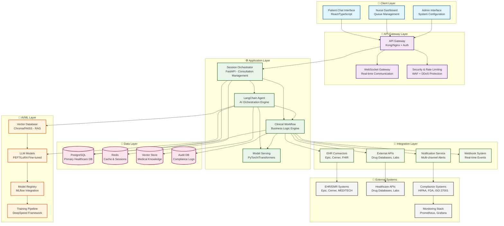

# Medical AI Assistant System Architecture



## Architecture Overview

The Medical AI Assistant follows a layered microservices architecture designed for healthcare environments with six main architectural layers:

### 🏗️ **Client Layer**
- **Patient Chat Interface**: React-based real-time consultation interface
- **Nurse Dashboard**: Queue management and assessment review system  
- **Admin Interface**: System configuration and monitoring

### 🔐 **API Gateway Layer**
- **Authentication & Authorization**: JWT-based with role-based access control
- **Security**: WAF, DDoS protection, and healthcare-specific rate limiting
- **Real-time Communication**: WebSocket gateway for live interactions

### ⚙️ **Application Layer**
- **Session Orchestrator**: Manages patient consultations and state
- **LangChain Agent**: AI orchestration with medical knowledge tools
- **Clinical Workflows**: Business logic for healthcare processes
- **Model Serving**: PyTorch/Transformers for AI model deployment

### 🤖 **AI/ML Layer**
- **LLM Models**: PEFT/LoRA fine-tuned medical models
- **Vector Database**: RAG system for medical knowledge retrieval
- **Model Registry**: Version control and deployment management
- **Training Pipeline**: DeepSpeed framework for model optimization

### 💾 **Data Layer**
- **Primary Database**: PostgreSQL with healthcare-specific schemas
- **Cache Layer**: Redis for session management and performance
- **Vector Store**: Medical knowledge base for RAG
- **Audit Database**: Compliance and regulatory logging

### 🔗 **Integration Layer**
- **EHR Systems**: Epic, Cerner, and custom EHR integrations
- **FHIR APIs**: Healthcare interoperability standards
- **External Services**: Drug databases, lab systems, imaging
- **Notification System**: Multi-channel patient and provider alerts

## Key Design Decisions

### 1. **Microservices Architecture**
- Enables independent scaling of components
- Facilitates healthcare compliance isolation
- Allows for technology diversity across layers

### 2. **Layered Security**
- Multi-layer security approach from client to data
- HIPAA-compliant PHI protection throughout
- Role-based access control with minimum necessary access

### 3. **AI-First Design**
- LangChain-based agent orchestration for clinical reasoning
- RAG integration for evidence-based responses
- Real-time model serving with safety filtering

### 4. **Healthcare Integration**
- FHIR-compliant interoperability
- EHR system connectors for seamless workflow integration
- Comprehensive audit trails for regulatory compliance

### 5. **Scalability & Performance**
- Multi-cloud deployment strategy (AWS/Azure/GCP)
- Kubernetes orchestration for container management
- Auto-scaling based on healthcare demand patterns

## Component Relationships

### Primary Data Flow
```
Patient Input → API Gateway → Session Orchestrator → LangChain Agent → LLM Models
                                                                 ↓
Compliance Audit ← Clinical Workflow ← AI Processing ← Vector Database
```

### Real-time Communication
```
Client Interface ↔ WebSocket Gateway ↔ Session Orchestrator ↔ Notification Service
```

### Integration Flow
```
Clinical Decision → EHR Integration → Healthcare Providers
                              ↓
Assessment Report → External APIs → Drug/Lab Systems
```

## Security & Compliance Architecture

- **Zero Trust Model**: Every component verified and secured
- **End-to-End Encryption**: AES-256 at rest, TLS 1.3 in transit
- **HIPAA Compliance**: Administrative, physical, and technical safeguards
- **Comprehensive Auditing**: All PHI access logged and monitored
- **Role-Based Access**: Healthcare-specific permission model

## Performance Targets

- **Response Time**: < 500ms API, < 2s AI processing
- **Availability**: 99.9% uptime with automatic failover
- **Throughput**: 10,000+ concurrent users
- **Scalability**: Auto-scaling based on healthcare demand
