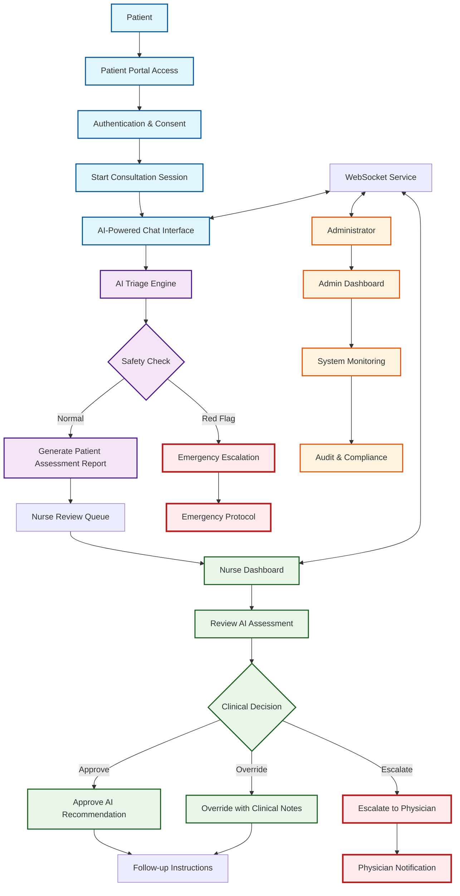

# User Interaction Diagram - Medical AI Assistant

## Primary User Interaction Flow

## Key User Types and Workflows

### 1. **Patients** (Primary Users)
- **Workflow**: Access → Consult → Receive Recommendations → Follow-up
- **Key Interactions**: Chat with AI, provide health information, review assessment results
- **Safety Features**: Red flag detection, emergency protocols, real-time monitoring

### 2. **Nurses/Healthcare Providers** (Clinical Reviewers)
- **Workflow**: Login → Review Queue → Assess Cases → Make Clinical Decisions
- **Key Interactions**: Review AI assessments, approve/override recommendations, add clinical notes
- **Human-in-Loop**: Final clinical authority with ability to override AI decisions

### 3. **Administrators** (System Management)
- **Workflow**: Monitor → Configure → Audit → Compliance
- **Key Interactions**: User management, system configuration, compliance monitoring
- **Oversight**: Full system visibility with audit trails and reporting

### 4. **Healthcare Organizations** (Customers)
- **Workflow**: Organization Setup → User Provisioning → Analytics → Compliance
- **Key Interactions**: Manage their healthcare providers, view usage analytics
- **Governance**: Organizational-level control and oversight

## Design Decisions

### 1. **Human-in-the-Loop Approach**
- **Rationale**: Critical healthcare decisions require human oversight
- **Implementation**: AI provides recommendations, nurses have final clinical authority
- **Safety**: Emergency protocols bypass normal flow for urgent situations

### 2. **Patient-to-Nurse Interaction Flow**
- **Rationale**: Seamless patient experience with professional oversight
- **Implementation**: Patients interact primarily with AI, complex cases escalated to nurses
- **Benefits**: Reduces nurse workload while maintaining clinical quality

### 3. **Real-time Communication**
- **Rationale**: Healthcare requires immediate response capabilities
- **Implementation**: WebSocket service for instant messaging and alerts
- **Safety**: Real-time red flag detection and emergency notifications

### 4. **Role-Based Access Control**
- **Rationale**: HIPAA compliance requires strict access controls
- **Implementation**: Different interfaces and permissions for each user type
- **Security**: Comprehensive audit trails for all user actions

### 5. **Safety-First Design**
- **Rationale**: Patient safety is paramount in healthcare applications
- **Implementation**: Multi-layer safety checks and emergency protocols
- **Compliance**: Built-in compliance monitoring and reporting

## Technical Architecture Highlights

- **Frontend**: React-based responsive interfaces for all user types
- **Backend**: Microservices architecture with AI engine integration
- **Real-time**: WebSocket service for instant communication
- **Security**: End-to-end encryption with comprehensive audit logging
- **Compliance**: HIPAA-compliant data handling throughout the system

## User Experience Principles

1. **Simplicity**: Intuitive interfaces for all user types
2. **Safety**: Multiple safety checks and emergency protocols
3. **Efficiency**: Streamlined workflows to reduce cognitive load
4. **Transparency**: Clear visibility into AI decision-making processes
5. **Accessibility**: WCAG-compliant design for inclusive access