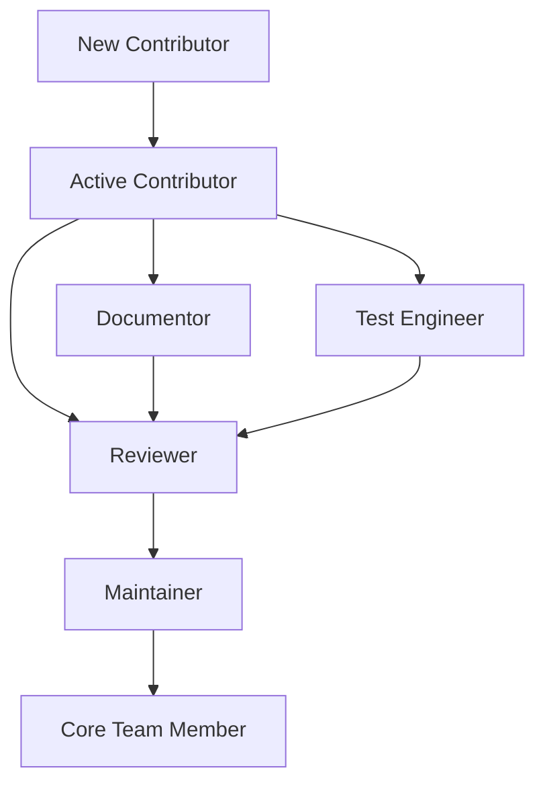

# Community Guidelines and Contribution Guide

## Welcome to the Medical AI Training Pipeline Community

Thank you for your interest in contributing to the Medical AI Training Pipeline project. This document provides comprehensive guidelines for contributing to our open-source project, ensuring high quality code, maintaining community standards, and fostering a welcoming environment for all contributors.

## Table of Contents

1. [Code of Conduct](#code-of-conduct)
2. [Getting Started](#getting-started)
3. [Contribution Types](#contribution-types)
4. [Development Workflow](#development-workflow)
5. [Coding Standards](#coding-standards)
6. [Documentation Guidelines](#documentation-guidelines)
7. [Testing Requirements](#testing-requirements)
8. [Pull Request Process](#pull-request-process)
9. [Issue Management](#issue-management)
10. [Community Roles](#community-roles)
11. [Communication Channels](#communication-channels)
12. [Recognition Program](#recognition-program)

## Code of Conduct

### Our Pledge

We are committed to making participation in the Medical AI Training Pipeline project a harassment-free experience for everyone, regardless of age, body size, disability, ethnicity, gender identity and expression, level of experience, nationality, personal appearance, race, religion, or sexual identity and orientation.

### Our Standards

**Positive Behavior:**
- Use welcoming and inclusive language
- Be respectful of differing viewpoints and experiences
- Gracefully accept constructive criticism
- Focus on what is best for the community
- Show empathy towards other community members

**Unacceptable Behavior:**
- Trolling, insulting/derogatory comments, and personal or political attacks
- Public or private harassment
- Publishing others' private information without explicit permission
- Other conduct which could reasonably be considered inappropriate

### Enforcement

Instances of abusive, harassing, or otherwise unacceptable behavior may be reported by contacting the project team at conduct@medical-ai-training.org. All complaints will be reviewed and investigated and will result in a response that is deemed necessary and appropriate to the circumstances.

## Getting Started

### Prerequisites

Before contributing, ensure you have:

- **Development Environment**:
  - Python 3.8 or higher
  - Git version control
  - Docker (optional, for containerized development)
  - CUDA-capable GPU (recommended for training features)

- **Required Knowledge**:
  - Python programming proficiency
  - Basic understanding of machine learning concepts
  - Familiarity with distributed computing concepts
  - Healthcare/medical domain awareness

### Initial Setup

1. **Fork the Repository**
   ```bash
   git clone https://github.com/your-username/medical-ai-training-pipeline.git
   cd medical-ai-training-pipeline
   ```

2. **Create Development Branch**
   ```bash
   git checkout -b feature/your-feature-name
   ```

3. **Install Development Dependencies**
   ```bash
   pip install -r requirements-dev.txt
   pip install -e .
   ```

4. **Setup Pre-commit Hooks**
   ```bash
   pre-commit install
   ```

## Contribution Types

We welcome various types of contributions:

### 🐛 Bug Reports
- Report bugs through GitHub Issues
- Include detailed reproduction steps
- Provide environment information
- Suggest potential fixes

### ✨ Feature Requests
- Propose new features via GitHub Issues
- Describe the use case and benefits
- Consider implementation complexity
- Discuss with maintainers before implementation

### 📝 Documentation
- Improve existing documentation
- Add missing documentation
- Translate documentation
- Create tutorials and guides

### 💻 Code Contributions
- Bug fixes
- Feature implementations
- Performance improvements
- Code refactoring
- Test additions

### 🧪 Testing
- Add unit tests
- Create integration tests
- Improve test coverage
- Performance testing
- Load testing

### 🎨 Design and UX
- UI/UX improvements
- Accessibility enhancements
- Visual design contributions
- User experience optimization

## Development Workflow

### Branch Naming Convention

```
<type>/<short-description>

Types:
- feature/     - New features
- bugfix/      - Bug fixes
- hotfix/      - Critical fixes
- docs/        - Documentation changes
- refactor/    - Code refactoring
- test/        - Test-related changes
- chore/       - Maintenance tasks
```

**Examples:**
- `feature/clinical-evaluation-metrics`
- `bugfix/deepspeed-memory-leak`
- `docs/tutorial-video-series`
- `hotfix/security-vulnerability`

### Commit Message Format

```
<type>(<scope>): <subject>

<body>

<footer>
```

**Types:**
- `feat`: New feature
- `fix`: Bug fix
- `docs`: Documentation changes
- `style`: Code style changes
- `refactor`: Code refactoring
- `test`: Test additions/modifications
- `chore`: Maintenance tasks

**Example:**
```bash
feat(training): add LoRA fine-tuning support

Implement LoRA (Low-Rank Adaptation) for parameter-efficient fine-tuning
of large language models in medical applications. Includes:
- LoRA configuration options
- Memory optimization techniques
- Clinical evaluation metrics

Closes #123
```

### Development Process

1. **Create Feature Branch**
   ```bash
   git checkout -b feature/your-feature-name
   ```

2. **Make Changes**
   - Write code following our standards
   - Add/update tests
   - Update documentation

3. **Run Pre-commit Checks**
   ```bash
   # Run all checks
   pre-commit run --all-files
   
   # Run specific checks
   pre-commit run black
   pre-commit run flake8
   pre-commit run mypy
   ```

4. **Test Your Changes**
   ```bash
   # Run unit tests
   pytest tests/
   
   # Run specific test categories
   pytest tests/unit/
   pytest tests/integration/
   pytest tests/performance/
   
   # Run with coverage
   pytest --cov=training_pipeline tests/
   ```

5. **Update Documentation**
   - Add docstrings to new functions
   - Update relevant documentation
   - Add examples for new features

6. **Commit Changes**
   ```bash
   git add .
   git commit -m "feat(training): add new feature description"
   ```

7. **Push and Create PR**
   ```bash
   git push origin feature/your-feature-name
   # Create pull request via GitHub UI
   ```

## Coding Standards

### Python Style Guide

We follow PEP 8 with some modifications:

#### Code Formatting

**Line Length**: 88 characters (Black default)

**Example:**
```python
# Good
def long_function_name(
    param_one: str,
    param_two: int,
    param_three: Optional[List[str]] = None
) -> Dict[str, Any]:
    """Function with properly formatted parameters."""
    pass

# Bad
def long_function_name(param_one, param_two, param_three=None):
    pass
```

#### Import Organization

```python
# Standard library imports
import json
import os
from pathlib import Path
from typing import Dict, List, Optional, Any

# Third-party imports
import numpy as np
import pandas as pd
import torch
from transformers import AutoModel, AutoTokenizer

# Local imports
from training_pipeline.utils.data_utils import MedicalDataset
from training_pipeline.models.base import BaseModel
from training_pipeline.config import TrainingConfig
```

#### Naming Conventions

```python
# Classes: PascalCase
class MedicalDataset:
    pass

class TrainingPipeline:
    pass

# Functions and variables: snake_case
def load_medical_data():
    config = get_training_config()

# Constants: UPPER_SNAKE_CASE
MAX_SEQUENCE_LENGTH = 512
DEFAULT_BATCH_SIZE = 32
SUPPORTED_MODELS = ["bert-base", "roberta-base"]

# Private methods: single underscore prefix
def _private_method(self):
    pass

# Magic methods: double underscore prefix (avoid unless necessary)
def __init__(self):
    pass
```

#### Documentation Standards

```python
def train_model(
    model: torch.nn.Module,
    dataset: MedicalDataset,
    config: TrainingConfig
) -> TrainingResults:
    """Train a medical AI model with the provided dataset.
    
    This function implements the core training loop for medical AI models,
    supporting both single-GPU and distributed training scenarios.
    
    Args:
        model: The PyTorch model to train
        dataset: MedicalDataset containing training data
        config: TrainingConfig with hyperparameters
        
    Returns:
        TrainingResults containing training metrics and final model
        
    Raises:
        ValueError: If model architecture is not supported
        RuntimeError: If training encounters unrecoverable errors
        
    Example:
        >>> model = AutoModel.from_pretrained("bert-base")
        >>> dataset = MedicalDataset.load("path/to/data")
        >>> config = TrainingConfig(epochs=10, batch_size=32)
        >>> results = train_model(model, dataset, config)
        >>> print(f"Final loss: {results.final_loss}")
    """
    if not _validate_model_architecture(model):
        raise ValueError(f"Unsupported model architecture: {type(model)}")
    
    # Implementation here
    pass
```

### Code Quality Requirements

#### Type Hints

```python
from typing import Dict, List, Optional, Union, Any

def process_medical_data(
    data: Union[str, Path, Dict[str, Any]],
    output_format: str = "json",
    include_metadata: bool = True
) -> Optional[Dict[str, Any]]:
    """Process medical data with proper type hints."""
    pass
```

#### Error Handling

```python
def safe_model_loading(model_path: str) -> Optional[torch.nn.Module]:
    """Safely load a model with comprehensive error handling."""
    try:
        if not os.path.exists(model_path):
            logger.error(f"Model path does not exist: {model_path}")
            return None
            
        model = AutoModel.from_pretrained(model_path)
        logger.info(f"Successfully loaded model from {model_path}")
        return model
        
    except (OSError, ValueError, RuntimeError) as e:
        logger.error(f"Failed to load model from {model_path}: {e}")
        return None
        
    except Exception as e:
        logger.critical(f"Unexpected error loading model: {e}")
        raise
```

## Documentation Guidelines

### Documentation Structure

```
docs/
├── README.md                 # Main documentation
├── installation/             # Installation guides
├── user-guide/              # User documentation
├── developer-guide/         # Developer documentation
├── api/                     # API documentation
├── tutorials/               # Tutorial content
├── examples/                # Code examples
└── resources/               # Additional resources
```

### Writing Style

- **Clear and Concise**: Use simple, direct language
- **Active Voice**: Write in active voice when possible
- **Consistent Terminology**: Use consistent terms throughout
- **Code Examples**: Include working code examples
- **Screenshots**: Add visual aids where helpful

### Documentation Templates

#### Feature Documentation

```markdown
# Feature Name

## Overview
Brief description of the feature and its purpose.

## Usage

### Basic Example
```python
# Simple usage example
result = feature_function()
```

### Advanced Configuration
```python
# Advanced usage with custom configuration
config = FeatureConfig(
    option1=value1,
    option2=value2
)
result = feature_function(config=config)
```

## Configuration Options

| Parameter | Type | Default | Description |
|-----------|------|---------|-------------|
| option1 | str | "default" | Description of option1 |
| option2 | int | 42 | Description of option2 |

## API Reference

### Function Signature
```python
def feature_function(
    param1: str,
    param2: int = 42,
    **kwargs
) -> FeatureResult:
    pass
```

## Troubleshooting

### Common Issues
1. **Issue**: Description
   **Solution**: Resolution steps
```

## Testing Requirements

### Test Categories

#### Unit Tests
- Test individual functions and methods
- Mock external dependencies
- Fast execution (< 1 second per test)

```python
import pytest
from unittest.mock import Mock, patch
from training_pipeline.models.lora_model import LoRAModel

class TestLoRAModel:
    def test_model_initialization(self):
        """Test LoRA model initialization."""
        config = LoRAConfig(rank=16, alpha=32)
        model = LoRAModel(config)
        assert model.rank == 16
        assert model.alpha == 32
    
    def test_forward_pass(self):
        """Test forward pass with mock input."""
        config = LoRAConfig()
        model = LoRAModel(config)
        
        # Mock input
        input_ids = torch.tensor([[1, 2, 3, 4, 5]])
        
        # Mock output
        with patch('torch.randn') as mock_randn:
            mock_randn.return_value = torch.tensor([[0.5, 0.3, 0.2]])
            
            result = model(input_ids)
            assert result.shape == (1, 5, 768)
```

#### Integration Tests
- Test component interactions
- Real external dependencies
- Medium execution time (< 30 seconds)

```python
import pytest
from training_pipeline.training.trainer import MedicalTrainer
from training_pipeline.data.dataset import MedicalDataset

class TestMedicalTrainer:
    def test_training_pipeline_integration(self):
        """Test full training pipeline with small dataset."""
        # Create small test dataset
        dataset = MedicalDataset.create_test_data(size=100)
        
        # Initialize trainer
        trainer = MedicalTrainer(
            model_name="microsoft/DialoGPT-small",
            config=TrainingConfig(
                epochs=1,
                batch_size=2,
                max_steps=10
            )
        )
        
        # Run training
        results = trainer.train(dataset, dataset)
        
        # Verify results
        assert results.training_loss < 5.0
        assert results.accuracy > 0.1
```

#### Performance Tests
- Benchmark critical operations
- Resource usage validation
- Longer execution time acceptable

```python
import pytest
import time
from training_pipeline.performance.benchmark import benchmark_training

class TestPerformance:
    def test_training_performance_benchmark(self):
        """Benchmark training performance."""
        start_time = time.time()
        
        results = benchmark_training(
            model_size="medium",
            batch_sizes=[1, 2, 4, 8],
            epochs=1
        )
        
        end_time = time.time()
        total_time = end_time - start_time
        
        # Performance assertions
        assert results["throughput"] > 10  # samples per second
        assert results["memory_usage"] < 8000  # MB
        assert total_time < 300  # 5 minutes max
```

### Test Coverage Requirements

- **Minimum Coverage**: 80% line coverage
- **Critical Path Coverage**: 100% for core functionality
- **New Feature Coverage**: 90% for new features

### Running Tests

```bash
# Run all tests
pytest

# Run with coverage report
pytest --cov=training_pipeline --cov-report=html

# Run specific test categories
pytest tests/unit/ -k "test_model"
pytest tests/integration/ -k "test_training"
pytest tests/performance/ -k "benchmark"

# Run tests in parallel
pytest -n auto

# Run tests with verbose output
pytest -v

# Run tests and stop on first failure
pytest -x
```

## Pull Request Process

### Pre-Submission Checklist

- [ ] Code follows style guidelines
- [ ] All tests pass locally
- [ ] Test coverage meets requirements
- [ ] Documentation is updated
- [ ] CHANGELOG.md is updated
- [ ] Commit messages follow conventions
- [ ] No merge conflicts with main branch

### Pull Request Template

```markdown
## Description
Brief description of changes made.

## Type of Change
- [ ] Bug fix (non-breaking change which fixes an issue)
- [ ] New feature (non-breaking change which adds functionality)
- [ ] Breaking change (fix or feature that would cause existing functionality to not work as expected)
- [ ] Documentation update
- [ ] Performance improvement
- [ ] Code refactoring

## Testing
- [ ] Unit tests added/updated
- [ ] Integration tests added/updated
- [ ] All tests pass locally
- [ ] Test coverage is sufficient

## Documentation
- [ ] Documentation is updated
- [ ] Docstrings are added/updated
- [ ] Examples are provided
- [ ] API changes are documented

## Checklist
- [ ] Code follows project style guidelines
- [ ] Self-review completed
- [ ] Code is properly commented
- [ ] Documentation builds successfully
- [ ] No breaking changes (or properly documented)

## Related Issues
Closes #(issue_number)
```

### Review Process

#### Automated Checks
- **Continuous Integration**: All tests must pass
- **Code Quality**: Linting and formatting checks
- **Security Scanning**: Vulnerability detection
- **Documentation**: Builds and links verification

#### Code Review Criteria
1. **Correctness**: Does the code work as intended?
2. **Readability**: Is the code clear and understandable?
3. **Performance**: Are there performance implications?
4. **Testing**: Is the code adequately tested?
5. **Documentation**: Is the code and API well-documented?
6. **Security**: Are there security concerns?

#### Review Timeline
- **Initial Review**: Within 48 hours
- **Follow-up Reviews**: Within 24 hours
- **Approval**: Requires 2 approvals from maintainers
- **Merge**: After all checks pass and reviews approved

### Merging Strategy

- **Squash and Merge**: Preferred for feature branches
- **Rebase and Merge**: For complex changes with multiple commits
- **Merge**: For hotfix branches with multiple related commits

## Issue Management

### Issue Types

#### Bug Reports
Use the bug report template:

```markdown
**Bug Description**
Clear description of the bug.

**Reproduction Steps**
1. Go to '...'
2. Click on '....'
3. Scroll down to '....'
4. See error

**Expected Behavior**
What should happen.

**Environment**
- OS: [e.g. Ubuntu 20.04]
- Python Version: [e.g. 3.8.10]
- CUDA Version: [e.g. 11.4]
- GPU Model: [e.g. RTX 3080]

**Additional Context**
Screenshots, error messages, etc.
```

#### Feature Requests
Use the feature request template:

```markdown
**Is your feature request related to a problem?**
Description of the problem.

**Describe the solution you'd like**
Description of the solution.

**Describe alternatives you've considered**
Description of alternative solutions.

**Use Case**
Describe the specific use case.

**Additional Context**
Screenshots, mockups, or additional context.
```

### Issue Prioritization

#### Priority Levels
1. **Critical**: Security issues, major bugs affecting functionality
2. **High**: Important bugs, requested features with significant impact
3. **Medium**: Regular bugs, standard feature requests
4. **Low**: Minor issues, enhancement requests

#### Label System
- `bug`: Bug reports
- `enhancement`: Feature requests
- `documentation`: Documentation improvements
- `good first issue`: Good for new contributors
- `help wanted`: Assistance needed
- `question`: General questions
- `security`: Security-related issues

### Issue Assignment

- **Self-assignment**: Contributors can self-assign issues
- **Maintainer assignment**: Maintainers assign based on expertise
- **Collaborative**: Multiple contributors can work on complex issues

## Community Roles

### Role Definitions

#### Contributors
- Submit pull requests
- Report bugs
- Suggest features
- Participate in discussions
- Write documentation

#### Reviewers
- Review pull requests
- Provide feedback
- Ensure code quality
- Test changes

#### Maintainers
- Review and approve PRs
- Manage releases
- Maintain project direction
- Resolve conflicts
- Mentor contributors

#### Core Team
- Project governance
- Strategic decisions
- Community management
- Code of conduct enforcement

### Role Progression



### Becoming a Maintainer

#### Requirements
- Consistent contributions over 6+ months
- Code quality and reliability
- Community engagement
- Technical expertise
- Review skills

#### Process
1. Nomination by existing maintainer
2. Community feedback period
3. Core team evaluation
4. Appointment decision

## Communication Channels

### Primary Channels

#### GitHub Discussions
- **General**: General project discussions
- **Q&A**: Questions and answers
- **Ideas**: Feature discussions
- **Show and Tell**: Share your work

#### GitHub Issues
- Bug reports
- Feature requests
- Technical discussions

### Secondary Channels

#### Discord Server
- Real-time chat
- Technical discussions
- Pair programming sessions
- Community events

#### Email
- security@medical-ai-training.org (Security issues)
- conduct@medical-ai-training.org (Code of conduct)
- maintainers@medical-ai-training.org (Maintainer contact)

#### Weekly Office Hours
- Live Q&A sessions
- Technical support
- Feature discussions
- Community feedback

### Communication Guidelines

#### Response Times
- **Urgent issues**: 24 hours
- **Regular issues**: 48-72 hours
- **Questions**: 1 week
- **General discussions**: 2 weeks

#### Language
- English as primary language
- Professional and respectful tone
- Clear and concise communication
- Inclusive language

## Recognition Program

### Contributor Recognition

#### Contribution Levels
1. **Bronze**: 5+ merged pull requests
2. **Silver**: 25+ merged pull requests
3. **Gold**: 50+ merged pull requests
4. **Platinum**: 100+ merged pull requests

#### Recognition Methods
- Contributor profile on website
- LinkedIn/GitHub recommendations
- Conference speaking opportunities
- Maintainer nominations
- Special badges and labels

### Achievement Categories

#### Code Contributions
- Most commits
- Bug fixes
- Performance improvements
- New features

#### Documentation
- Tutorial contributions
- API documentation
- Translation contributions
- Examples and guides

#### Community
- Forum assistance
- Issue triaging
- Code review excellence
- Mentorship

#### Special Recognition
- Security researcher acknowledgment
- Medical domain expert recognition
- Open source advocacy
- Diversity and inclusion champion

### Hall of Fame

We maintain a Hall of Fame for top contributors:

```markdown
# Hall of Fame

## Top Contributors

### 2024
1. **Jane Smith** - 47 merged PRs
2. **John Doe** - 32 merged PRs
3. **Alex Johnson** - 28 merged PRs

## Special Recognition

### Security Champion
**Jane Smith** - Identified and reported critical security vulnerability

### Documentation Hero
**John Doe** - Authored comprehensive tutorial series

### Community Builder
**Alex Johnson** - Organized community meetups and mentoring program
```

## Resources

### Developer Resources
- [Development Setup Guide](README.md#development-setup)
- [API Documentation](docs/api/)
- [Testing Guidelines](docs/testing/)
- [Performance Optimization](docs/performance/)

### Medical AI Resources
- [Medical AI Ethics Guidelines](docs/medical-ethics/)
- [Clinical Validation Best Practices](docs/clinical-validation/)
- [Regulatory Compliance](docs/compliance/)
- [Bias Detection and Mitigation](docs/bias-mitigation/)

### External Tools
- **IDE Support**: VSCode extensions, PyCharm configurations
- **Linting**: Pre-commit hooks, CI/CD integration
- **Testing**: pytest configurations, coverage reporting
- **Documentation**: Sphinx setup, theme customization

## Conclusion

Thank you for contributing to the Medical AI Training Pipeline project! Your contributions help make healthcare AI more accessible, reliable, and effective. Together, we're building tools that can improve patient outcomes and advance medical research.

For questions about contributing, please reach out through our communication channels or ask during our weekly office hours.

### Contact Information

- **Project Maintainers**: maintainers@medical-ai-training.org
- **Community Manager**: community@medical-ai-training.org
- **Technical Support**: support@medical-ai-training.org

---

**Document Version**: 1.0  
**Last Updated**: November 4, 2025  
**Maintained by**: Medical AI Training Community Team