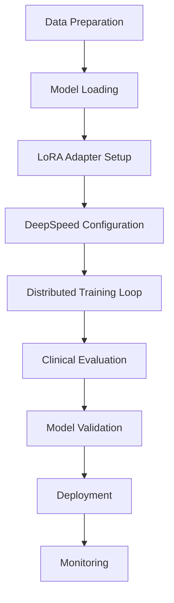

# Medical AI Training Pipeline Documentation

   

A comprehensive, production-ready training pipeline for medical AI models featuring distributed training, LoRA adapters, and HIPAA-compliant workflows.

## Table of Contents

- [Overview](#overview)
- [Quick Start](#quick-start)
- [Installation](#installation)
- [Training Pipeline](#training-pipeline)
- [Configuration](#configuration)
- [Examples](#examples)
- [Best Practices](#best-practices)
- [API Reference](#api-reference)
- [Troubleshooting](#troubleshooting)
- [Contributing](#contributing)

## Overview

The Medical AI Training Pipeline is designed to provide:

### 🎯 **Core Features**
- **Distributed Training**: Multi-GPU, multi-node training with DeepSpeed
- **LoRA Adapters**: Parameter-efficient fine-tuning for medical models
- **HIPAA Compliance**: Built-in PHI protection and audit trails
- **Clinical Evaluation**: Medical accuracy assessment and validation
- **Model Serving**: Production-ready inference with FastAPI
- **Performance Optimization**: Memory-efficient training for large models

### 🏗️ **Architecture**
```
Training Pipeline
├── DeepSpeed Engine (Distributed Training)
├── LoRA Adapters (Parameter-Efficient Fine-tuning)
├── PHI Protection (Data Privacy)
├── Clinical Evaluation (Medical Accuracy)
├── Model Serving (Production Deployment)
└── Performance Monitoring (Real-time Metrics)
```

### 🎯 **Use Cases**
- Medical text analysis and classification
- Clinical decision support systems
- Patient data processing and analysis
- Medical image analysis
- Drug interaction prediction
- Diagnostic assistance systems

## Quick Start

### One-Command Training Setup

```bash
# Download and setup everything automatically
python scripts/quick_start.py \
    --model_name microsoft/DialoGPT-medium \
    --dataset_path ./data/medical_qa.json \
    --epochs 10 \
    --output_dir ./outputs/medical_model
```

### Basic Single-GPU Training

```bash
# Simple training with default settings
python scripts/train_distributed.py \
    --config configs/single_node_config.json \
    --model_name bert-base-uncased \
    --dataset_path ./data/train.json \
    --output_dir ./checkpoints
```

### LoRA Fine-tuning

```bash
# Parameter-efficient fine-tuning
python scripts/train_lora.py \
    --config configs/lora_config.yaml \
    --model_name facebook/opt-125m \
    --dataset_path ./data/medical_dataset.json \
    --output_dir ./lora_checkpoints
```

### Multi-GPU Training

```bash
# Distributed training across multiple GPUs
torchrun \
    --nproc_per_node=4 \
    scripts/train_distributed.py \
    --config configs/multi_node_config.json \
    --model_name bert-large-uncased \
    --dataset_path ./data/large_dataset
```

## Installation

### Prerequisites

- **Python**: 3.8+ (recommended: 3.10)
- **CUDA**: 11.8+ or 12.1+
- **PyTorch**: 2.0.0+
- **DeepSpeed**: 0.12+
- **Hardware**: NVIDIA GPU with 8GB+ VRAM (16GB+ recommended)

### Environment Setup

#### 1. Create Virtual Environment

```bash
# Using venv
python -m venv medical_ai_env
source medical_ai_env/bin/activate  # Linux/Mac
# medical_ai_env\Scripts\activate  # Windows

# Using conda
conda create -n medical_ai python=3.10
conda activate medical_ai
```

#### 2. Install Dependencies

```bash
# Core dependencies
pip install -r requirements.txt

# LoRA-specific dependencies
pip install -r lora_requirements.txt

# Medical AI specific dependencies
pip install transformers datasets accelerate
pip install bitsandbytes peft
pip install fastapi uvicorn
pip install scikit-learn pandas numpy
```

#### 3. Verify Installation

```bash
# Test setup
python test_setup.py

# Verify GPU availability
python -c "import torch; print(f'CUDA available: {torch.cuda.is_available()}')"
python -c "import deepspeed; print(f'DeepSpeed version: {deepspeed.__version__}')"
```

### System Requirements

#### Minimum Requirements
- **CPU**: 4-core processor
- **RAM**: 16GB system memory
- **GPU**: NVIDIA RTX 3070 or equivalent (8GB VRAM)
- **Storage**: 100GB available space

#### Recommended Requirements
- **CPU**: 8-core processor
- **RAM**: 64GB system memory
- **GPU**: NVIDIA RTX 4090 or A100 (24GB+ VRAM)
- **Storage**: 500GB+ NVMe SSD

#### Distributed Training Requirements
- **Network**: High-bandwidth interconnects (InfiniBand recommended)
- **Nodes**: 2-8 nodes with multi-GPU setup
- **Storage**: Shared filesystem (NFS, Lustre, or equivalent)

## Training Pipeline

### Pipeline Architecture



### Training Stages

#### 1. Data Preparation
- **Data Loading**: JSON, CSV, HuggingFace datasets
- **PHI Detection**: Automated PHI identification and redaction
- **Data Validation**: Medical data integrity checks
- **Splitting**: Train/validation/test splits with stratification

#### 2. Model Setup
- **Base Model**: Load pre-trained transformer models
- **LoRA Adapters**: Initialize parameter-efficient adapters
- **Configuration**: Set up DeepSpeed with ZeRO optimization
- **Optimization**: Configure optimizer and learning rate schedules

#### 3. Training Loop
- **Distributed Training**: Multi-GPU/multi-node training
- **Gradient Accumulation**: Support for large effective batch sizes
- **Mixed Precision**: BF16/FP16 training for better performance
- **Checkpointing**: Regular saves with resume capability

#### 4. Evaluation
- **Clinical Metrics**: Medical-specific evaluation metrics
- **Performance Monitoring**: Real-time training metrics
- **Validation**: Model performance on medical datasets
- **Testing**: Final model evaluation and testing

#### 5. Deployment
- **Model Export**: Export models for serving
- **API Setup**: FastAPI-based serving infrastructure
- **Validation**: Production readiness validation
- **Monitoring**: Ongoing performance monitoring

## Configuration

### Configuration Files

#### 1. Single Node Training (`configs/single_node_config.json`)
```json
{
    "zero_optimization": {
        "stage": 1,
        "offload_optimizer": false,
        "allgather_partitions": true,
        "reduce_scatter": true,
        "allgather_bucket_size": 5e8,
        "reduce_bucket_size": 5e8
    },
    "bfloat16": {
        "enabled": true
    },
    "zero_allow_untested_optimizer": true,
    "train_batch_size": 8,
    "gradient_accumulation_steps": 1,
    "gradient_clipping": 1.0,
    "steps_per_print": 10,
    "wall_clock_breakdown": true
}
```

#### 2. Multi-Node Training (`configs/multi_node_config.json`)
```json
{
    "zero_optimization": {
        "stage": 2,
        "offload_optimizer": {
            "device": "cpu",
            "pin_memory": true
        },
        "allgather_partitions": true,
        "reduce_scatter": true,
        "allgather_bucket_size": 2e8,
        "reduce_bucket_size": 2e8,
        "sub_group_size": 1e9,
        "prefetch_bucket_size": 5e7,
        "param_persistence_threshold": 4e5,
        "stage3_prefetch_stream_reserve_memory": 5e7
    },
    "bfloat16": {
        "enabled": true
    },
    "train_batch_size": 4,
    "gradient_accumulation_steps": 8,
    "gradient_clipping": 1.0,
    "steps_per_print": 10,
    "save_interval": 100,
    "logging": {
        "tensorboard": {
            "enabled": true,
            "output_path": "./logs/tensorboard/"
        }
    }
}
```

#### 3. Large Model Training (`configs/large_model_stage3_config.json`)
```json
{
    "zero_optimization": {
        "stage": 3,
        "offload_optimizer": {
            "device": "cpu",
            "pin_memory": true
        },
        "offload_param": {
            "device": "cpu",
            "pin_memory": true
        },
        "gather_16bit_weights_on_model_save": true
    },
    "bfloat16": {
        "enabled": true
    },
    "train_batch_size": 1,
    "gradient_accumulation_steps": 32,
    "gradient_clipping": 1.0,
    "sub_group_size": 1e9,
    "prefetch_bucket_size": 5e7,
    "param_persistence_threshold": 4e5,
    "stage3_prefetch_stream_reserve_memory": 5e7,
    "gather_bucket_size": 5e8,
    "reduce_bucket_size": 5e8,
    "logging": {
        "tensorboard": {
            "enabled": true,
            "output_path": "./logs/tensorboard/"
        }
    },
    "checkpoint": {
        "use_pin_memory": true
    }
}
```

### LoRA Configuration (`configs/lora_config.yaml`)

```yaml
model_name: "microsoft/DialoGPT-medium"
output_dir: "./lora_checkpoints"

# LoRA Parameters
lora_r: 16  # Rank of the low-rank matrices
lora_alpha: 32  # Scaling parameter
lora_dropout: 0.1  # Dropout probability
lora_target_modules: ["q_proj", "v_proj", "k_proj", "o_proj", "gate_proj", "up_proj", "down_proj"]

# Training Parameters
learning_rate: 0.0002
weight_decay: 0.001
per_device_train_batch_size: 4
gradient_accumulation_steps: 8
num_train_epochs: 3
logging_steps: 10
save_steps: 500
eval_steps: 500
dataloader_num_workers: 4
warmup_steps: 100
lr_scheduler_type: "cosine"

# Data Parameters
max_length: 512
train_file: "./data/train.json"
validation_file: "./data/validation.json"

# PHI Protection
enable_phi_protection: true
phi_redaction_method: "replacement"
phi_validation_strict: true

# Performance
fp16: true
gradient_checkpointing: true
```

## Examples

### Basic Training Example

See `examples/basic_training_example.py` for a complete basic training setup.

### Advanced Training Example

See `examples/advanced_training_example.py` for complex configuration examples.

### Clinical Evaluation Example

See `examples/clinical_evaluation_example.py` for medical accuracy assessment.

### Distributed Training Example

See `examples/distributed_training_example.py` for multi-GPU/multi-node training.

### Model Serving Example

See `examples/model_serving_example.py` for production serving setup.

## Best Practices

### Medical AI Training

#### 1. Data Privacy and Compliance
- **PHI Protection**: Always enable PHI protection for medical data
- **Data Encryption**: Use encrypted data storage and transmission
- **Access Control**: Implement proper access controls and audit trails
- **Compliance**: Ensure HIPAA, GDPR, and local regulations compliance

#### 2. Model Development
- **Validation**: Use stratified splits for medical datasets
- **Evaluation**: Use clinically relevant metrics
- **Fairness**: Monitor for bias in medical populations
- **Interpretability**: Ensure model decisions can be explained

#### 3. Training Optimization
- **Memory Efficiency**: Use ZeRO optimization for large models
- **Mixed Precision**: Enable BF16 for better performance
- **Gradient Accumulation**: For larger effective batch sizes
- **Regular Checkpointing**: Prevent training loss from failures

### Performance Optimization

#### 1. Model Size Guidelines
- **Small Models (< 1B)**: Use ZeRO Stage 1
- **Medium Models (1-10B)**: Use ZeRO Stage 2 with CPU offloading
- **Large Models (> 10B)**: Use ZeRO Stage 3 with full offloading

#### 2. Hardware Optimization
- **GPU Memory**: Monitor and optimize GPU memory usage
- **Communication**: Optimize NCCL settings for your network
- **I/O**: Use fast storage for data loading
- **CPU**: Use multiple workers for data preprocessing

#### 3. Training Efficiency
- **Batch Size**: Start small and increase for memory constraints
- **Learning Rate**: Use warmup and cosine annealing schedules
- **Early Stopping**: Monitor validation metrics for overfitting
- **Resume Training**: Always save checkpoints for long training runs

## API Reference

### Core Classes

#### DeepSpeedUtils
```python
from utils.deepspeed_utils import DeepSpeedUtils

# Setup distributed environment
DeepSpeedUtils.setup_distributed_environment(
    rank=0,
    world_size=4,
    master_addr="localhost",
    master_port="29500"
)

# Get world information
world_info = DeepSpeedUtils.get_world_info()
```

#### LoRATrainer
```python
from scripts.train_lora import LoRATrainer

trainer = LoRATrainer(
    model_name="microsoft/DialoGPT-medium",
    config_path="configs/lora_config.yaml",
    output_dir="./checkpoints"
)

trainer.train()
trainer.save_model()
```

#### ClinicalEvaluator
```python
from utils.clinical_evaluation import ClinicalEvaluator

evaluator = ClinicalEvaluator(
    model=model,
    tokenizer=tokenizer,
    medical_test_dataset=test_dataset
)

results = evaluator.evaluate_all_metrics()
clinical_accuracy = evaluator.calculate_clinical_accuracy()
```

#### ModelServer
```python
from utils.model_serving import ModelServer

server = ModelServer(
    model_path="./checkpoints",
    config_path="configs/serving_config.yaml"
)

server.start(host="0.0.0.0", port=8000)
```

### Utility Functions

#### PHI Protection
```python
from utils.phi_redactor import PHIRedactor

redactor = PHIRedactor()
clean_text = redactor.redact_phi(medical_text)
is_phi_detected = redactor.contains_phi(medical_text)
```

#### Performance Monitoring
```python
from utils.performance_benchmark import PerformanceMonitor

monitor = PerformanceMonitor()
monitor.start_training_monitoring()
metrics = monitor.get_training_metrics()
```

## Troubleshooting

### Common Issues

#### 1. Memory Issues (OOM)
**Symptoms**: CUDA out of memory errors, training crashes
**Solutions**:
- Reduce batch size
- Enable gradient checkpointing
- Use ZeRO Stage 2 or 3
- Enable CPU offloading
- Use 8-bit quantization

#### 2. Communication Issues
**Symptoms**: Process hangs, communication timeouts
**Solutions**:
- Check network connectivity
- Optimize NCCL settings
- Increase timeout values
- Verify process group initialization

#### 3. Performance Issues
**Symptoms**: Slow training, poor utilization
**Solutions**:
- Check GPU utilization
- Optimize data loading
- Use mixed precision training
- Tune batch sizes
- Enable communication compression

#### 4. Data Issues
**Symptoms**: Training fails, poor accuracy
**Solutions**:
- Validate data format
- Check data preprocessing
- Verify PHI protection settings
- Ensure proper data splits

### Diagnostic Tools

#### System Information
```bash
# GPU information
nvidia-smi
python -c "import torch; print(torch.cuda.is_available())"

# System memory
free -h
python -c "import psutil; print(f'Available RAM: {psutil.virtual_memory().available/1024**3:.1f}GB')"

# Network connectivity
ping -c 4 master_node_ip
```

#### Performance Benchmarking
```bash
# Run performance benchmark
python scripts/benchmark_performance.py \
    --config configs/single_node_config.json \
    --benchmark_type all

# Memory profiling
python -m memory_profiler training_script.py
```

#### Training Validation
```bash
# Test configuration
python test_setup.py

# Validate model compatibility
python -c "from utils.model_utils import validate_model; validate_model('bert-base-uncased')"
```

## Advanced Topics

### Custom Training Loops
- Implementing custom loss functions
- Advanced optimization techniques
- Custom learning rate schedules
- Multi-task training

### Production Deployment
- Model serving with FastAPI
- Container deployment with Docker
- Kubernetes deployment
- Monitoring and logging

### Integration Examples
- HuggingFace Hub integration
- Weights & Biases integration
- MLflow experiment tracking
- Custom evaluation pipelines

## Contributing

We welcome contributions to the Medical AI Training Pipeline!

### Development Setup

1. Fork the repository
2. Create a feature branch
3. Install development dependencies: `pip install -r requirements-dev.txt`
4. Run tests: `pytest`
5. Submit a pull request

### Code Style
- Follow PEP 8 guidelines
- Use type hints
- Write comprehensive docstrings
- Add tests for new features

### Documentation
- Update documentation for new features
- Add examples for new functionality
- Keep API references up to date

### Reporting Issues
When reporting issues, please include:
- System configuration
- Error messages and logs
- Reproduction steps
- Expected vs actual behavior

## License

This project is licensed under the MIT License - see the [LICENSE](../LICENSE) file for details.

## Support

For support and questions:
- Check the troubleshooting guide
- Review existing documentation
- Search existing issues on GitHub
- Create a new issue with detailed information

## Changelog

See [CHANGELOG.md](../CHANGELOG.md) for a detailed history of changes.

---

**Important Notice**: This training pipeline handles medical data and must be used in compliance with all applicable regulations including HIPAA, GDPR, and local medical data protection laws. Always ensure proper data protection and privacy measures are in place.